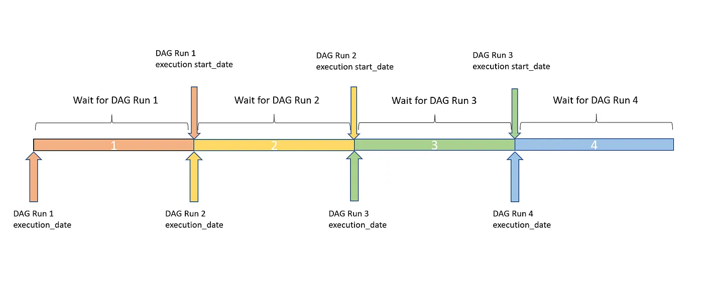
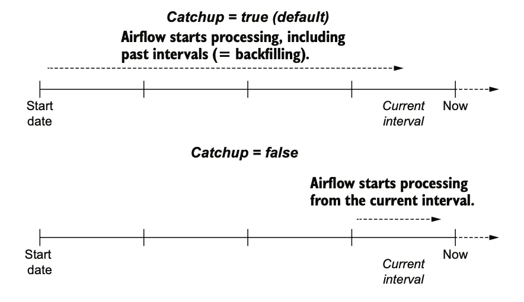

Airflow exists for the sole purpose of removing the need to write a bash or python script, set up a server with a cron job and then run your ETL pipeline. With Airflow, we're doing all this under one roof with monitoring and visualization built in.

Airflow uses something called a DAG (Directed acyclic graph)

Airflow is primarily written with Python scrips that compose of the below imports

    from airflow import DAG
                                                                                                                                                 from datetime import datetime

We need to use datetime as airflow runs certain operations on a time schedule, an example is below

    with DAG("my_dag", start_date=datetime(2022, 1, 1), schedule_interval="@daily") as dag:

What happens here is we:

* Define the dag with a name
  * `my_dag`
* Set a start time that the Dag is effective from
  * 2022, january the first
* Set a schuedle time
  * Daily at midnight (see below table)
  * Can also be a cron job

We have a set few options of built-in timings we can use, or a cron job.

### Presets

Preset

Meaning

Cron

`None`

Don’t schedule, use for exclusively “externally triggered” DAGs

N/a

`@once`

Schedule once and only once

N/a

`@hourly`

Run once an hour at the beginning of the hour

`0 * * * *`

`@daily`

Run once a day at midnight

`0 0 * * *`

`@weekly`

Run once a week at midnight on Sunday morning

`0 0 * * 0`

`@monthly`

Run once a month at midnight of the first day of the month

`0 0 1 * *`

`@yearly`

Run once a year at midnight of January 1

`0 0 1 1 *`

Note: use `schedule_interval=None` opposed to directly quoting with `"none"`

Another way to set out the config is like below:

    default_args = {
        'owner': 'airflow',
        'depends_on_past': False,
        'start_date': datetime(2015, 12, 1),
        'email': ['airflow@example.com'],
        'email_on_failure': False,
        'email_on_retry': False,
        'retries': 1,
        'retry_delay': timedelta(minutes=5),
        'schedule_interval': '@hourly',
    }

    dag = DAG('tutorial', catchup=False, default_args=default_args)

Each section is self-explanatory (provided you can understand the general key value pari's name)
Some are not, I will explain below

* depends\_on\_past
  * `depends_on_past` (boolean) when set to True, keeps a task from getting triggered if the previous schedule for the task hasn’t succeeded.
* retry\_delay
  * The delay after a failure before it should try the DAG again
* owner
  * Who owns the file permissions and who the program runs under

The catchup is quite advanced, so we will deep dive it below

### Catchup

We need to make some assumptions here

* Assume
  * Start date of 2020-1-1
  * Start time of 6am
  * Schedule interval of hourly

The action will happen at 2020-1-1 7am

Use the equation below

    Trigger Point → start_date + { schedule_interval } → till the end.

#### In simple terms

If you set the creation date a year ago, and upload it will create many dag instances, to prevent this we set `catchup=False`

The below explains this in way too much detail, but it's good to have

In the above image we are initial config where everything is fine and our DAG Run happened at 6. Then we paused the DAG.

Here we see that since at the next schedule DAG run was paused hence start\_date for the schedule is not available.

At the next schedule the same happened (DAG run was not triggered). Now we enable or schedule the DAG run from console

In the above diagram we see at the next schedule previously missed DAG Runs were triggered. Notice start\_date is the next schedule (9). While the Execution dates are the actual ones, if you notice, start\_date are same for the last three DAG runs. This denotes backfill. So first DAG run for execution date of 6 happened then for 7 and then for 8.

<!-- https://medium.com/nerd-for-tech/airflow-catchup-backfill-demystified-355def1b6f92 -->
