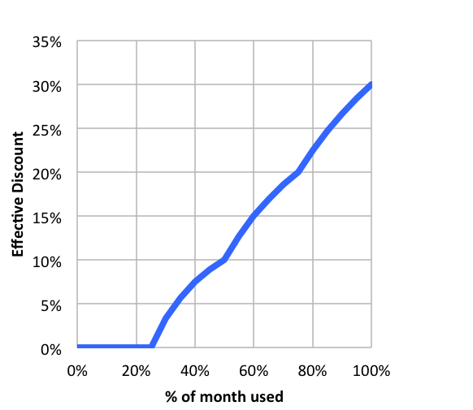

# Google Architect - page 1

GCP has 200+ services

The exam tests your **decision-making**

* Which services do you chose in which situation?
* How do you trade off between resilliance, performance and cost whilst not comprimising on security

* * *

What is cloud and why do we need it?

Before the cloud a company would have to do 'Peak load provisioning' where you buy servers for the peak load

Before cloud the cost of purchasing infrastructure was high, and an upfront cost

The infrastructure was under-utilized, and you need a dedicated infrastructure team

When you use the cloud you 'Provision' and 'rent' resources from the provider. For this you rent them and then return them back to the 'pool' once used.
This is called Elasticity and 'On demand Provisioning'

Trading capital expense for Variables Expense.

You are benifiting from the 'Economic of Scale' where the cloud provider gets the best deals for you.

You no longer need to spend money running a datacentre.

Allows you to go global in minutes.

* * *

GCP is one of the top 3 cloud providers, the other are AWS and Azure

GCP provides 200+ services, and has provided to be reliable and secure.

Is it the 'cleanest' cloud, as it's carbon-neutral

* * *

We move to the cloud due to on demand cloud provisioning.

When we talk about cloud applications, we talk about multiple GCP services.

* * *

Course content:

#### Regions and Zones

Imagine your application is deployed in the London Region.

This means that users from other locations will have High Latency.

If the DC crashes, your application goes down: Low Availability.

If the entire Region of London is unavailable, we will have the same architecture in a separate Region.

This is what we want to do with the cloud deployment, to have them as close to the user as possible, deployment across multiple regions.

##### Understanding Regions and Zones in GCP

All the cloud providers provide us with Regions. Google has 20 regions

A region is a specific geographical location to host your resources

Advantages:

* High Availability
* Low Latency
* Global Footprint
* Adherence to Government Regulations

How do we deploy HA in one geographical location?

within each region has multiple zones

Each region has 3 (or more) availability zones

Each zone has one or more 'Discreet clusters'

Each Zone has one or more Datacentre. these zones are all connected with low latency connections.

* * *

#### Google Compute engine

##### Features

When you want to deploy applicaitons, you need servers. In order to deploy to the cloud you need to deploy to a Virtual machine

In order to provision a machine, you need to use Google Compute engine

GCE helps you to:

* Create and manage the lifecycle of Virtual machines
* Load balancing and autoscaling instances
* Attach storage
* Manage network connectivity

##### Creating an instance

There are a lot of details you need to give

You need to (and have the option to) give:

* name
* Labels
* Region and Zone
* OS
* Firewall

##### Understanding machine types

There are some important choices we made:

1. Hardware
2. OS

When we talk about the hardware, we need to understand the Machine type and Machine family

* General Purpose:
    * E2, N2, N2D, N1
    * Best price-performance ratio
    * running Web applications and small-medium sized databases, dev environments
* Memory Optimized
    * Ultra-high memory workloads
    * M2,M1
    * Large in memory Database
* Compute Optimized
    * Compute Intensive workloads
    * C2
    * Gaming applications

First choice is what machine family, then the machine type

e2-standard-2

* e2 - Machine type family
* Standard - Workload
* 2 - Number of CPU's

Machine name

vCPU's

Memory

Maximum number of PD's

Max total PD size (TB)

Local SSD

Egress bandwith (Gbps)

e2-standard-2

2

8

128

257

No

4

e2-standard-4

4

16

128

257

No

8

e2-standard-8

8

32

128

257

No

16

e2-standard-16

16

64

128

257

No

16

e2-standard-32

32

128

128

257

No

16

Memory, Disk and Networking capabilities increase with the vCPU's

Second question is what OS do we want to run - This is chosen with the Image

We can pick a public Image, which are maintained by Google or opensource third parties

##### Understanding IP addressing in GCP

External IP address are Internet addressable, can be reached over the internet

Internal IP address are internal to the corporate network, so a VM with the IP of 10.128.0.2 address isnt reachable from your network

You cant have 2 instances with the same public IP

You have 2 separate corporate networks with the same internal network

To get a static IP address, we go to VPC networks > External IP address
Here we chose what network tier as well as version to use

Things to note:

* Static IP can be switched to another VM instance in the same project
* Static IP remains attached even after a reboot

Static IP's are billed when you are not using it!

##### Templates

We can speed up the creation of instances by using a template

It's used to create VM's as well as Managed instance groups

We can define the Machine Type, Image, labels and Start up script etc. once then apply to many!

Once the template is created, we cant update it. We need to copy it

You can specify an Image family which will pick the most recent non deprecated image.

There is no cost associated with creating a template

##### Images

Installing OS patches at boot can take a while to boot the instance

Create an image with the patches pre-installed

You can create an image from:

* Instance
* Persistant Disk
* Snapshot
* Image
* File in gcs

Can be shared accross projects

Deprecate old images (And specify a replacement image)

Harden an image - Customize images to your corporate standard

Startup scripts take time, whereas using a snapshot makes it quicker.

##### GCP web console

When people talk about the 'Console' It's the web interface

You can make things as a favourite, and they move to the top of the list.

Under home you can see the GCP Dashboard, has the project info as well as GCP status

##### Compute Engine Scenarios

Scenario

Solution

Pre-reqs to create a VM

1. Project
2. Billing account
3. Compute engine API Enabled

Dedicated hardware for Compliance, Licensing and Management needs

1. Sole tenant node group
2. Node Template
    1. Name
    2. Node type
    3. Affinity Labels
3. Create a VM
4. Under management go to sole tennancy

Thousands of VM's and update them and manage them

VM Manager tool in GCP

Login to server to install software

SSH

Don't want to expose the VM to the internet

Configure Firewall Rules

When you utilise a resource in GCP, you need to enable the API

#### Instance groups and load balancing

##### Instance groups

Instance groups are used to manage similar vm's and have one lifecycle as a unit

There are 2 types of Instance groups:

* Managed instance groups
    * Identical VM's created using a template
        * Same image, same machine type same verion
    * Health check
        * Check the server is responding
    * Auto-scaling
        * Scale the resources up based on a metric
    * Managed releases
        * can go from version to version with no downtime
* Unmanaged instance groups
    * Have VM's with different configurations
    * This is used to group vms with different configurations
    * With the group you don't get any of the features of Autoscaling or Autohealing
    * NOT recommended unless you need different kinds of VM's

Location can be either Zonal or Regional

Regional gives you HA

##### MIG

An identical set of VM's that are created with a template

* Maintain a number of instances
    * If an instance crashes, MIG will replace it
* Detect an application failure using health checks
* Increase instances based on load (Autoscaling)
* Add a Load balancer to distribute the load
* Create Instances in multiple zones (Regional MIG's)
    * Regional migs provide higher avalibliity compared to Zonal Migs
* Release new applications with no downtime
    * Rolling updates
    * Canary deployment (test new version of instance template and only push to a select few)

##### Creating a MIG

* You need an instance template
* Configuring autoscaling
    * Maximum number of instances
    * Minimum number of instances
    * Autoscaling metrics
        * CPU, LB utilisation, Stackdriver metrics
        * Cooldown period
            * How long to wait before looking at the autoscale metrics again before scaling
        * Scale in control
            * You don't want a sudden drop in the number of instances,
                * Example: don't scale down by more than 10% or 3 instances in 5 minutes
    * Auto healing
        * Configure a health check with an initial delay
            * How long to wait from scaling the instance (Creating it) before you check the server's health

When creating a MIG, you have 3 options:

* Stateless
    * Supports:
        * Autoscaling
        * Autohealing
        * Auto-updating
        * Multi-zone deployments
        * LB
* Statefull
    * Disk and metadata perservation
    * autohealing and updating
    * Multi-zonal deployment
    * Load balancing
* Unmanaged instance group
    * LB

##### Updating managed instance groups

* We can do a rolling upgrade
    * Gradual update
* Specify the new template
* You can also select a new template for a canary deployment
    * You set the instances to be swapped out once all is good they all switchout
    * You can pick a set of instances to remove and switchout
* Specify how the update is done
    * When should the update happen?
        * Immediately
        * When the instance group is resized
    * How should they be updated
        * Maximum surge: How many instances should be added at any point in time
        * Maximum unavailable: How many instances can be offline
    * Rolling restart/replace: Gradual restart of all instances in the group
        * No change in template, but restart existing VM's

Exam question:
Q: How to update but have the same number of instances in the group?
A: Maximum unavailable = 0

Exam question:
Q: True or false: Unmanaged instance groups provide you with self-helaing and auto-scaling capabilities
A: false

Exam question:
Q: Can a MIG contain different machine types?
A: No
E: This would be an umanaged instance group

Exam question:
Q: How can you prevent frequest scaling up and down of vm instances in a MIG
A: Cool down period

##### Load Balancing

* a Cloud LB distributes traffic between regions and instances
* Fully distributed software managed service

* Important features:
    * Healthcheck
        * Allows you to recover from failures
    * Autoscaling
    * Global load balancing with Anycast IP
        * can serve global traffic with this IP address
    * Internal load balancing
        * Allows you to do vm to vm loadbalancing
* Enables:
    * HA
    * Autoscaling
        * LB scales on requests
        * Instances scale based on requests
        * Resiliancy
            * Because of health check it can distribute traffic to healthy instances

##### Terminology

* Backed - group of resources that can receive traffic
* Front end - Specify an IP address, port and protocal. This is the IP address for your clients
    * for SSL, a cert must be assigned
* Host and path rules (For http(s) LB's) Defines the rules redirecting the traffic to different backends
    * Based on a path : breadnet.co.uk/blog vs breadnet.co.uk/download
    * Based on a Host: uk.breadnet.co.uk vs us.breadnet.co.uk
    * Based on HTTP Headers (Auth headers) and methods (Post, GET, etc.)

##### SSL/TLS Termination/ Offloading

* Client to LB: Over the internet
    * HTTPS is recommended
* LB to VM: Through internal network
    * HTTP is _ok_ whereas HTTPS is preferred
* SSL/TLS termination/ Offloading
    * Client to LB: HTTPS/TLS
    * LB to VM: HTTP/TCP

##### How to choose your LB

This is important to know

Load Balancer

Type of traffic

Proxy or Pass-through

Destination ports

External HTTP(s)

Global, External, HTTP or HTTPS

Proxy

HTTP/80/8080

HTTPS/443

Internal HTTP(S)

Regional, Internal, HTTP or HTTPS

Proxy

HTTP/80/8080

HTTPS/443

SSL Proxy

Global, External, TCP **without** SSL offload

Proxy

Many

TCP Proxy

Global, External, TCP without SSL Offload

Proxy

Many

External Network UDP/TCP

Regional, External, TCP or UDP

Pass-through

Any

Internal TCP/UDP

Regional, Internal, TCP or UDP

Pass-through

Any

##### Load balancing ac cross MIGs in multiple regions

* Regional MIG can distribute instances in different zones of a single region
    * Create multiple regional MIG's in different regions (In the same project)
* HTTP(S) load balancing can distribute load to multiple MIGS behind a single External IP address
    * User requests are redirected to the nearest Region
* Loadbalancing only sends traffic to healthy instances
    * If a health check fails the instnace is restarted
        * Ensure the healthcheck from the LB can reach the instance group (Firewall rules)
    * All the backends within a region are unhealthy
        * Traffic is distributed to healthy loads as always

##### Multiregional Micro-services

* Global routing: Routes to the nearest instance group
    * Needs network premium teir
        * Forward rule and it's external rule are regional
        * All back ends need to be in the same region

Exam Question:
Q: True or false: HTTPs LB can balance load between MIGS in different regions
A: True

Exam Question:
Q: Which of these networking tiers is recommended if you want to use global HTTPS LB
A: Premium

Exam Question:
Q: How many HTTPS LB's backends do you need to support 3 microservices each with 2 migs in 2 different regions
O:  1 (One backend service can route between multiple microservices)
O: 3 (One for each version of the Microservice)
O: 6 (One for each MIG)
A: 3:
E: There are 3 microservices, so url/ms1 url/ms2 url/ms3 each pointing to a backend, as you can have multiple backend groups per service

#### Compute engine & Load balancing for Architects

> It's not sufficient to get things working. We want more!

* Build resiliency
* Increase availability
* Increase scalability
* Improve performance
* Improve security
* Lower costs

Professional architect:

* Need to know the services
* Learn to build highly resillient, Highly avalible, scalable secure and perfomant with low cost

##### Availability

Percentage

Downtime (Month)

Comment

99.95

22 Minutes

99.99

4:30 minutes

Most online/ SaaS aims for 99.99

99.999%

:26

This is a tough one

The Availability is the **whole application!**
This includes the API, Database, Front end etc

##### High Availability architecture

* Multiple regional MIG's per Microservice
* Distribute load using Global HTTPS Load Balancer
* Configure health checks for MIG's  and LB
* Enable Live Migration on the instnaces

* Advantages
    * Instances distributed accross regions
    * Even if a region is down, your application is avalible
* Global LB is HA
* Health checks ensure Auto-healing

##### Compute engine Features: GPU

* How do you accelerate maths intensiveness and graphic intensive workloads
* Add GPU to your virtual machine
    * High performance for math intensive and graphic workloads
    * Higher cost
    * Use images with libraries installed
        * Otherwise, GPU won't be used
    * GPU restrictions:
        * Not supported on all machine types
        * On host Maintanance: Value must be terminate
* Recommended **availability policy**:
    * Automatic restart - ON

##### GCE Security & Performance

Security

* Use firewall rules to restrict traffic
* Use internal IP address where possible
* Use Sole tennants where the regulatory needs
* Use hardened images to launch your vm's

Performance

* Chose the correct machine size
* Use GPU and TPU to increase perfomrance
    * Use GPU to accelerate math and graphic intensive workloads
    * Use TPU's for massive matrix operations (Tensor processing unit for AI)
* Prefer creating hardened custom images opposed to installing software at startup

##### Resiliency for GCE and LB

Resiliency - Ability for a system to provide the needs it's expected to provide when one or more parts break

* Build resillient archiecture
    * run VM's behind an LB in a MIG
* Have the right data avalible
    * Use cloud monitoring (Stack driver)
    * Install logging agent to send logs to cloud logging
* Be prepared for the unexpected (And changes)
    * Enable Live migration and automatic restarts where Availible
    * Configure the correct health checks
    * Up to date image is copied to multiple regions

##### Cost efficiency for GCE and LB

* Autoscaling
    * have optimal number of VM instances running
* Understand sustained use discounts
* Make use of commuted use discounts

#### Discounts

##### Sustained use discount

Automatic discounts for running VM instances for significant portions of time

[

Example:

If you use N1 and N2 machines for more than 25% of the month, you get a 20-50% discount on every incramental minute

No action required on your part

Applicable for instances running GKE

Does not apply for E2 and A2

Does not apply when using App Engine flexible and Dataflow

#####  Committed use discount

* For workloads with predictable resource needs
* Commited for 1-3 years
* up to 705 discount based on machine type and GPU's
* Applicable for Instances created using GKE
* Does not apply when using App Engine flexible and Dataflow

##### Running fault-tolerant non-critical workloads

Preemptive vms are a good choice.

* Short-lived (up to 80% cheaper)
    * can be stopped by GCP at any time within 24 hours
    * you get 30 second warning before termination
* You should use them if
    * Your application is fault-tolerant
    * You're very cost sensitive
    * workload is not Immediate
        * Non-immediate batch processing jobs
* RESTRICTIONS
    * Not always avalible
    * No SLA and cannot be migrated to regular VM's
    * No automatic restarts
    * Free tier credits do not apply

To save state, create metadata with the key of shutdown-script and a script on the server to run

##### Billing for GCP

* You are billed by the second (After a minimum of one minute) (If you start an instance you are billed for a minute
* You are not billed when the instance is stopped
    * You are billed for any storage attached that isn't deleted

You should set up budget alerts

* Saving money
    * Chose the right VM for the workload
    * Discounts
        * Sustained use discount
        * Commited use discount
        * Preemptive VM

#### G cloud

* Most GCp services can be interfaced with gcloud
* You can create, delete update and read from the cli

There are some services that have specific CLI tools

* Cloud storage: gsutil
* Big query: BQ
* Cloud Bigtable: CBT
* Kubernetes: kubectl

for 75% of the resources you can use gsutil

You can use \`gcloud init\` to initilize the gcloud command like tool

you can use \`gcloud config list\`

##### Gcloud command structure

The command is split into

`gcloud GROUP SUBGROUP ACTION`

Where it goes:

* Group:
    * Config or compute or container ot dataflow
        * Which service are you playing with
* Subgroup
    * Instances, images, instance-templates etc
        * Which subgroup of the service do you want to play with
    * Action
        * Create, list, destroy etc

Example:

`gcloud compute instances list`

To get all info about an instance you would use

gcloud compute instance describe

##### GCLOUD: Things to remember

* gcloud shell is backed by a vm instance
* 5GB of persistent storage in $HOME
* latest SDK's (Docker, gcloud etc)
* Instances inavice under 20 minutes are terminated
* after 120 days of inactivity even you $home is deleted
* cloudshell can be used to SSH in to individual machines

#### Managed Servcices

* Running in the cloud
    * You don't want to run in the cloud the same way you did before in a datacentre
* Terminology
    * Iaas
    * PaaS
    * FaaS
    * CaaS
    * Serverless

##### IaaS & PaaS

IaaS is only using the VM's and setting everything up your self.

You are responsible for:

* Application code
* Configuring LB
* Autoscaling
* OS updates and patches
* Avaliblity

PaaS is when you use a platform from the cloud provider

The cloud provider is responsible for the deployment and managment

All you need to do is focus on the application code

example is App Engine in GCP

##### Containers/ Microservices

Instead of building a large monolithic service, you build lots of small ones and build them in many languages

* Enterprise is heading towards microservices
    * Build small focused microservices
    * Flexibility to innovate
* Deployments become more comples

This is where containers come in to play

##### Docker

You can create a docker image for each of your microservices

* Create a docker image for the MS
* Docker images have all your needs
    * application run time
    * application code and dependencies
* Ability to run anywhere
    * Local machine
    * Corporate data centre
    * cloud
* Advantages
    * Containers are lightweight
        * Do not have a guest OS
    * Isolation
            *   If there is an issue with the container, it won't affect anything
    * Cloud agnostic/ neutral

##### Container Orchestration

There are a number of container orchestration solutoins

When using it, you create a yaml deployment telling the orchestrator how many deployments

* Typical features
    * Auto scaling
    * service discovery
        * Helps microservices to know where they are with no hard coding
    * Load balancing
        * distribute load
    * Self-healing
        * Do health check and replace failing instances
    * Zero-downtime deployments
        * Release a deployment with no downtime

#### App engine

App engine is the simplest way to deploy your applications in to GCP

* Supports:
    * Go, Java, .NET, Node.js, PHP, Python, Ruby (Preconfigured run times)
    * connect to a variety of Google cloud storage products
* No Usage charges
    * Pay for resources provisioned
* Features:
    * Automatic load balancing and Auto Scaling
    * Managed platform updates and application health monitoring
    * Application verisioning
    * Traffic splitting

##### Compute engine vs App Engine

* Compute engine:
    * IAAS
    * More flexibility
    * More responsibility
        * Choosing image
    * Installing software
    * Choosing hardware
    * Fine-grained access/ permissions
    * Avaibility etc
* App Engine
    * PaaS
    * Server-less
    * Lesser responsibility
    * Lower flexibility

##### App Engine Enviroments

* Standard
    * applications run in language specific sandboxes
    * Complete isolation from OS, Disks and other apps
    * V1: Java, Python, PHP, Go (Old versions)
        * Only python and PHP
            * restricted network access
            * Only white-listed extensions and libraries
        * No such restrictions
    * V2: Java, Python, PHP, Jode.js, Ruby, Go
        * Full network access and no restrictions
* Flexible
    * Applicaitons run within docker containers
        * Make use of compute engine virtual machines
    * Supports ANY runtime
    * Provides access to background access and local disks

##### App Engine: Application component hierarchy

* Application: One app per project (Acts as the _container_ for the deployment **(Not** a docker container)
* Services: Multiple microservices or app components
    * Each **service** can have different settings
    * Was called modules
* Versions(s): Each version associated with code and configuration
    * Each version can run in one or more instances
    * Multiple versions can co-exist
    * Options to roll back and split traffic

##### Comparing app engine standard vs flexible

Feature

Standard

Flexible

Pricing factors

Instance hours

vCPU, Memory & PD

Scaling

Manual, basic, Automatic

Manual, Automatic

Scaling to zero

Yes

No

Instance startup time

seconds

Minutes

Rapid scaling

Yes

No

Max. Request timeout

1-10 minutes

60 minutes

Local Disk

Mostly (Except for v1) can write to /tmp

Yes; ephemeral. New disk on startup

SSH for debugigng

No

Yes

From the looks of it, flexible seems more like a glorified GCE

##### App Engine: Scaling instances

* Automatic - Automatically scale instances based on the load
    * Reccomended for continously running workloads
        * Autoscale based on
            * CPU
            * Target thresholf
            * Max concurrent requests
        * Configure max and min instances
* Basic - Instances are created when requested
    * Reccomended for Adhoc workloads
        * Instances shutdown if ther eis ZERO requets
            * tries to keep costs low
            * High latency
        * Not suported by app engine flexible
        * Conficure max instances and idle timeout
            * Idle timeout is the time from the last request
* Manual
    * configure the number of instances

#### GKE

* Managed Kubernetes service
* Minimize operatoins with auto-repair and auto-upgrade
* Provides pod and cluster autoscaling
* Runs on COS (Container optimized OS)

##### Commands

To connect to the cluster and set your kubectl:

    gcloud container clusters get-credentials cost-optimized-cluster-1 --zone us-central1-c --project fourth-jigsaw-307721

then you can use kubectl

If you need specific workloads to run, you can add a pool. This can be a GPU workload for example

##### Service and Ingress

Service are a set of posds within  anetwork that can be used for load balancing and discovery

Ingress are a collection of rules for routing external http(s) traffic

##### commands

See [Here](https://bookstack.breadnet.co.uk/books/google-certs/page/kubectl-commands)

##### Deployments

You can deploy in YAML which is the suggested approach as yaml is "declarative" so you tell it what you want to do

when you do this, you can use a file

    kubectl apply -f <file.yml>

This still very much needs to follow the Order of operations tho

##### Node pools

when you want to deploy a service that for example needs access to a GPU, you can setup a new node pool

    gcloud container node-pools create <pool name> --cluster <cluster name>
    gcloud container node-pools list --cluster <cluster name>

when it comes to using that node pool, in deployment.yml you will use:

    nodeSelector: cloud.google.com/gke-nodepool: <pool name>

#### Understanding GKE cluster

* Cluster: Group of compute engine instances
    * Master node: Manages the cluster
    * worker node: Runs the workloads
* Master Node: (Control plane)
    * API Server:
        * Handles all communicatoin for a K8's cluster
    * Scheduler
        * Works out where to place things
    * Control manager
        * Managed deployments and replica sets
    * etcd
        * Distributed database storing the state of the cluster
* Worker nodes
    * Runs your pods
    * Kubelet
        * Manages communication with the master node

Type

Description

Zonal cluster

Single Zone - Single control plane. nodes run in same zone

Multi-zonal - Single control plane but nodes running in multiple zones

Regional cluster

Replicas of the contol plane runs in multiple zones of a given region. Nodes also run in the same zone where control planes run

Private cluster

VPC-Native cluster. Nodes only have internal IP address

Alpha Cluster

Access to early features for API

##### Pods, containers etc

* A pod is the smallest depolyable unit
* It contains one or more containers
* Each pod is assigned one or more epeheral IP address

All containers in a pod share:

* Network
* Storage
* IP Address
* Ports
* Volumes (Shared PD)

They can have many status:
Running, Pending, Succeeded, failed or unknown

##### deployment vs replica set

* A **deployment** is created for each microservice
    * kubectl create deployment m1 --image:m1:v1
    * deployment represents a microservice (With all it's releases)
    * deployment manages new releases ensuring 0 downtime
* replica set ensures that a specific number of pods are running for a microservice

Deployment is from shifting from one release to a new release

replica set ensures that always has the correct number of pods

##### Kubernetes - service

* Service
    * Ensure that the external users are not inpacted when:
        * Pod fails
        * New release happens
* create a service
    * exposes pods to the outside world using a stable IP
    * Ensures the external world does not get impacted
* Three types of service
    * cluster IP: Internal to the cluster
    * LoadBalanccer: Exposes the service via the cloud providers load balancer
    * NodePort : Exposes service on each nodes' IP address
        * Use case: You don't want to create an external load balancer for each microservice, so create an ingress component to balance the load)

##### Kubernets Ingress

* This is the reccomened approach for providing access to services in a cluster
    * Provides load balancing and SSL
    * control traffic by defining rules
    * Reccomendeatoin: Node Port service to each microservice. expose using an ingress rule
    * Ingress allows you to use a single load balancer and control ingress in to multiple micro services

#### Container registry

* Once you have created a docker image, you need to push it somewhere
* There is one fully managed by google called Google Container registry (GCR.io)
* (alternative) docker HUb
* Can be integrated with CICD (Cloud build)
* GCR also has the ability to scan your containers for vulnerabilities
* Naming:
                                                                            gcr.io/<project-name>/<container name>:<tag>

##### Creating docker images

* Docker file contains what the container needs to do to be created

    FROM alpine:8.16.1-alpine
    WORKDIR /app
    COPY . /app
    RUN npm install
    EXPOSE 5000
    CMD node index.js

Docker file explination

* FROM: use a base image
* WORKDIR: where the commands are to take place
* RUN: execute a command
* EXPOSE: Expose a network port
* COPY: copy a file from local to remote
* CMD: when the container is used, what command should be run when the container starts

Best practices:

* Image should be as small as possible
* Use small images (Alpine)
* Do not copy unescarry node modules
* Move the things that change the least to the top
    * for each command, a layer is created
* To speed up the creation, use as little layers as possibe that changes

##### Google Cloud functions

* Imagine you want to execute some code when an event happens
    * A file is uploaded in cloud storage
    * An error log is written to Cloud Logging
    * A message arrives to pub/sub
* Enter Cloud Functions
    * Run code in response to events
    * Great thing with cloud functions is you don't need to worry about the scaling of the code
* Time bound
    Default: 1 Minute
    Maximum: 9 Minutes

    * You cant use cloud functions to run a big batch job
* each run is run in a seperate instance so there is nothing shred

##### cloud Functions: concepts

* Event: Upload an object
* Trigger: what function to trigger when an event happens
    * When an HTTP call is recieved, you can run a job

##### cloud run & cloudrun for anthos

* Cloud run: "from container to production in seconds"
* Fully managed, serverless platofrm
    * Zero infrastructure to deploy
    * Pay per use (for CPU, memory and requests as well as networking)
* fully integrated, end to end developer experience
    * No limitations in languages
    * easily portable as it's a container
    * End to end develper experience
        * cloud code - IDE
        * Cloud Build - cicd
        * Cloud monitoring - Monitoring tool
        * Cloud ligging interacoitns - tracing
* Anthos - run K8's anywhere
    * cloud, multi-cloud, anywhere
* Cloudrun for anthos
    * Deploy the workloads to anthos clusters running on promise or on Google cloud

Description

Command

Deploy a new container

    gcloud run deploy <service name> --image <container image url> --revision-suffix v<number>

first deployment creates a service and revision

Next deployment for the same service create new revisions

List available revision

    gcloud run revisions list

Adjust traffic assigments

    gcloud run services update-traffic <service name> --to-revisions=v<number>=<number percentage>,v<other verison>=<number percentage>

#### KMS

##### Encryption

* Data at rest: Stored in a device or a backup
    * data on a hard disk, in a database or in archives
* data in Motion
    * data that is moving over the network
    * 2 types:
        * In and out of the cloud (from the internet)
        * within the cloud
* Data in use: Active data in a non-persisted state
    * Example: Data in your ram

##### Symmetric key encryption

* Symmetric key encryption algorithms use the same key for encryption and decryption

Key factor 1: choose the right encryption algorithm
Key factor 2: How do we secure the

##### Asymmetric key Encryption

* 2 keys: Public and private
* Also called Public Key Cyprography
* Encrypt data with public key and decrypt with private key
* Share the public key with everybody and keep the private key with you

##### Cloud KMS

* Create and manage Cryptogrphic keys (Symmetric and Asymmetric)
* Control their use in GCP applications and services
* Provide an API to encrypt, decrypt or sign data
* Use existing cryptographic keys created on-premise
* Integrates with almost all GCP services that need data encrypted
    * google-managed - No configuration required
    * Customer managed. Use keys from KMS
    * Customer supplied - Provide your own keys
* Protection level
    * HSM
        * Hardware
    * Software
        * Software
* You can pick what key to use when crating a VM
    * Ensure that the service account has the correct IAM roles

#### Storage

##### Types

* Block storage
    * Persistent disk
        * Zonal: replicated in one zone
        * Regional: Data replicated in multiple zones
    * Local SSD's : Local block storage
        * Scratch disk : Not all machine types support local ssd.
* File Storage:
    * Filestore

##### Block storage

* Hard drive
* Only can be attached to one server
* Can  attach **read only** block devices to many instances
* You can connect multiple block storage devices to each VM
* Use:
    * DAS
    * SAN
        * High performance Databases
* Local SSD
    * Physically attached to the host of the vm instance
    * Typically used to hold cache
    * Lifecycle is tied to the VM instance
        * Restart the instance and data is gone
    * High IOPS
    * Key is google managed
    * Not all machine types support Local SSD
    * Supports SCSI and NVMe
        * Ensure that your image has support
    * For better performance, get a bigger one. Higher IOPS, or more vCPU
    * Cannot detatch and attach to another instance
* Persistant disk
    * Network provisioned block sotrage
    * Increase whilst running
    * Performance increase with size
    * Can remove and attach from instances
    * Regional PD's are x2 more expensive than zonal PD's

Feature

Persistent Disks

Local SSD's

Attached to VM instance

As a network drive

Physically attached

Lifecycle

Seperate from VM instance

Tied with VM Instance

I/O speed

Lower (Network latency)

10-100x of PD's

Spanshots

Yes

No

Use case

Permanent storage

Ephemeral storage

##### Persistent Disks - Standard

Feature

Standard

Balanced

SSD

Underlying Storage

HDD

SSD

SSD

Referred to as

pd-standard

pd-balanced

pd-ssd

Perfomance - Sequential IOPS (Big/data batch)

Good

Good

Very good

Performance - Random IOPS

Bad

Good

Very good

Cost

Cheapest

In between

Expensive

Use Cases

Big data (Cost efficinet)

Balance between cost and eprformance

##### Persistent disks - Snapshots

* Take a Point in time snapshot of your PD's
* Schedule snapshots
    * Also Auto-delete snapshots after x days
* Multi-regional
* Share across regions and projects
* Incremental
* Keep similar data together
    * Keep only boot info on the boot disk
* Avoid taking the snapshots less than an hour apart
* Creating snapshots from disk is faster than creating from images
    * But creating disks from image is faster than creating from snapshots
    * Snapshots are incrimental
    * If you are repeatidly creating disks from snapshots:
        * Create an image then create disks
* Attaching
    * `gcloud compute instances attach-disk <instance-name> --disk <disk-name>`
    * list the block devices
        * lsblk
    * make the file system
    * Format it
    * mount it
    * assign permissions
* Resizing
    * `gcloud compute disks resize <disk name> --size <size>`

##### File storage

* Where files are stored
* Media workflows
* For users to have quick and secure access
* Can be shared by several servers
* NFSv3
* Provisioned capacity
    * How large a filestore do you want
* High performance filestore
    * 16gbps
    * 480k IOPS
    * Supports SSD and HDD

##### Object storage

* Cloud storage
* Types
    * Standard
        * General storage
    * Nearline
        * Less than once a month
    * Coldline
        * Less than once a quater
    * archive
        * Less than once a year
* Treat the entire object as one block, if you want to update it, you have to push the whole image (for xample)
* Rest API to access the items
    * Provides a CLI
        * Not cloud
        * gsutil
* When moving data the cloud the best solution is to first move it to gcs then the product
* bucket names should contain **only** lower case, number letter hyphens and underscores
* 3-63 characters
* should not contain google or start with goog
* Unlimited objects in a bucket
* Each object is identified with a unique key
* Maximum object size is 5TB
* Object versioning
    * It's enabled at bucket level
    * If you delete the live object, it becomes a non-current version
    * each version is identified by an object key and a generation number
* Object lifecycle managment
    * How to save costs
        * You will use object managemnt lifecucle
    * Use conditions
        * Age
        * CreatedBefore
        * IsLive
        * MatcehsStorageClass
        * NumberOfNewerVersion
    * Based on these ctiteria:
        * Move the objects
        * Delete the object
        * All Automated
* Encrypting cloud storage
    * Cloud storage encrypts data on the server side **by default**
    * Cloud storage will encrypt the data
    * 2 types
        * Server side
            * Depending on GCS to encrypt it
            * Google Managed
            * Customer managed key
                * Ensure that the user has the correct IAM permissions
        * Client side
            * Encrypting before sending
            * You need to send the correct key when you store the data
            * Ensure that data is encrypted at rest
            * Add in the API headers

* Metadata
    * Items have metadata attached to them
    * Fixed key metadata
        * These are the Google provided ones we cant change
            * cache-control - If the object is served to a user how long can they cache it for
* Compliance
    * Configure data retention period
    * You can lock/ unlock a retention policy
        * By locking no one can edit the policy
        * Action is permanent.
        * You cant decrease it's retention period
        * Same thing can be done on bucket creation

##### Best practices

* Avoid sensitive names
* Store in the closest region
* Ramp up gradually the writes and reads per second
* Do not use sequential names
* Mount to a folder using cloud fuse

#### Transferring data to the cloud

* Most popular solution is moving to GCS
    * Good for one time use
    * sub 1TB
    * On premise or another google storage  bucket
* Storage transfer service
    * Transfer from other cloud providers
    * Setup repeat schedules
    * reliable and fault-tolerant
    * More than 1TB
        * options
            * GCS
            * S3
            * Azure
* Transfer appliance
    * Physical Data appliance that is shipped to your Datacentre

#### Machine image

* Machine image is different from an image
* Multiple disks can be attached with a VM
* A machine image contains everything you need to create an instance
* Basically a 1:1 copy of the whole thing.

Scenarios

Machine image

Persistent disk snapshot

Custom image

Instance template

Single disk abckup

Yes

Yes

Yes

NO

Multiple disk backup

Yes

No

No

No

Differential backup

Yes

Yes

No

No

Instance cloning and replication

Yes

No

Yes

Yes

VM Instance configuration

Yes

No

No

##### Storage - Scenarios - Persistent Disks

Scenario

Solution

Improve the performance

Increase the size of the PD or add VCPU

Increase durability of PD

Regional PD

Hourly backup

Schedule hourly snapshots

delete old snapshots from schedule

Configure it as pert of your snapshot scheduling​

##### Review - Global, regional and zonal

* Global
    * Images
    * Snapshots
    * Image snapshots
* Regional
    * Regional MIG
    * Regional MIG
* Zonal
    * Zonal MIG
    * Instances
    * Persistent disk
        * You can attach directly to an instnace
