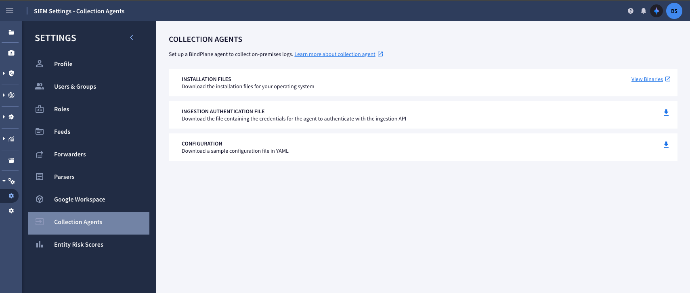
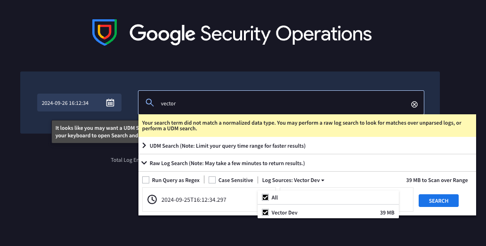
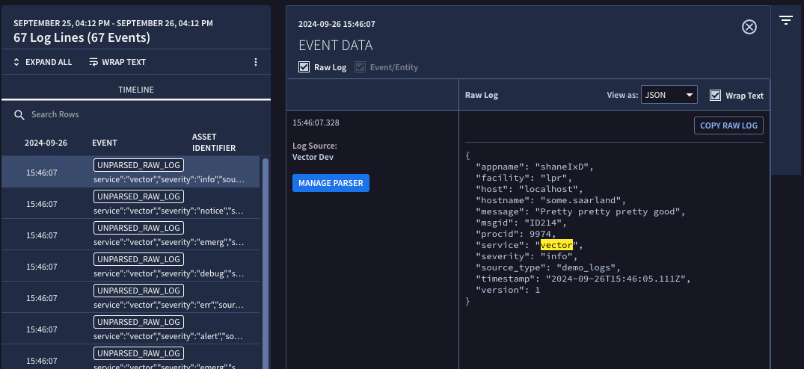

## What

Chronicle (Or now known as Security Operations) is a SIEM/SOAR tool

Datadog Vector is a tool that allows you to aggregate logs and push them places

This document will go over how to push demo logs to Chronicle

## How

### Setup Authentication

Navigate to your chronicle instance > **settings** > **SIEM Settings** > **Collection agents**

Click on `INGESTION AUTHENTICATION FILE`



### Write the config file

For this example we will be pushing demo logs to our Chronicle instance

```yaml
sources:
  generate_syslog:
    type:   "demo_logs"
    format: "syslog"
    count:  100
transforms:
  remap_syslog:
    inputs:
      - "generate_syslog"
    type:   "remap"
    source: |
      structured = parse_syslog!(.message)
      . = merge(., structured)
sinks:
  chronicle:
    credentials_path: "~/Downloads/auth.json"
    type: gcp_chronicle_unstructured
    inputs:
      - remap_syslog
    region: <>
    customer_id: <>
    encoding:
      codec: "json"
    log_type: VECTOR_DEV
```

!!! tip "customer_id and region"
    You will need to set the `customer_id` and `region` your self.

    Customer ID can be found under **Settings** > **SIEM Setings** > **Profile**

## View these logs

For some reason beyond my knowledge, you cant view these logs in the new search

Go to search, then click old search, type `vector` then click **search**

Select `Log Sources` and select vector



Your logs will now show up


