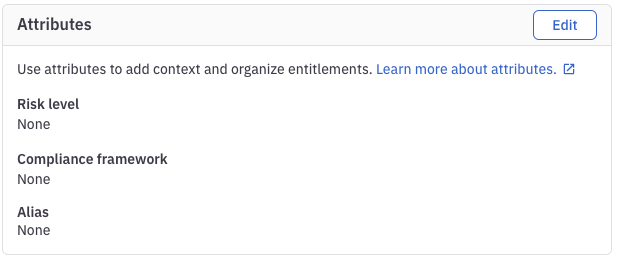

## What

In ConductorOne you can create alias' which allows developers to easily request access, without having to know the app ID or the entitlement ID

## How

Navigate to **Applications** > **_application name_** > **Entitlements**

Select an Entitlement you want to add an alias to

Click **Edit** at the bottom and set the name of an entitlement



## View it in action

Running the below command will search all the Entitlements you can access

```shell
➜ cone search
  | Alias      | Display Name          | App    | Resource Type | Resource
✓ | alias-test | Example Group Member  | AWS v2 | group         | aws_example_app
```

Now if you wish to assume this Entitlement you can run the below

```shell
cone get --alias alias-test
```
