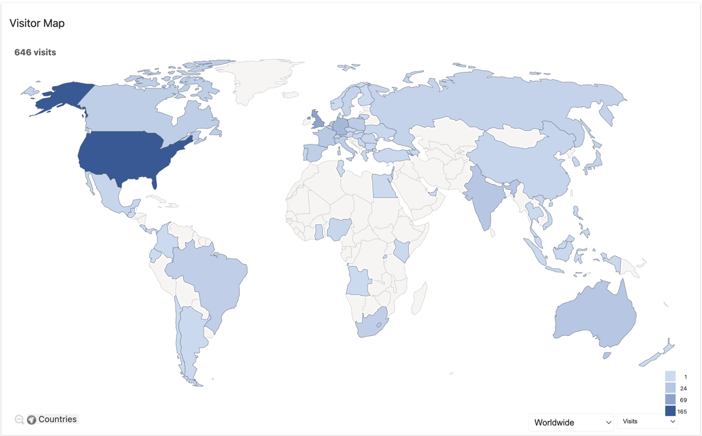

# Fly deployment Strategy

## Issues

### 1 - Buildkit takes too long

#### Problem Statement

Using the Command as below, in the back end Fly copies the Docker file and the files it needs up to their Build instance, builds the image and 
pushes it to their internal Registry.

```shell
fly deploy --dockerfile dev.Dockerfile --config dev.toml
```

The issue here was we are now wasting time copying code from (in order):

Github <--> Codefresh <--> Fly.io <--> Builder <--> Docker <--> Pull docker image and run

#### Solution

The solution was to split the pipeline up, and point Fly.io towards a pre-built docker image, hosted on Docker hub. 
 
### 2 - Latency in the US

#### Problem Statement

As most of my Visitors come from the US (See below)



I want to serve the content closer. Cloudflare is great for half this problem, as it caches some site in the USA.

The issue then becomes when a page is stale, it has to fetch the site from the UK.

#### Solution

Fly.io has the ability to deploy _apps_ in multiple regions at the same time, with what I think is the same IP address?

See [Fly Regions](fly-regions.md) on how to set this up