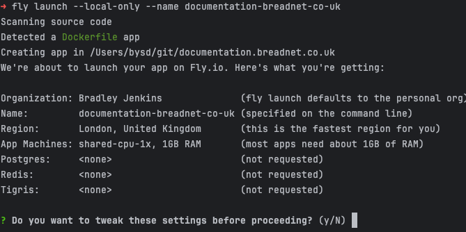

## What

This guide hopes to set the groundwork on how to get an mkdocs site up and running
on [Fly.io](https://fly.io?ref=documentation.breadnet.co.uk)

### What is Fly

Fly is a _serverless_ hosting service that allows you to run Containers pretty much for free

### What is mkdocs

Mkdocs is a documentation system designed for Markdown and extreme simplicity.

We are going to use the [Material for mkdocs](https://squidfunk.github.io/mkdocs-material/?utm_source=breadnet.co.uk&utm_medium=kb&utm_campaign=mkdocs%20on%20fly.io) theme, but it's very easily changed to suit others.

## How

### Prerequisites

* Have a working mkdocs site
* Have a GitHub account
* Have a fly.io account (They're free)

If you would like me to create a Video walkthrough on how to do this, please let me know by opening an issue on GitHub

### Configure the Dockerfile

As Fly.io (Fly) runs everything as Containers, we need to have one.

Create a file called `Dockerfile` and `nginx.conf` in the same directory as your `mkdocs.yaml` file

```sh
touch {nginx.conf,Dockerfile}
```

In the `Dockerfile` place the below

```dockerfile
FROM squidfunk/mkdocs-material:latest as BUILDER
WORKDIR /app
COPY mkdocs.yml /app/mkdocs.yml
COPY docs /app/docs
RUN ["mkdocs", "build"]

FROM nginx:stable-alpine3.17-slim
COPY nginx.conf /etc/nginx/conf.d/default.conf
COPY --from=BUILDER /app/site /var/www/documentation
HEALTHCHECK CMD curl --fail http://localhost:80 || exit 1"
EXPOSE 80
```

And in the `nginx.conf` file, the below:

```nginx
server {

    listen       80;
    listen  [::]:80;

    root /var/www/documentation;
    index  index.html;

    error_page 404 403 /404.html;
    error_page  404              /404.html;
    location = /404.html {
        root /var/www/documentation;
        internal;
    }

    location /healthz { # Setups the `/healthz` page
       stub_status on; # Turns on the module designed to output status of the server
       access_log off; # Do not log requests to this endpoint
       allow 127.0.0.1; # Allows Localhost
       allow 172.16.0.0/12; # Allow Consul to access the page
       deny all; # Any one else gets put in the bin
    }
}
```

Now we need to test if this works

=== "Docker"

    ```shell
    docker build docs:1 && docker run -p 8080:80 docs:1
    ```

=== "Podman"

    ```shell
    podman build docs:1 && podman run -p 8080:80 docs:1
    ```

Browse to <http://localhost:8080> and you should see your site

### Fly.io part

Fly have made some large changes recently to how you launch an app.

#### Install Fly CLI

=== "Mac"

    === "Brew"

        ```shell
        brew install flyctl
        ```

    === "Curl"

        ```shell
        curl -L https://fly.io/install.sh | sh
        ```

=== "Linux"

    ```shell
    curl -L https://fly.io/install.sh | sh
    ```

=== "Windows"

    ```shell
    pwsh -Command "iwr https://fly.io/install.ps1 -useb | iex"
    ```

#### Authenticate to Fly

```shell
fly auth login
```

You will be directed to Fly.io's site where you select your user.

Ensure your `Dockerfile` works, as without a working Dockerfile the next steps will fail

```shell
fly launch --name <give it a name>
```

You will then be asked to confirm the defaults it's proposing



Once you type `y` it will open a web page. You can click **Confirm Settings**

Once that's done, you should see the app is now built and deployed! Click on the URL and ensure everything is working as you'd expect

### GitHub Actions

The command `fly launch` automatically creates a secret in GitHub for you called `FLY_API_TOKEN` that we can use in the next steps

Edit the file `.githuib/workflows/fly-deploy.yml` and replace it with the below

```yaml
name: Build Site
on:
  push:
    branches:
      - main
    paths:
      - docs/**
      - .github/workflows/fly-deploy.yml
      - mkdocs.yml
      - Dockerfile
      - fly.toml
jobs:
  site:
    runs-on: ubuntu-latest
    name: Build Documentation
    steps:
      - name: Git Clone
        uses: actions/checkout@v4
      - name: Fly Build and Deploy
        uses: userbradley/actions-fly@v1.0.0
        with:
          flyToken: ${{ secrets.FLY_API_TOKEN }}
```

This uses a GitHub action I created, which under the hood just runs the fly deploy command. You're also welcome to use the
pre-built fly action!

Commit all the files, and push to your repo. When a commit _touches_ the `docs/**` files, the `mkdocs.yaml` file or
anything in the `docs` directory, it will build the site.

## Things don't work

Please open an issue, and use the `Docs dont work` tab to file an issue.

I am happy to assist!

If you need an example of this working, this repo uses Fly

See [.github/workflows/prod.yaml](https://github.com/userbradley/documentation.breadnet.co.uk/blob/main/.github/workflows/prod.yaml)

## What to read next?

* [Setup Broken Link Checker for your mkdocs site](../../kb/markdown/lychee-link-checker.md)
