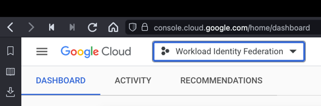
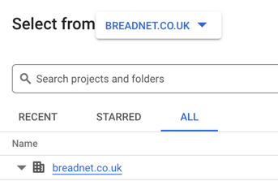
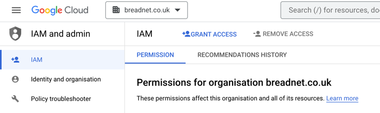
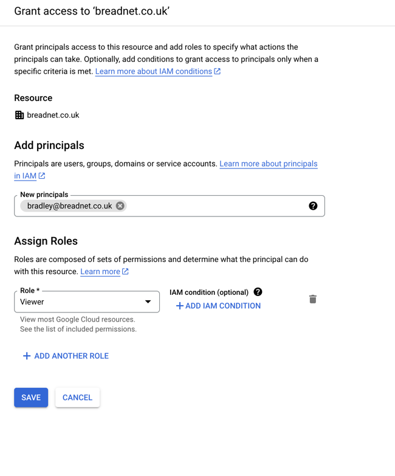

# Add external user to Google Cloud Platform Organization

## Why

Sometimes you need to add external users to your Google Cloud Platform for maintenance or external contractors.

## How

### Navigating to IAM console

Navigate to [Google Cloud Console](https://console.cloud.google.com/home/dashboard) 

Use the project Selector at the **top left** of the window to open the Projects window

Select the top _line item_ that will be your companies' domain.

Once you have selected the Domain, on the left, click the **Hamburger menu** and click **IAM**

!!! question "I cant see IAM at the top"
    This is because your console may be different. Use the search bar and search for `IAM`

### Granting external user access

Click on the **Grant access** button

Search for the user you wish to add on the right hand side, and then select `Viewer`

!!! question "Why is `Viewer` not visible"
    You need to scroll down **incredibly** far to locate the `viewer` role

Click **save**
