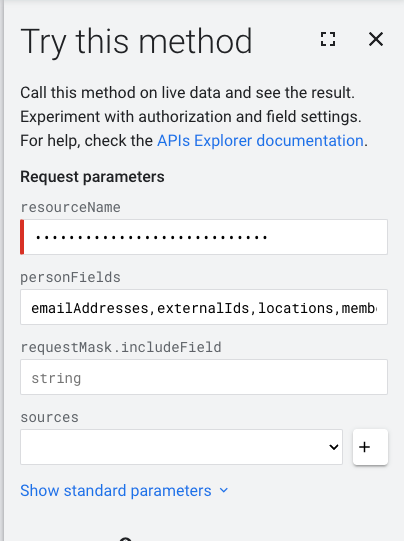

## What

In google cloud, there are some systems (namely composer) that display users by their Numerical ID in logs


??? note "Redacted ID's"
    All the ID's have been changed from their original ones so no use trying to use this

This is made up of the below

```text
          * ------------------------ Accounts Domain
          |              * -------- Numerical Identifier
          |              |
accounts.google.com:114108529276530960947
```

If anyone ever finds the Documentation on how these are made, or what the field names are, please get in contact

## Get user email address from ID

Navigate to Googles [Method: people.get](https://developers.google.com/people/api/rest/v1/people/get) API Playground

On the right hand side will be a `Try this method` Tab


Below details what to put in each field

| Field name     | Value                                              | Example                                            |
|----------------|----------------------------------------------------|----------------------------------------------------|
| `resourceName` | `people/<numerical ID`                             | `people/114108529276530960947`                     |
| `personFields` | `emailAddresses,externalIds,locations,memberships` | `emailAddresses,externalIds,locations,memberships` |

Note: The `resourceName` field will continue to have a red banner next to it

The page will now look like the below



Once filled out, press `Execute`

## Interpret the Response

The response will be at the bottom and look like the below


The full code block is like below

``` json
{
  "resourceName": "people/<redacted>",
  "etag": "<redacted>",
  "emailAddresses": [
    {
      "metadata": {
        "primary": true,
        "verified": true,
        "source": {
          "type": "DOMAIN_PROFILE",
          "id": "<redacted>"
        },
        "sourcePrimary": true
      },
      "value": "<redacted>" // (1)!
    },
    {
      "metadata": {
        "verified": true,
        "source": {
          "type": "DOMAIN_PROFILE",
          "id": "<redacted>"
        }
      },
      "value": "<redacted>"
    }
  ],
  "memberships": [
    {
      "metadata": {
        "source": {
          "type": "DOMAIN_PROFILE",
          "id": "<redacted>"
        }
      },
      "domainMembership": {
        "inViewerDomain": true
      }
    }
  ]
}
```

1. Email address of the user in question

## Possible Errors

### resourceName and etag only

You either:

* Don't have access to their User account details
* Or have not selected a field that the user has filled out
