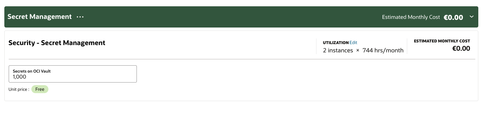

## Why

When selecting a secret manager to use when you're running an on-premise cluster, it's useful to know a cost comparison
in order to get the cheapest

## The providers

* Scaleway
* AWS Secret manager
* Google cloud Secret manager
* IBM Secret Manager
* Azure key vault
* Oracle Vault

## Cost comparison

!!! note "All costs are in euros"
    Entries are in order of cheapest to most expensive, per secret

| Provider name               | Cost per secret | Cost per 10,000 API |
|-----------------------------|-----------------|---------------------|
| Oracle Vault                | free            | free                |
| Scaleway                    | 0.04            | 0.03                |
| AWS Secret Manager          | 0.37            | 0.046               |
| Google Cloud Secret manager | 0.055           | 0.028               |
| Azure Key vault             | unknown         | 0.028               |
| IBM Secret Manager          | 0.19873366      | 296/instance        |

## Some notes

* IBM Secret manager seems to require an _instance_ which costs eur296 a month
* Oracle vault pricing page shows as free, this is confirmed on their blog post: [Announcing Oracle Cloud Infrastructure Vault and Secrets Management](https://blogs.oracle.com/cloudsecurity/post/announcing-oracle-cloud-infrastructure-vault-and-secrets-management#:~:text=blog%20post.-,And%20No%20Cost,-Effective%20secrets%20management)

