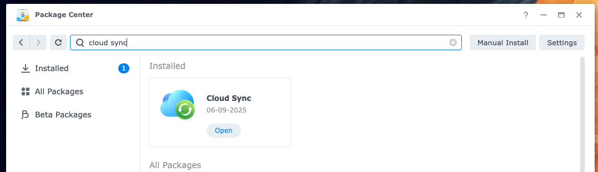
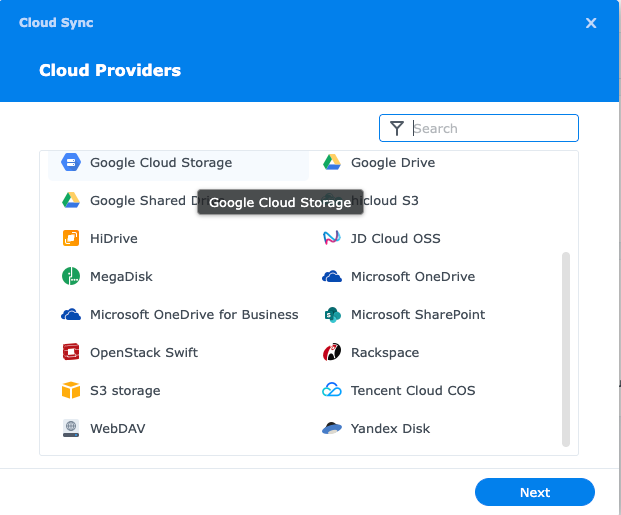
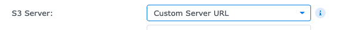
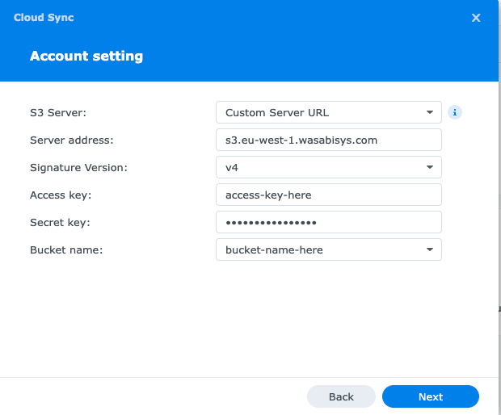

This document will assume you know the basics of using Wasabi and Synology, and will not go in to details on either, but will provide a rough overview

## Wasabi setup

You will need to have already created:

* Bucket
* User
* Keys

For the `policy` you should use the below

!!! tip "Bucket name"
    Replace `${bucket}` with the name of your bucket

```json
{
  "Version": "2012-10-17",
  "Statement": [
    {
      "Sid": "CloudSyncBucketPermissions",
      "Effect": "Allow",
      "Action": [
        "s3:ListBucket",
        "s3:GetBucketLocation"
      ],
      "Resource": "arn:aws:s3:::${bucket}"
    },
    {
      "Sid": "CloudSyncObjectPermissions",
      "Effect": "Allow",
      "Action": [
        "s3:GetObject",
        "s3:PutObject",
        "s3:DeleteObject",
        "s3:AbortMultipartUpload",
        "s3:ListMultipartUploadParts"
      ],
      "Resource": "arn:aws:s3:::${bucket}/*"
    }
  ]
}
```

??? note "Explain the policy to me"

    ```json
        {
          "Sid": "CloudSyncBucketPermissions",
          "Effect": "Allow",
          "Action": [
            "s3:ListBucket",
            "s3:GetBucketLocation"
          ],
          "Resource": "arn:aws:s3:::${bucket}"
        }
    ```

    This allows the NAS to list the bucket's objects and get the location of the bucket.

    Why this is required, I am not too sure. We've already created the bucket in a region

    [AWS Docs: GetBucketLocation](https://docs.aws.amazon.com/AmazonS3/latest/API/API_GetBucketLocation.html)

    But the API returns something like

    ```xml
    <?xml version="1.0" encoding="UTF-8"?>
    <LocationConstraint xmlns="http://s3.amazonaws.com/doc/2006-03-01/">us-west-2</LocationConstraint>
    ```

    ```json
    {
          "Sid": "CloudSyncObjectPermissions",
          "Effect": "Allow",
          "Action": [
            "s3:GetObject",
            "s3:PutObject",
            "s3:DeleteObject",
            "s3:AbortMultipartUpload",
            "s3:ListMultipartUploadParts"
          ],
          "Resource": "arn:aws:s3:::${bucket}/*"
    }
    ```

    Allows getting an object to recover, pushing objects, deleting them and then streaming multi part uploads

You should then attach this policy to the user

## Synology setup

Ensure you've got the `Cloud Sync` app installed from the Synology package Centre



Open Cloud sync, click **+** then scroll down and select `S3 Storage`



Click on `S3 Server: Amazon S3` and change this to **Custom Server URL**



Depending on what region you've made your bucket in, this is different

!!! note "Not tested with Alias URL's"

    Wasabi has the concept of _Alternative/ Alias_ URL's for their storage endpoints.

    [See here](https://docs.wasabi.com/v1/docs/service-urls-for-wasabis-storage-regions)

    I have not tested this setup with them, so if you have errors check your URL

| Region                            | Service URL                     |
|-----------------------------------|---------------------------------|
| Wasabi US East 1 (N. Virginia)    | s3.us-east-1.wasabisys.com      |
| Wasabi US East 2 (N. Virginia)    | s3.us-east-2.wasabisys.com      |
| Wasabi US Central 1 (Texas)       | s3.us-central-1.wasabisys.com   |
| Wasabi US West 1 (Oregon)         | s3.us-west-1.wasabisys.com      |
| Wasabi CA Central 1 (Toronto)     | s3.ca-central-1.wasabisys.com   |
| Wasabi EU Central 1 (Amsterdam)   | s3.eu-central-1.wasabisys.com   |
| Wasabi EU Central 2 (Frankfurt)   | s3.eu-central-2.wasabisys.com   |
| Wasabi EU West 1 (United Kingdom) | s3.eu-west-1.wasabisys.com      |
| Wasabi EU West 2 (Paris)          | s3.eu-west-2.wasabisys.com      |
| Wasabi EU West 3 (United Kingdom) | s3.eu-west-3.wasabisys.com      |
| Wasabi EU South 1 (Milan)         | s3.eu-south-1.wasabisys.com     |
| Wasabi AP Northeast 1 (Tokyo)     | s3.ap-northeast-1.wasabisys.com |
| Wasabi AP Northeast 2 (Osaka)     | s3.ap-northeast-2.wasabisys.com |
| Wasabi AP Southeast 1 (Singapore) | s3.ap-southeast-1.wasabisys.com |
| Wasabi AP Southeast 2 (Sydney)    | s3.ap-southeast-2.wasabisys.com |

If our bucket is in `eu-west-1`, we are going to use `s3.eu-west-1.wasabisys.com`

Fill out the name of your bucket, as well as access key ID



| Field name        | Explainer                                                                                                                                                                                                              |
|-------------------|------------------------------------------------------------------------------------------------------------------------------------------------------------------------------------------------------------------------|
| S3 server         | Use AWS defaults or use our own S3 compliant Endpoint                                                                                                                                                                  |
| Server address    | The URL of the S3 endpoint. **Do not** include `https://`                                                                                                                                                              |
| Signature version | Allows you to authenticate your requests to AWS resources, and Wasabi supports this in the `Host:` header [which is documented here](https://docs.wasabi.com/v1/docs/how-do-i-use-aws-signature-version-4-with-wasabi) |
| Access key        | Your AWS Access key from Wasabi                                                                                                                                                                                        |
| Secret key        | Your AWS Secret key from Wasabi                                                                                                                                                                                        |
| Bucket name       | Bucket name                                                                                                                                                                                                            |

## Creating tasks

This is out of scope of this document, [Synology have documentation](https://kb.synology.com/en-uk/DSM/help/CloudSync/cloudsync?version=7)
