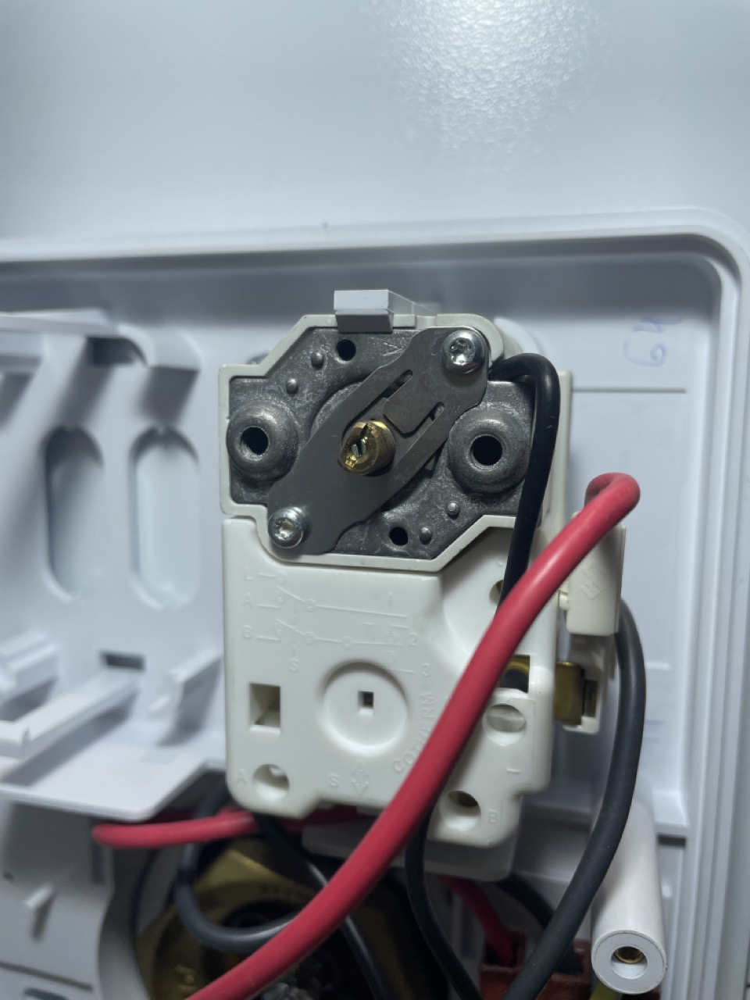

!!! Warning "About using this guide"
    This guide is designed only for the `TDX120ERP`

!!! note "Increased water usage"
    By reducing the temperature of the water, you will use more hot water to get the shower/ bath to the same temperature
    that you previously enjoyed.

    If you take short showers (and no baths) then I reccomend doing this, but if you have 2+ people that have long showers it's best to not bother

## Why

Recently it was identified that Heating the water was using around 43% of my monthly power bill.

## Power off the heater

See [Consumer unit](../cu/consumer-unit.md), and turn off the switch labeled `Immersion Heater`

## Open the Bottom cover

!!! danger
    Ensure that the power is switched off from the mains before opening

Remove the Screw on the right hand side using a Phillips Screwdriver

## Setting the temperature

We are able to set the temperature between the below values

| Maximum                               | Minimum                              |
|---------------------------------------|--------------------------------------|
| 68°C (154.4 freedom units) | 12°C (53.6 freedom units) |

Once the cover is open, locate the Thermostat.

!!! Info
    Familiarize your self with the below diagram.

    Turning to the left will **decrease** the heat

    Turning to the right will **Increase** the heat

    

=== "Turn the temperature down"

    Turn the screw towards the **left**

    You will hear a slight `click` noise as you go to the left. That will be the original heat setting.

=== "Turn the temperature up"

    Turn the screw towards the **right**

## Additional Information

