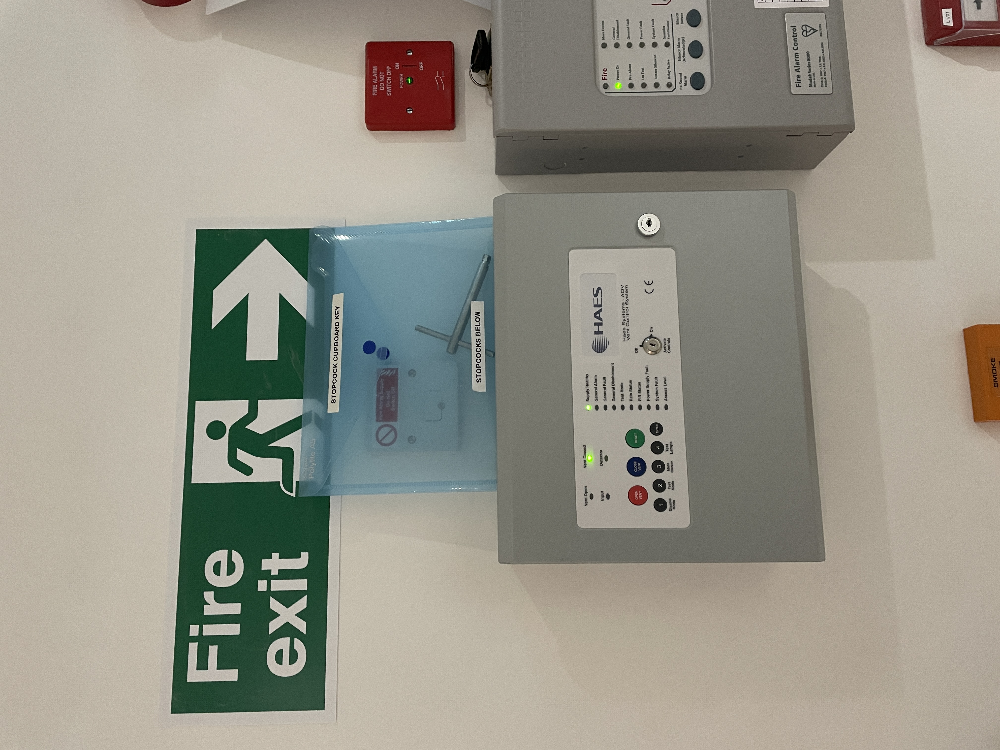
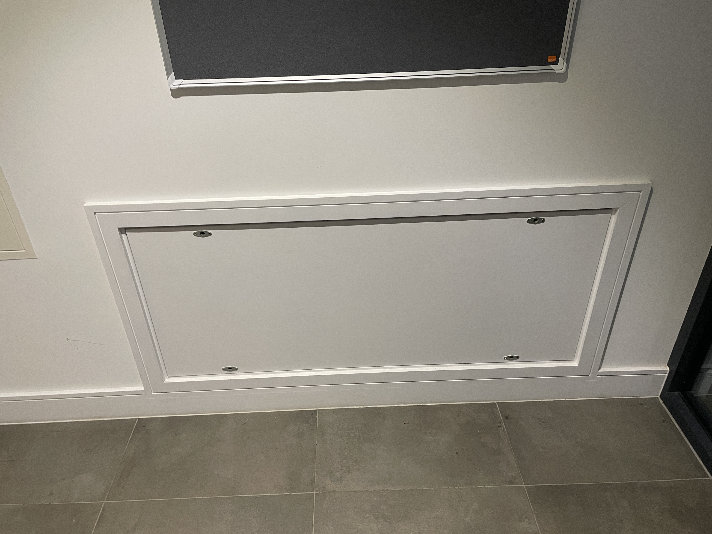

# Water

!!! warning "How to shut the water off"
    1. [At the valve](#how-to-turn-off-the-water-at-the-mains)
    2. [In the apartment](#how-to-turn-off-the-water-in-the-apartment)

## Where is my Shutoff valve

The shut-off valves are located in the **main entrance** on the **right hand side**  

## Which one is mine

The numbering is done Right to Left. On the Blue pipe will be written the number

## How to turn off the water at the mains

1. Take the key out the pouch

2. Place the key in the holes on the top of the board pictured below

3. Turn right
4. Pull the board off
5. Locate your valve
6. Turn it Clockwise 

## How to turn off the water in the apartment

1. Open the door holding the water tank
2. Locate the valve coming from the ceiling
3. Turn it in the direction the arrow shows