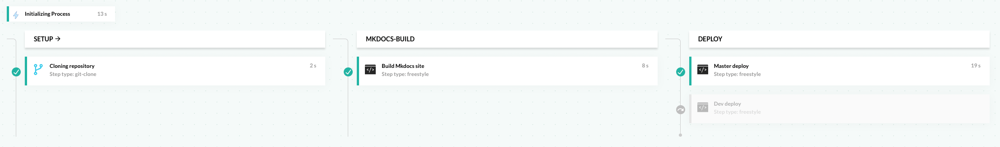

This is the _new_ documentation site for [breadNET](https://breadnet.co.uk)

## Other sites maintained
| Site name                         | Link                                                           |
|-----------------------------------|----------------------------------------------------------------|
| Main site                         | [breadnet.co.uk](https://breadnet.co.uk)                       |
| CV                                | [bradley.breadnet.co.uk](https://bradley.breadnet.co.uk)       |
| Kubernetes Manifest documentation | [kubernetes.breadnet.co.uk](https://kubernetes.breadnet.co.uk) |

## How this site works

Like mentioned [above](#:~:text=new%20documentation%20site%20for%20breadNET) - This is the _new_ documentation site,
replacing `bookstack.breadnet.co.uk` (Which is now offline)

I have decided to move towards an [SCM](https://git-scm.com) based site.

This means I write [markdown files](https://raw.githubusercontent.com/userbradley/documentation.breadnet.co.uk/master/README.md) and then using [mkdocs](https://mkdocs.org/) with the [material theme](https://squidfunk.github.io/mkdocs-material/)
the site gets built.

### How the site gets _built_

I have a CD pipeline that builds the site and copies it to the webserver

You can view the [Source code](https://github.com/userbradley/documentation.breadnet.co.uk/blob/dev/cd/codefresh-v1.yml) for the pipeline 
