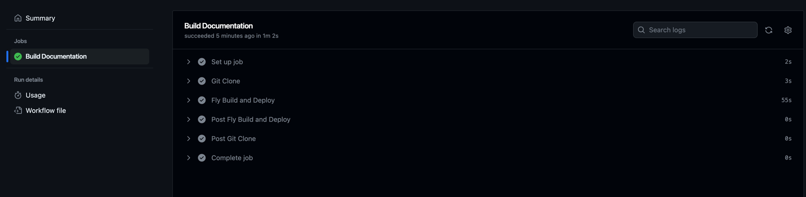

# Welcome

 

This site holds all past documents I wrote since starting in IT (2016) as well as new documents that I create.

This site gets updated [on average, once a day](https://github.com/userbradley/documentation.breadnet.co.uk/graphs/commit-activity)

I used to use [Bookstack](https://bookstackapp.com/?utm_source=breadnet&utm_medium=documentation&utm_campaign=documentation) but migrated as I got
fed-up of managing an ubuntu server

## Other sites maintained

* [breadNET](https://breadnet.co.uk/?mtm_campaign=documentation&mtm_kwd=mainpage)
* [My CV/ Resume](https://bradley.breadnet.co.uk/?mtm_campaign=documentation&mtm_kwd=mainpage)

## How this site works

This site replaces Bookstack. I decided that it was time to move towards something easier to manage, and that can be run pretty much
anywhere that docker runs.

It now runs on [fly.io](https://fly.io) and is powered by [mkdocs](https://www.mkdocs.org)

The cool part is now I just write markdown files, and the site gets built on commit to dev.

Once the dev site is checked and everything looks good, we can open a PR and merge to master.

### How the site gets _built_

I have a CD pipeline that builds a docker image, and publishes it to [fly.io](https://fly.io?ref_documentation-breadnet-co-uk)

I recently migrated from Codefresh to GitHub actions, so there is no longer a pretty photo of the pipelines

The pipelines are 60% faster since moving.

You can see the pipeline config on [GitHub Actions](https://github.com/userbradley/documentation.breadnet.co.uk/blob/master/.github/workflows/prod.yaml)
