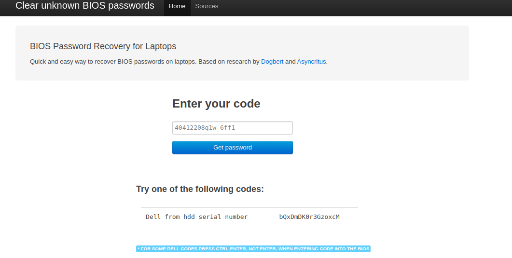

## What

When buying second hand computers off eBay, sometimes a Dell system will come with the below

```text
Hard-drive #NZFN901636Z-6FF1, the system internal HDD-0, is protected by a password authentication system. You cannot access data on this hard drive without the correct password. Please type in the hard drive password
```

This guide will show you how to bypass this

## How

Make a note of the Serial number. In the below screenshot it is the number after `#`


Navigate in your browser to [bios-pw.org](https://bios-pw.org)

Type the ID in, and click `get password`



Type the password in, and most importantly press **ctrl + enter**

Your system should now boot normally
