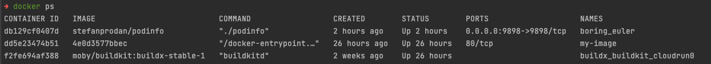

## Get running containers

--8<-- "docs/kb/docker/docker-ps.md"

It will display something like the below



We will be targeting the first container running

## Stream the logs

```shell
docker logs -f db129cf0407d
```

This command streams the logs coming out of the docker container to your cli

!!! tip "Short Container ID"
    We don't have to use the entire long `CONTAINER ID`, we can use the first 3 characters.

    === "Full CONTAINER ID"

        ```shell
        docker logs -f db129cf0407d
        ```

    === "Short CONTAINER ID"

        ```shell
        docker logs -f db1
        ```

## Additional Reading

[View Container Logs (Docker website)](https://docs.docker.com/config/containers/logging/)
