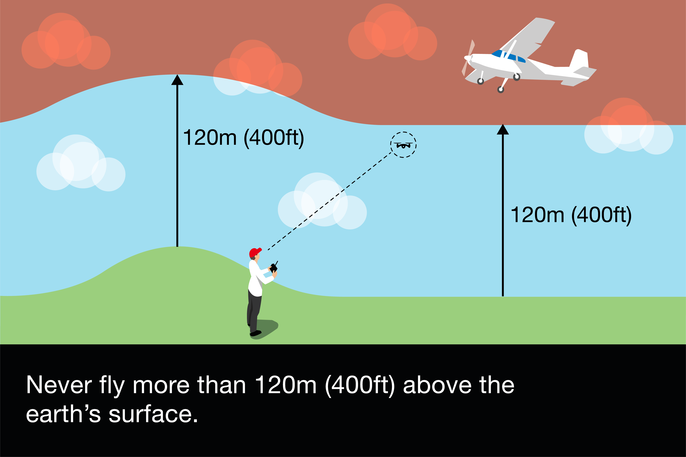

!!! note "Weight of the drone"
    We assume your drone weighs less than 250g

[Drone laws](https://register-drones.caa.co.uk/drone-code/where-you-can-fly)

## Maximum height

120 meters (400ft) from the ground

## Flying close to people

[You can.](https://register-drones.caa.co.uk/drone-code/where-you-can-fly#:~:text=you%20can%20fly%20closer%20to%20people%20than%2050m%20and%20you%20can%20fly%20over%20them)

Remember, you must never put people in danger. Even small drones and model aircraft could injure people if you don’t fly them safely.

If you’re flying a drone or model aircraft that’s below 250g, you can fly closer to people than 50m, and you can fly over them.

## Crowded people

Not allowed to fly near large crowds of people

## residential, recreational, commercial and industrial sites

[You can fly here.](https://register-drones.caa.co.uk/drone-code/where-you-can-fly#:~:text=250g%20at%20residential%2C%20recreational%2C%20commercial%20and%20industrial%20sites.)

You can fly small drones and model aircraft that are lighter than 250g at residential, recreational, commercial and industrial sites.

Remember, you must always fly safely.

### Examples of residential, recreational, commercial and industrial sites

#### Residential sites include

* individual residential buildings
* small groups of residential buildings
* housing estates
* villages
* cities and towns
* schools

#### Recreational sites include

* tourist attractions
* sports facilities
* beaches and parks
* theme parks

#### Commercial sites include

* shopping centres
* warehouses
* business parks

#### Industrial sites include

* factories
* docks
* rail and transport hubs

## Stay well away from airports, airfields, spaceports and aircraft

!!! danger "Prison"
    If you endanger the safety of an aircraft, you could go to prison for five years.

## Respect other people and their privacy

Don't take videos or photos of peoples back gardens or though their windows

## Make sure you can be clearly seen when you’re out flying

This is to enable people to contact you

## Keep photos and videos secure

Delete images you no longer need
