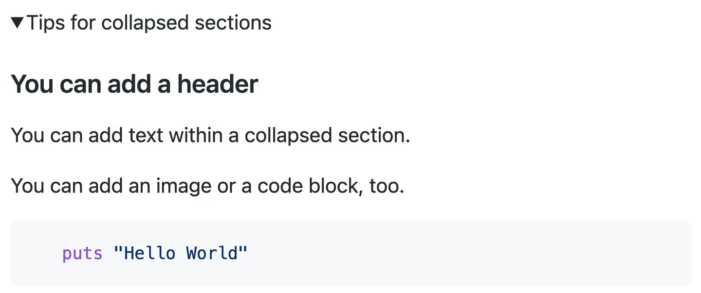

## What

In GitHub Markdown, we can create collapsed sections

## How

~~~
<details>

<summary>Tips for collapsed sections</summary>

### You can add a header

You can add text within a collapsed section.

You can add an image or a code block, too.

```ruby
   puts "Hello World"
```

</details>
~~~

The Markdown inside the `<summary>` label will be collapsed by default:


After a reader clicks `>`, the details are expanded:


