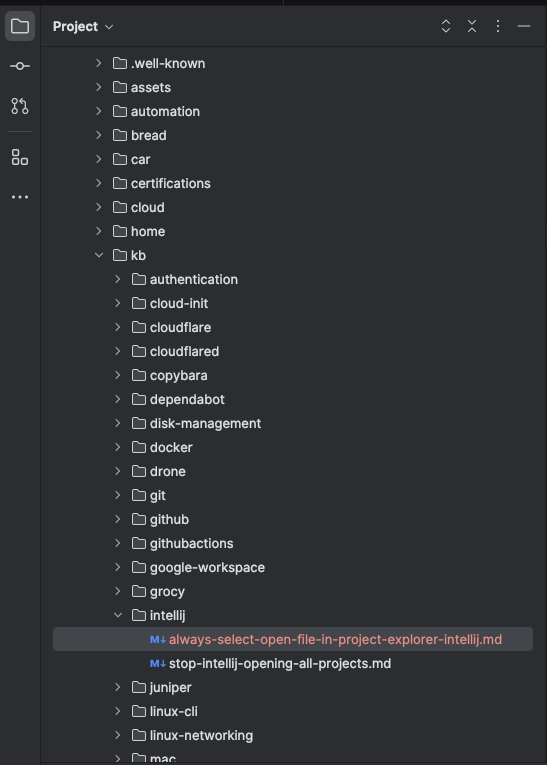
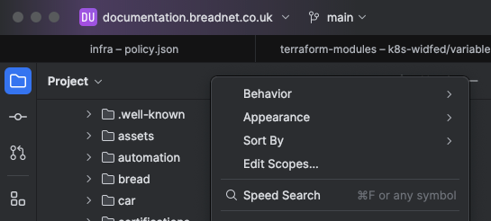
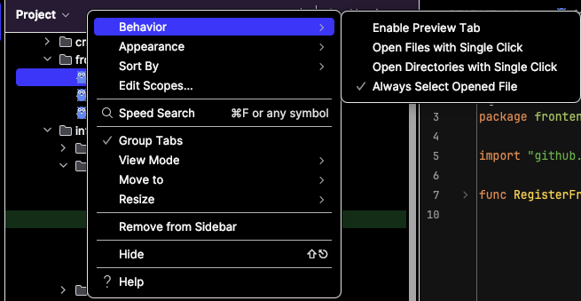

On older version of Intellij when you open a file from the search dialogue, it would expand the file in the Project tab

Example, editing `docs/kb/intellij/always-select-open-file-in-project-explorer-intellij.md`

## How to enable this

Right click on the bar above the project explorer

Click on **Behaviour** > **Always Select Opened File**

## Further reading

* [Intellij support post](https://intellij-support.jetbrains.com/hc/en-us/community/posts/13016403707666-Toggle-button-for-Always-select-opened-file-in-Project-view)
