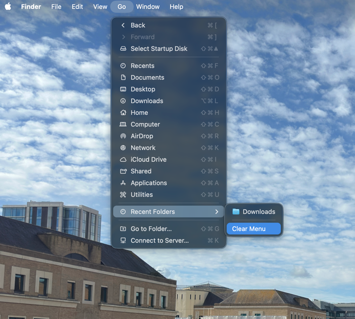

## Why

Perhaps you've been browsing files you do not want others to know exist, like your Will or something else.

## How

### Step 1: Finder UI

**Finder** > **Go** > **Recent Folders** > **Clear**



### Step 2: Shell

Open Terminal and paste the below

```shell
rm -rf $TMPDIR../C/com.apple.recentitems/
killall Finder
```
