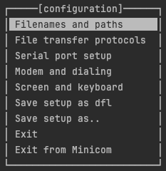
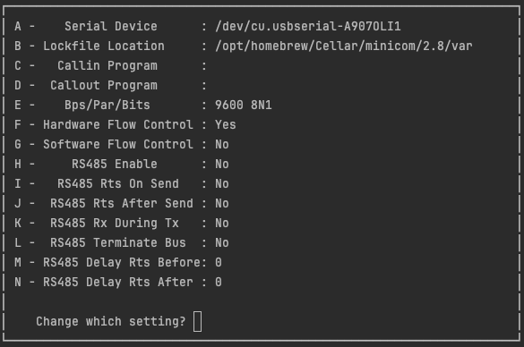
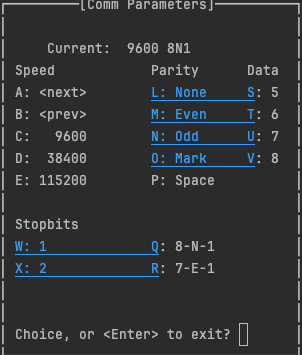
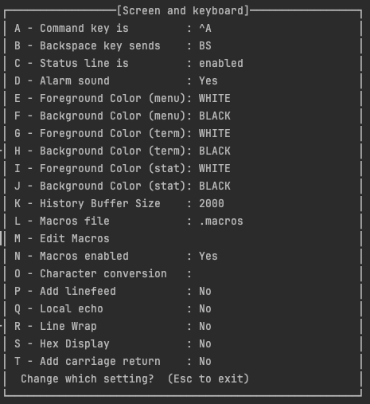

Macs are _supposedly_ well known for being able to **just work** with serial ports

In my professional opinion there are 2 simple systems we can use to connect to Serial ports on Mac

* Minicom
* screen

First we need to find the serial device

## Locate the serial device

Open your terminal and navigate to `/dev`

```shell
cd /dev
```

List all the `tty` devices

```shell
ls /dev/tty.*
```

_Hopefully_ there will be a device like `/dev/tty.usbserial-<>` where `<>` are letters and numbers

Make a note of the fill path of that device. We will need this later

Here's where you get to chose your own adventure


## Specific Setup

=== "Minicom"

    First we need to configure Minicom to use the correct device and Baud rate

    For your Baud rate, see if it's listed in the [Useful Baud rate](#useful-baud-rates) section, otherwise check your vendors user manual
    that you threw away because you're a man, and you don't need to manual (spoken by a man who threw away their manual)

    ```shell
    minicom -s
    ```

    You will see an interface like the below

    

    Use the Down arrow key to select `Serial port setup` then press enter

    Your page will now look like this

    

    Press the key `a` on keyboard, then paste in the path to the serial port.

    Press `enter` to exit once configured.

    Then press `e` and you'll get an interface like the below

    

    Press the letter `c` for `9600` or the letter `e` for the `115200` baud rate

    Once done, press `enter` to get back to the main menu

    Select `Save setup as dfl`

    ### Quality of life changes

    These changes are entirely optional, but make using minicom easier on a mac

    At the main menu screen, select `Screen and keyboard` then press enter

    Press the `a` key to selext `Command key is`

    

    Now press `Control + a`

    Press `enter` then select `save setup as dfl`

    You can now exit minicom, and then at your terminal type `minicom` and you'll be presented with a terminal console on your device

=== "Screen"

    Screen is the simpler of the setups

    To open the Serial connection we run


    ```shell
    screen /dev/tty.usbserial-A907OLI1 9600
    ```

    where `9600` is the Baud rate. See the [Useful Baud rate](#useful-baud-rates) section on some vendor specifics


## Usefull Baud rates

| Vendor Name | Rate                   |
|-------------|------------------------|
| Cisco       | (most commonly) `9600` |
| Juniper     | `9600`                 |
| Mikrotik    | `115200`               |
