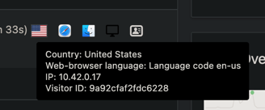

## Why

When running Matomo (FKA Piwiki) behind Cloudflare in Proxy mode, or using [cloudflared](../../kubernetes/k3s/cloudflare-tunnels-on-k3s.md)
the IP address isn't always the Public IP address of the user, but instead the edge node of Cloudflare

An example is below



## Solution

Edit the `config.ini.php` file and add the below under `[General]`

```toml
[General]
proxy_client_headers[] = "HTTP_CF_CONNECTING_IP"
proxy_client_headers[] = "HTTP_X_FORWARDED_FOR"
proxy_host_headers[] = "HTTP_X_FORWARDED_HOST"
```

If you're doing this on Kubernetes, then you need to have a PVC set up for this, as we cant [set environment variables for lists](https://plugins.matomo.org/EnvironmentVariables#:~:text=Configuration%20arrays%20are%20currently%20not%20supported%2C%20for%20example%20you%20cannot%20define%20which%20Plugins%5B%5D%20should%20be%20loaded.)
