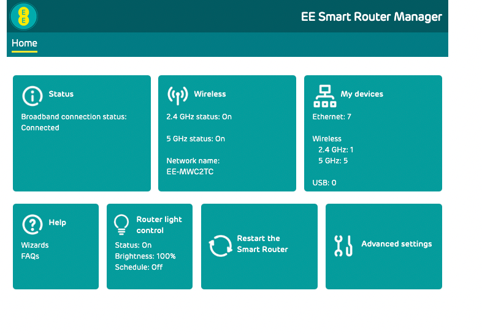
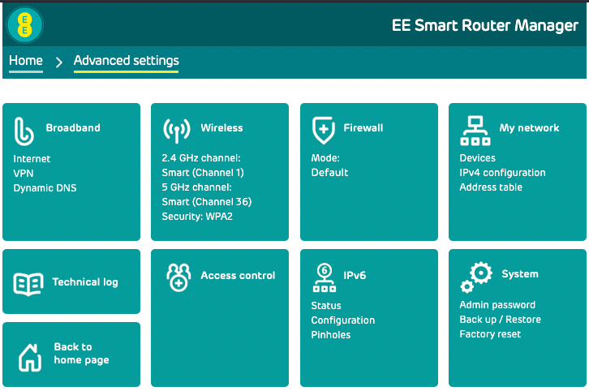
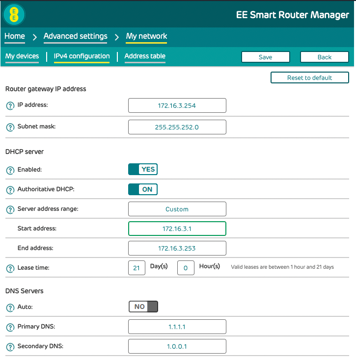
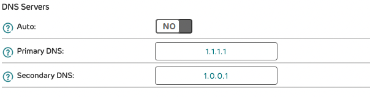

## Why

You want to configure alternative DNS servers that don't belong to EE

## How

Navigate to your routers management IP address

Unless you've changed it, EE will be one of the below:

* [http://192.168.1.254](http://192.168.1.254)
* [http://192.168.1.1](http://192.168.1.1)

Click on `Advanced Settings`

Click on `My Network`

Click on `IPV4 configuration`

You have the choice on what DNS servers you want to use.

Some choices are below

| Provider name | IP address                      |
|---------------|---------------------------------|
| Cloudflare    | `1.1.1.1` and `1.0.0.1`         |
| Google        | `8.8.8.8` and `4.4.4.4`         |
| Quad9         | `9.9.9.9` and `149.112.112.112` |

Click `Auto` and disable it

Insert the `Primary DNS` and `Secondary DNS` in to the webUI

In the above I have used `1.1.1.1` and `1.0.0.1` which is Cloudflare
