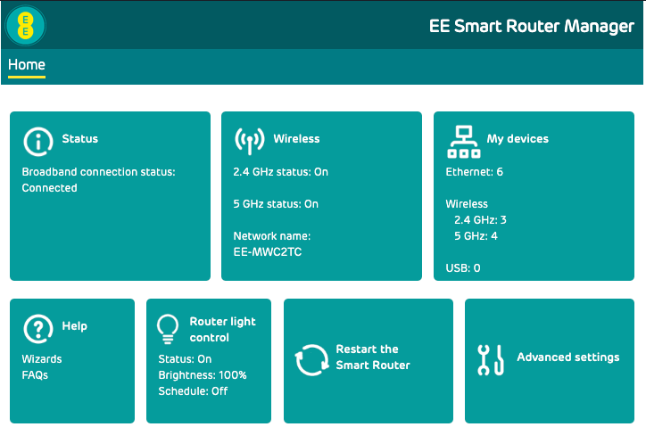
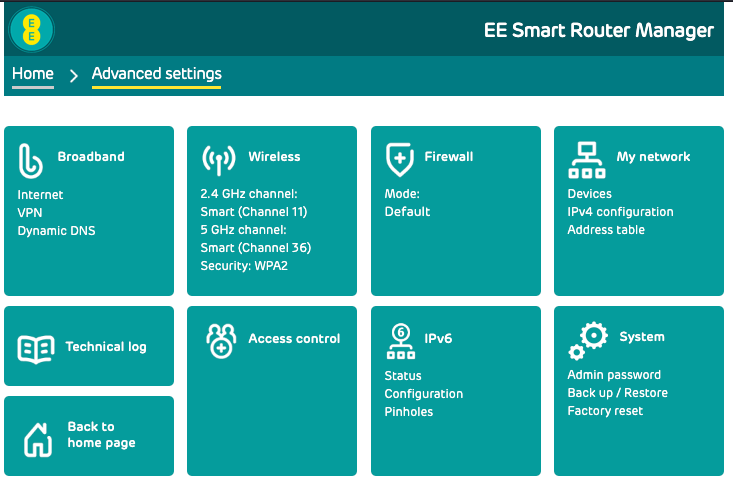
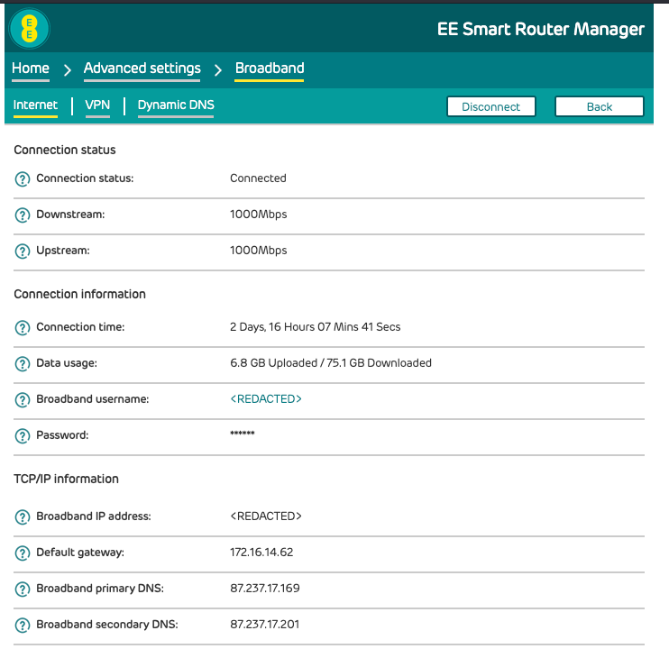
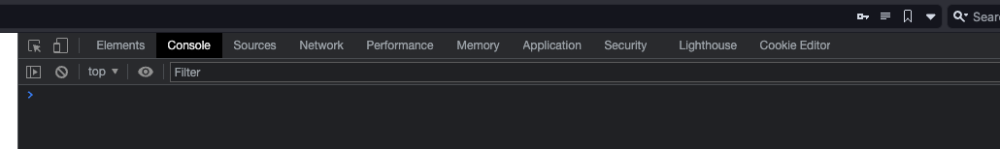
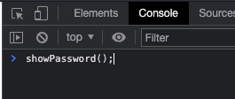
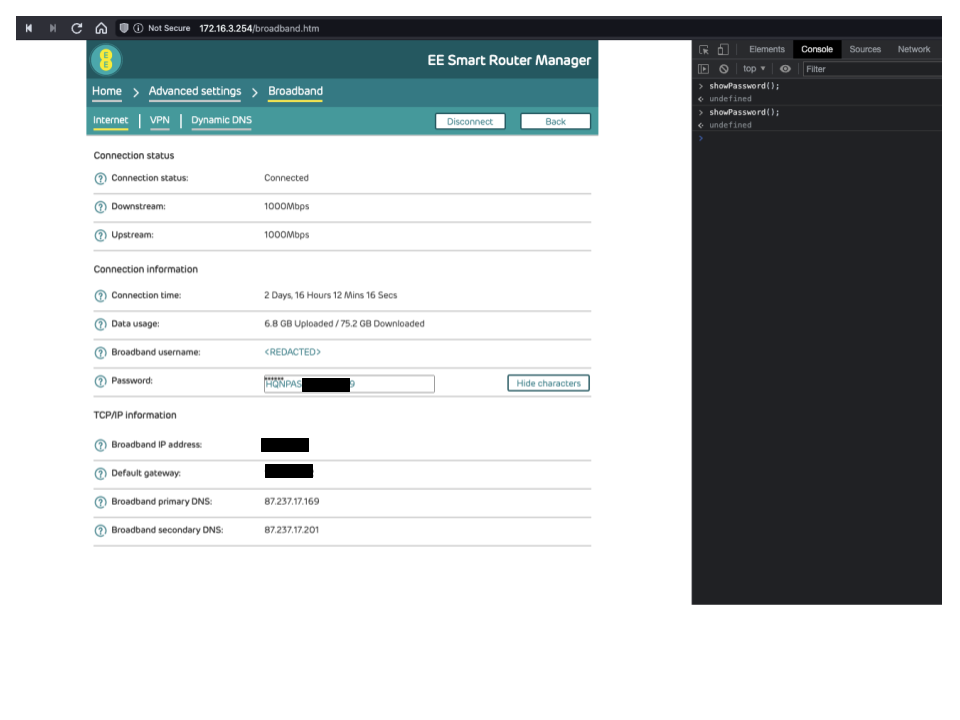

!!! warning "I accept no responsibility"
    You're probably an adult, and probably chose to follow this with your own free will.

    I accept no responsibility if this breaks things.

## Why

If you want to use a different router with your EE connection, you need to know the PPPoE username and password.

On the EE form, there is a user who claims that the password is made up of the username, but EE have since changed this

## How to get the password

### Login to your router

Browse to the Ip address (Probably [192.168.1.254](http://192.168.1.254))

Click on `Advanced Setings`



Click on `Boradband`



You will need to log in with the password on the bottom of your router.

You should see a page like the below



### Open Dev tools

On your keyboard press `f12` (on a mac `fn` + `f12`)

Click on `Console` on the Dev tools



### Find the password

With Dev Tools open on the `Console` tab, paste in the below

```javascript
showPassword();
```

Press enter



You will see the password show up, you will need to be quick to copy and paste it out to a notepad document



You are now free to do what ever you want with this password.
