## Why

Due to how the VPN is set up, the TLS will re-negotiate every 24 hours.

This means that once every 24 hours the connection will drop.

## How do I know the connection has dropped

You will have no internet

## How to resolve it

### Connect to the router

!!! note "Use another device for this"
    Due to how the network is set up, you cant use a device on the VPN network to access the router

=== "Winbox"

    Search for `Winbox` on your computer.

    Type in the IP address of the router

    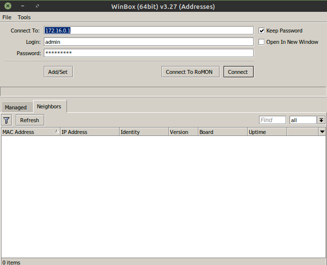

    Type in the password

    Click `Connect`

=== "Website"

    Navigate to the Router's IP address

    Type in your username and password

    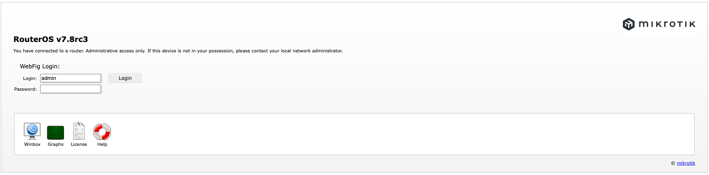

    Click `Login`

### Locate the new IP address

=== "Winbox"

    Click `IP` then `Address`

    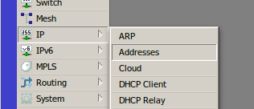

    Make note of the IP address of the VPN tunnel. It will probably be called `London`

    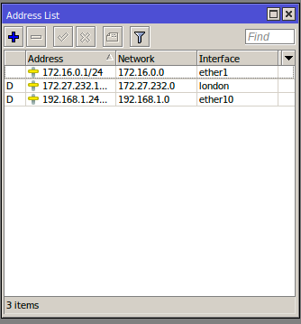

    In our example, the IP address is `172.27.232.9`

    (_nb: this is an old screenshot, just use your imagination_)

=== "Website"

    Click `IP` then `Address`

    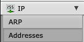

    Make note of the IP address of the VPN tunnel. It will probably be called `London`

    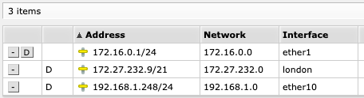

    In our example, the IP address is `172.27.232.9`

### Update the IP address

=== "Winbox"

    Navigate to `IP` > `Firewall`

    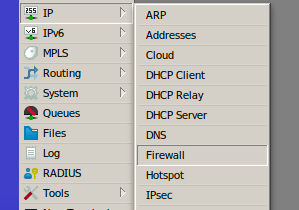

    Click on the `NAT` tab

    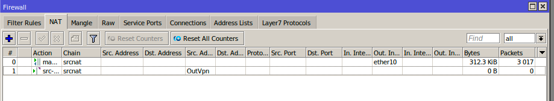

    Then **double-click** on the `src-nat` rule (_one at the bottom_)

    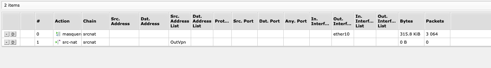

    Click on `Action`

    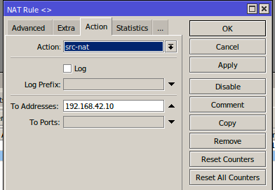

    !!! info "It will have an address already in it"
    This is expected. We need to update it

    Type the new Address in to the box.

    Click `apply` then `ok`

=== "Website"

    Navigate to `IP` > `Firewall`

    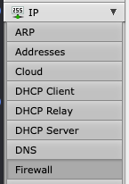

    Click on the `NAT` tab

    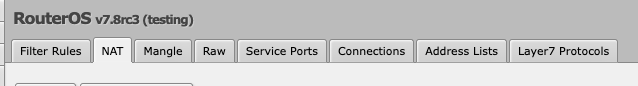

    Then **double-click** on the `src-nat` rule (_one at the bottom_)

    

    Scroll down till you find a field called `To Address`

    !!! info "It will have an address already in it"
    This is expected. We need to update it

    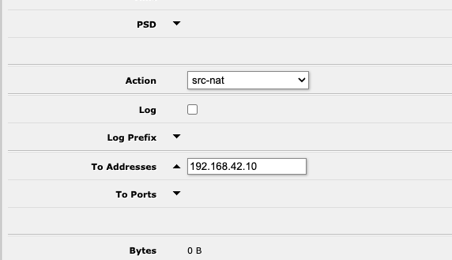

    Type the new Address in to the box.

    _the field will go blue once changed_

    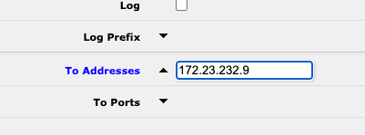

    Scroll to the top of the page, and click `apply` then `ok`

    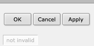
