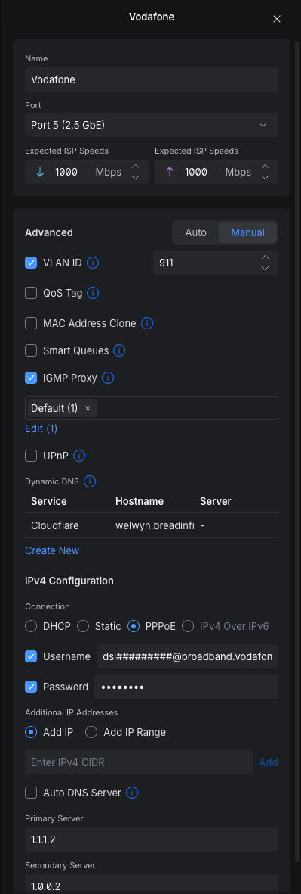

## What

If you have no intentions to use the locked down, cheap Vodafone router that they supply you, you will need to have the PPPoE credentials
in order to use a third party router.

If you are unsure what PPPoE is, please refer to the [Wikipedia page on PPPoE](https://en.wikipedia.org/wiki/Point-to-Point_Protocol_over_Ethernet)

## Some notes

As far as I can tell, this guide will only work on CityFibre, due to the VLAN. However the rest of the guide remains true

## Getting your PPPoE credentials

You will need to contact customer service.

Be firm but polite around needing the credentials. They will give you the usual garbage about how _uSINg A thiRD parTy RouTEr May ADd isSuES aND InSTability WE MaY NOt be ABle to troubLEsHoOT iSsUEs_ - and to that I say... Poo you!

You can use the below

```text
Hello Support. Please provide me with the PPPoE username and password for my connection.

I need this copy and pasted in to the chat, as some characters (like 0 and o) look similar.

If possible please can you text this to me
```

## PPPoE details

Regardless of your router, you will require the below details

| Field name | Value                                   |
|------------|-----------------------------------------|
| `VLAN ID`  | `911`                                   |
| Username   | `dsl#########@broadband.vodafone.co.uk` |
| Password   | What ever Vodafone gave you             |

## Add Vodafone to Unifi

Navigate to **Settings** > **Internet**

Click on the interface that has your cable plugged in to.

Give it a name, for example `Vodafone`

Under the Advanced field, click `Manual`

Set the below:

* `VLAN ID` set it to `911`
* IGMP Proxy `Default`
* IPv4 Configuration `PPPoE`
* Username: `dsl#########@broadband.vodafone.co.uk`
* Password: _What vodafone provided_

An example config is below:


