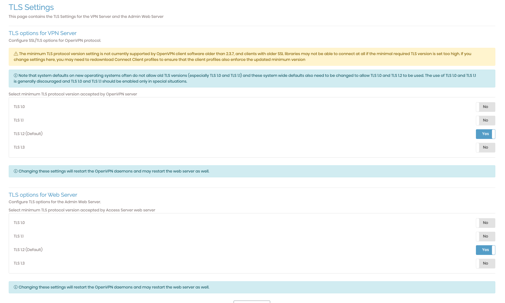

# Connecting Mikrotik to OpenVPN AS

!!! warning "This page is a brain dump"
    So it should not be relied on, and probably won't ever be updated 





issue:

```text
IP packet with unknown IP version=0 seen
```

```markdown
/ip neighbor discovery-settings set discover-interface-list=none
```

```markdown
ca.crt  client.crt  client.key
```

```shell
certificate import file-name=ca.crt 
certificate import file-name=client.crt 
certificate import file-name=client.key 
```

```shell
ppp profile add name=OVPN-client change-tcp-mss=yes only-one=yes use-encryption=required use-mpls=no
```


http://missinglink.github.io/mikrotik-openvpn-client/