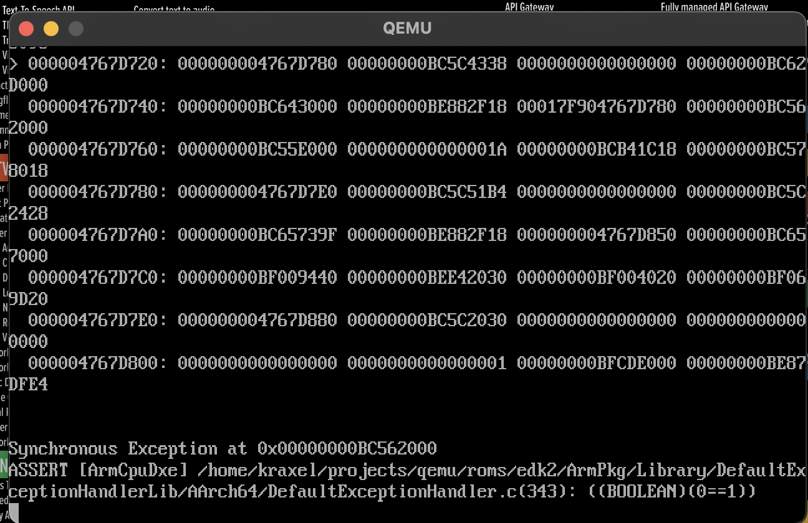

## Why

Once again, my container runtime broke on my mac, and I refuse to go to Docker.

I had an issue with QEMU would just break



I had a look and it seems you can run Podman on a mac using Lima

## How

### Install Lima

```shell
brew install lima
```

### Create a podman Vm

```shell
lima create template://podman
```

### Connect Podman

You will get a message like the below once Lima has started up

```text
INFO[0071] Message from the instance "podman":
To run `podman` on the host (assumes podman-remote is installed), run the following commands:
------
podman system connection add lima-podman "unix:///Users/me/.lima/podman/sock/podman.sock"
podman system connection default lima-podman
podman run quay.io/podman/hello
```

Simply run

```shell
podman system connection add lima-podman "unix:///Users/$(whoami)/.lima/podman/sock/podman.sock"
podman system connection default lima-podman
```

### Test

```shell
podman run hello-world
```

??? note "Example output"

    ```text
    podman run hello-world
    Resolved "hello-world" as an alias (/etc/containers/registries.conf.d/000-shortnames.conf)
    Trying to pull quay.io/podman/hello:latest...
    Getting image source signatures
    Copying blob sha256:6f7d332c6972d7de13acdd07eafee248b5435ff1b69d22d1cbbe9c64198d4777
    Copying config sha256:1b10fa0fd8d184d9de22a553688af8f9f8adbabb11f5dfc15f1a0fdd21873db2
    Writing manifest to image destination
    !... Hello Podman World ...!

             .--"--.
           / -     - \
          / (O)   (O) \
       ~~~| -=(,Y,)=- |
        .---. /`  \   |~~
     ~/  o  o \~~~~.----. ~~
      | =(X)= |~  / (O (O) \
       ~~~~~~~  ~| =(Y_)=-  |
      ~~~~    ~~~|   U      |~~

    Project:   https://github.com/containers/podman
    Website:   https://podman.io
    Documents: https://docs.podman.io
    Twitter:   @Podman_io
    ```
