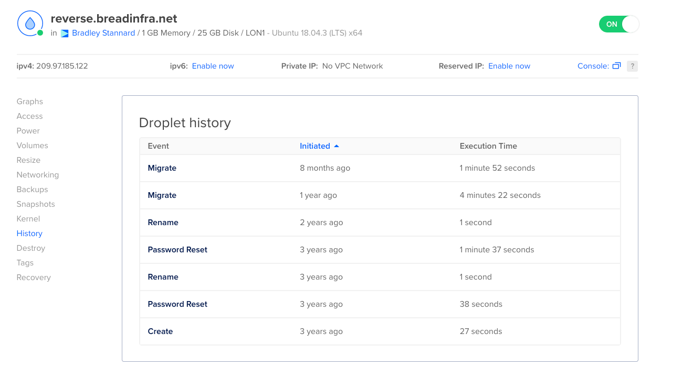
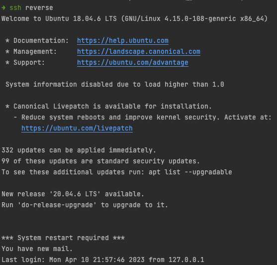
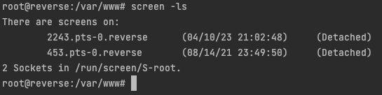
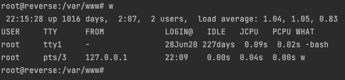
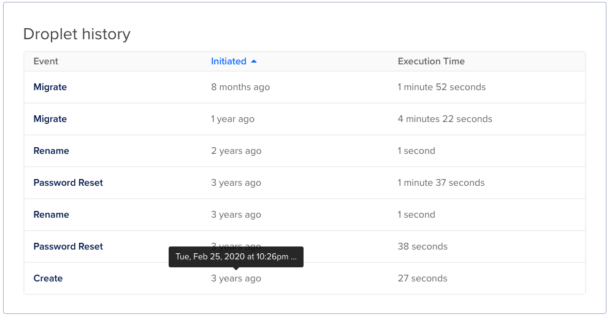
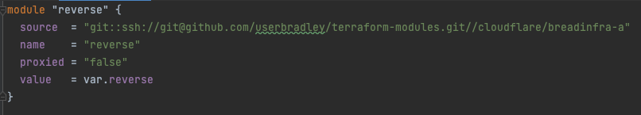
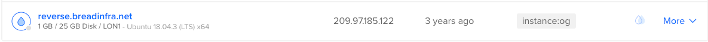
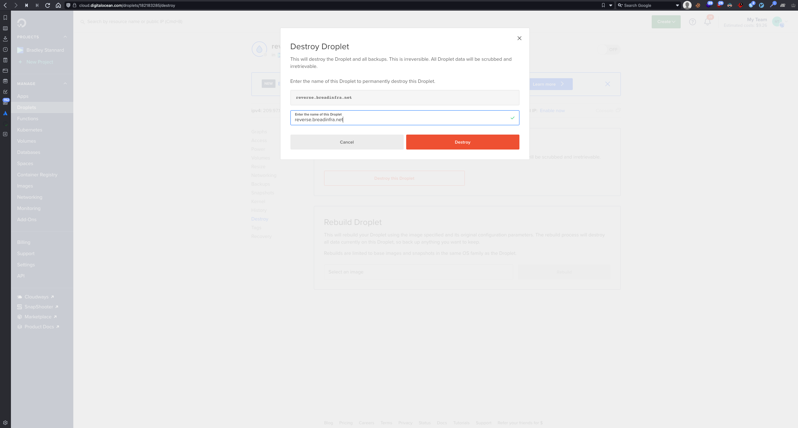

## What is this page

This page is dedicated to the server that ran breadNET, all the way from the start.

This was the first ever server I deployed to the cloud, and it's been running from: **25th February 2022 at 10:26 PM** 
till **10th April 2023 11:51 PM**

It ran (in no specific order): 

- Bookstack
- Ghost
- Mariadb
- matomo
- Books with Brook
- breadNET Corp
- CV
- Ignore
- IP Resolver
- Kirsty Lawrie's site
- Privacy
- Static site
- Changelog
- Jellyfin (Reverse Proxy)
- Gitlab (Reverse Proxy)
- Jira (Reverse Proxy)
- Leantime (Reverse Proxy and hosted on)
- Kanboard
- Passbolt
- Learning docker

This server that's been trundling away since 2020 has done me well, and despite my career being somewhat like a farm vet

> Cattle not pets

I can't help but feel a little sadness come over me as I delete this instance, and it's IP address be released in to the wild

## An ode to reverse

```markdown
Oh, mighty server reverse,
Thy power I cannot traverse.
For thou hast been my faithful guide,
Teaching me skills that can't be denied.

With Docker, PHP, and Terraform too,
I learned to build and deploy anew.
And with Ansible, thy magic wand,
My sites run smoothly, always fond.

Thou art the heart of my digital home,
A steadfast presence that never doth roam.
For all the times I've called on thee,
Thou hast answered, without a plea.

And so, my dear reverse, I sing
This ode to thee, my eternal thing.
For all the knowledge thou hast given,
My gratitude shall forever be driven.

Oh, mighty server reverse,
Thou art a teacher, a savior, a curse.
But through it all, I shall remain,
Forever grateful for thy endless gain.
```

## Stats and Screenshots

### Uptime


### Digital ocean control panel



### Login banner



### Screen session running since 08-14-21



### The idle session



### Creation date



### The DNS record for the server



### Server sitting in the console



## Goodbye old pal

