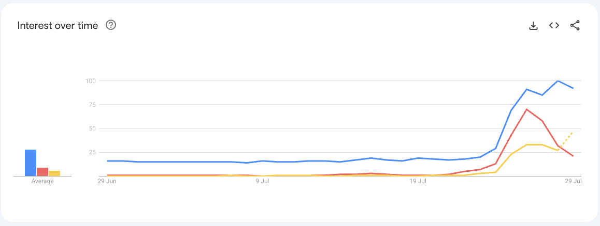
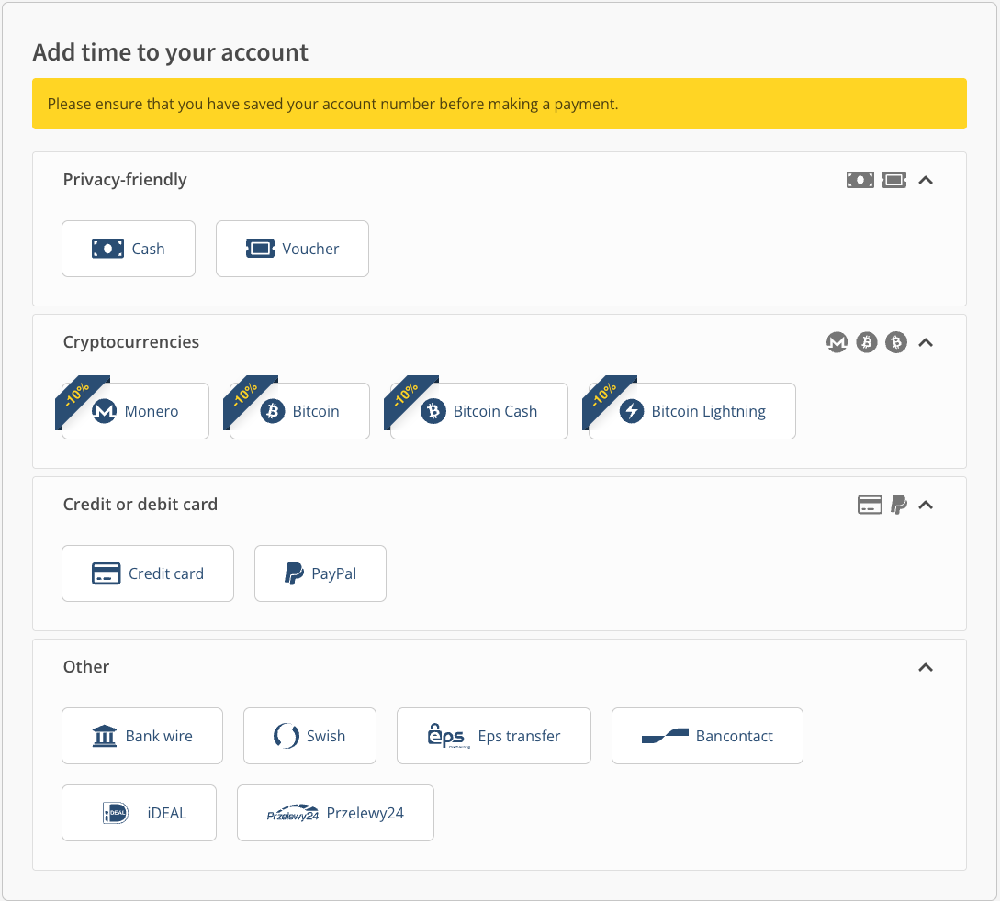
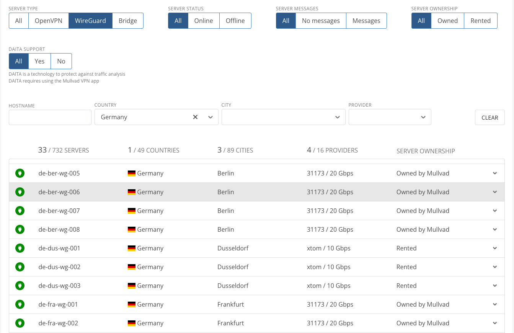
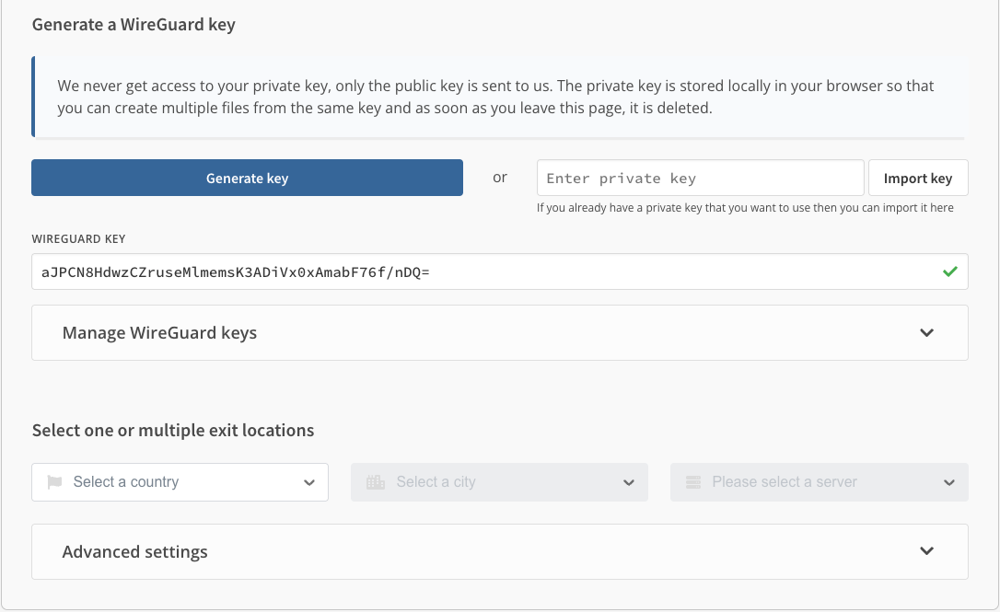
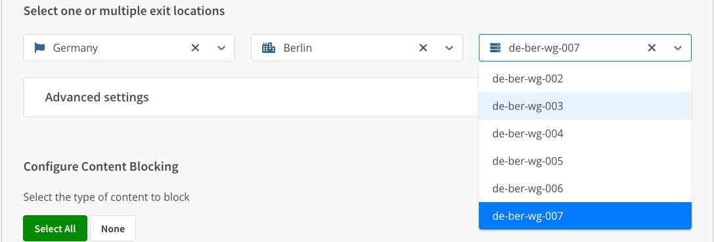
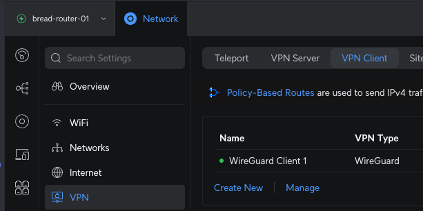
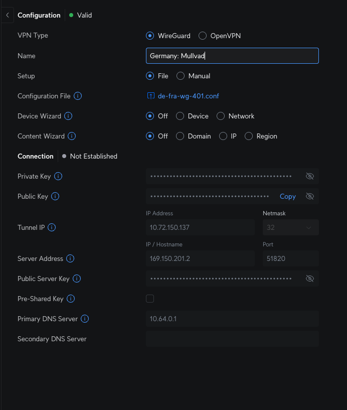
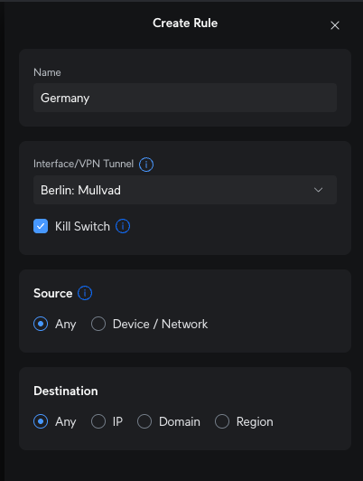

## Why

You want to route your traffic over a VPN to avoid ISP restrictions or [country based stupidity](https://en.wikipedia.org/wiki/Online_Safety_Act_2023)

??? danger "The real reason why"

    UK Government has decided that you need to verify your identity to access certain sites they deem dangerous. This has come
    in to play via the [Online Safety Act.](https://www.gov.uk/government/publications/online-safety-act-explainer/online-safety-act-explainer)

    The law is very wide and sweeping, meaning like [Wikipedia: Eating Disorder](https://en.wikipedia.org/wiki/Eating_disorder)
    require age verification, according to [gov.uk: Content that is harmful to children](https://www.gov.uk/government/publications/online-safety-act-explainer/online-safety-act-explainer#:~:text=self%2Dharm-,eating%20disorders,-or)

    This becomes a very slippery slope in to locking information behind something even worse than a paywall or a cookie banner,
    your real world identity.

    Wikipedia have said that this act ["violate our commitment to collect minimal data about readers and contributors"](https://www.bbc.co.uk/news/technology-65388255)

    More can be read [on Wikipedia](https://en.wikipedia.org/wiki/Online_Safety_Act_2023) about the law before it's too late.

    VPN searches have gone up massively since the laws came in to play

    

    Finally, if you are in the UK, [Please consider signing the petition to Repeal the Online Safety Act](https://petition.parliament.uk/petitions/722903)

## How

You will need

* Mullvad account
* Access to Unifi Console

### Mullvad account

??? tip "I want to remain more anonymous"

    There is a limit to how anonymous one can remain, but if you wish you can create your account over TOR

    Please copy and paste the below `.onion` site in to your TOR browser

    ```text
    http://o54hon2e2vj6c7m3aqqu6uyece65by3vgoxxhlqlsvkmacw6a7m7kiad.onion/
    ```

    You can then follow the rest of the documentation

Navigate to [https://mullvad.net/](https://mullvad.net/)

Click **Get Started** on the website

Click **Generate an account number**

!!! tip "Make a note of this"
    Write it on a piece of paper, and keep it safe. If you want to add credit or add more devices, you need this.

You will then be greeted with a page like the below



You have several options on how to pay for time to be added to your account. Mullvad do not offer monthly discounts,
promotions etc., nor do they advertise much. They offer their services for €5 a month.

If you want your account to be active for 8 months, you send them €40. Very simple. Go through your payment method of choice, and then
your account will say something like

```text
Paid until
August 25, 2025 at 04:39 AM
```

### Create Wireguard VPN Config

Wireguard is considerably faster than OpenVPN, for this reason we will be using Wireguard.

First decide on what Country you want to use, if you're using this to bypass UK restrictions, pick a close european country.

For this example I will be picking Germany.

Set `Server type` to **WireGuard**



We are going to pick `de-ber-wg-007`, copy that to your clipboard and then head back to your account

Navigate to **WireGuard configuration** in your account

Click **Generate key**



You will then need to set your server location and specific server.

Fill out the country from the country you chose earlier. In our example we're using `Germany`, and our server is in Berlin



Now select **Advanced settings** and for **Tunnel traffic** select only `IPv4`

!!! note "Tunnel IPv4 and IPv6"
    I've had issues with Unifi and tunneling both V4 and V6 traffic, so your mileage may vary

Then click **Download file** and keep this somewhere to hand

### Unifi Setup

Navigate to your Unifi controllers IP address, or use the _site manager_ interface: [https://unifi.ui.com](https://unifi.ui.com)

Select your controller

Navigate to **Settings** (Gear icon) > **VPN** > **VPN Client**



Click `Create New`

Give it a name, something like `<location>: Mullvad` works

Upload the config file, and it will fill out all the Details for you



### Configure routing over the VPN

You can chose to either route specific devices, networks, IP's or domains over the VPN.

How you do that is up to you.

This guide will show you the page, then you can decide

Navigate to **Policy Engine** > **Policy-Based routes**

Click `Create Entry`

Here you need to set `Interface/VPN Tunnel` to the one you just set up. You can decide what hosts to send over the
tunnel, etc



## Need more help

If you need more help, please feel free to open an issue on my [Git repo](https://github.com/userbradley/documentation.breadnet.co.uk/issues)
and I will be more than happy to help!
