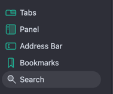
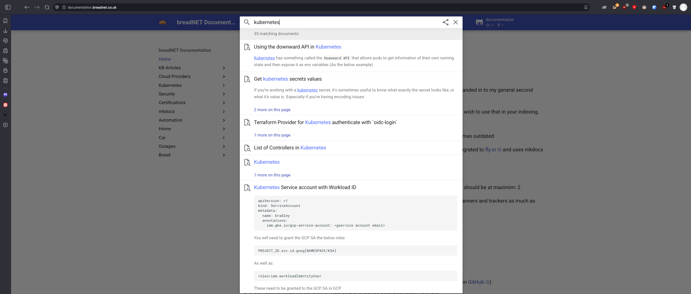

## Why

I refer back to my documentation site a lot. Naturally I wrote this site for my self first, and then you (the reader) -
so it makes sense that I want quick access to search this site when I need something.

In Vivaldi browser you've got the ability to add custom search engines

## How

Open Vivaldi Settings and navigate to **Search**

Click `+` then give it a name like `Documentation`

For nickname use `d`

For URL use `https://documentation.breadnet.co.uk/?q=%s`

It should now look like this

## How to sue

In your URL bar type `d kubernetes` and press enter.

Your URL bar will look like

When you press enter, it will pre-fill the search bar and load the results

