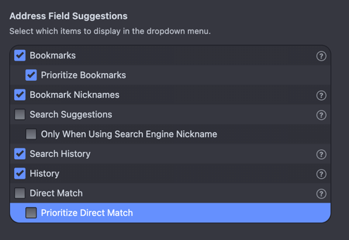
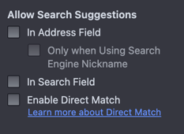

## What

Direct match, in my opinion, is scummy from Vivaldi who says they are a privacy respecting browser.

When you type `Amazon` in to the URL bar it does the below

Either sends you to the below as a Bookmark

```
https://vivaldi.com/bk/amazon-gb-bk
```

OR

```
ww44.affinity.net/sssweb?enk=dff30b161f959356320b33920b26ad23b7bfd77f9e0c589daff9877bf850ce13b568a0c70706c125e9b7fa764ab128aba6caae72e14b494ba91497f9cbfbb12fcd797452a7fe60dda10b805895fdf708763a226349b04a6c7805aa752f6b6d0769c36b7ce5195121
```

Both of these feel wrong, as they have the ability to fingerprint you.

This is called `Direct match` in Vivaldi.

## How

Open Settings and navigate to `Address Bar`

On the right, deselect `Direct match` and `Prioritise Direct match`



Navigate to **Search** in Settings and de-select `Enable Direct Match`


