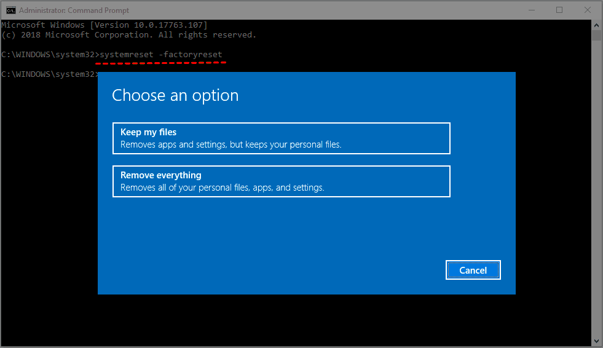
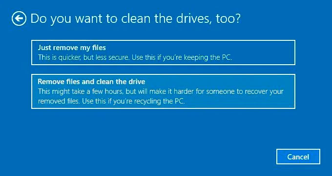

## Why

When passing a laptop to a new person, selling or donating you want to remove all personal documents and settings

## How

### Open command prompt as Administrator

1. Open the windows start menu
2. Type `Command Prompt`
3. Right-click on the black icon and the words
4. Click `Run as Administrator`

### Open the reset dialogue

In the command prompt window (Black box)

Type the below

```powershell
systemreset –factoryreset
```

Press the enter key

### Reset everything

A blue window similar to the below should open



Select the option that says `Remove Everything`

!!! warning "Remove everything"
    This option will delete *everything* on the computer, returning it to how you got ir from the store

### Clean the drives

You will see a page like the below



Select `Remove files and clean the drive`

### Ready to reset

You will see a final window that says `Ready to Reset this PC`

!!! warning "Resetting will wipe everything"
    This is your last chance to back out, and stop. Continuing will remove all data from the device

Click `Reset`

## FAQ

### How long will this take

30 minutes to 2 hours

### The computer has restarted

This is normal. Leave it for 2 hours and then it will be done

### Can I recover files after resetting the computer

!!! danger
    No
