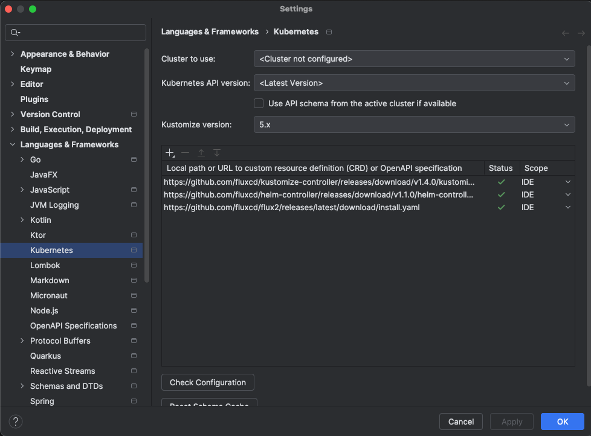

## Why

When editing Flux files, you'd like to have auto-completion

## How

Open IntelliJ settings and navigate to **Language & Frameworks** > **Kubernetes**

Click the `+` button then put in

```text
https://github.com/fluxcd/flux2/releases/latest/download/install.yaml
```

Click **Check Configuration** and they should all have green arrows


