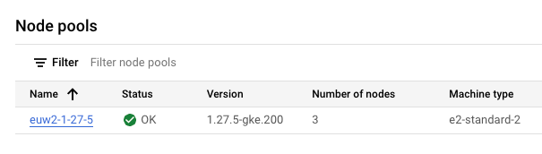

## What

In GKE, if you want to upgrade a node pool, or take one down for maintanance, this is the easiest thing to follow

## How

### Locate the pool name

In GKE console, navigate to the Cluster then click `NODES` and make note of the pool name



### Cordon Node

```shell
kubectl cordon -l cloud.google.com/gke-nodepool=<pool name>
```

### Drain node

```shell
kubectl drain -l cloud.google.com/gke-nodepool=<pool name> --delete-emptydir-data --ignore-daemonsets --force
```

### Delete old nodes

```shell
kubecl delete node -l cloud.google.com/gke-nodepool=<pool name>
```
