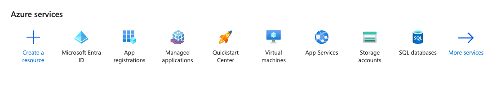
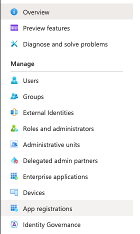
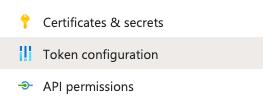
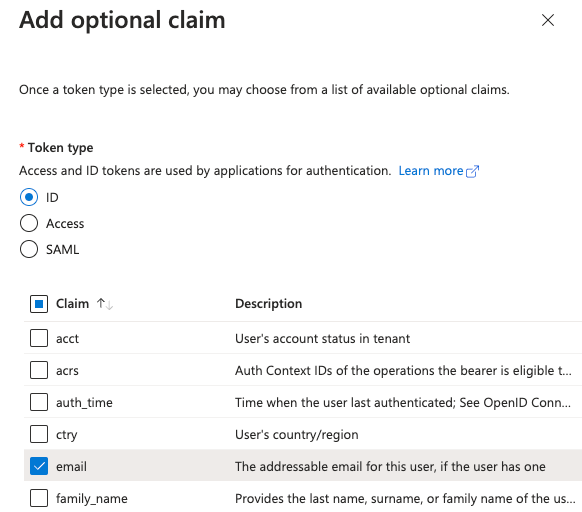
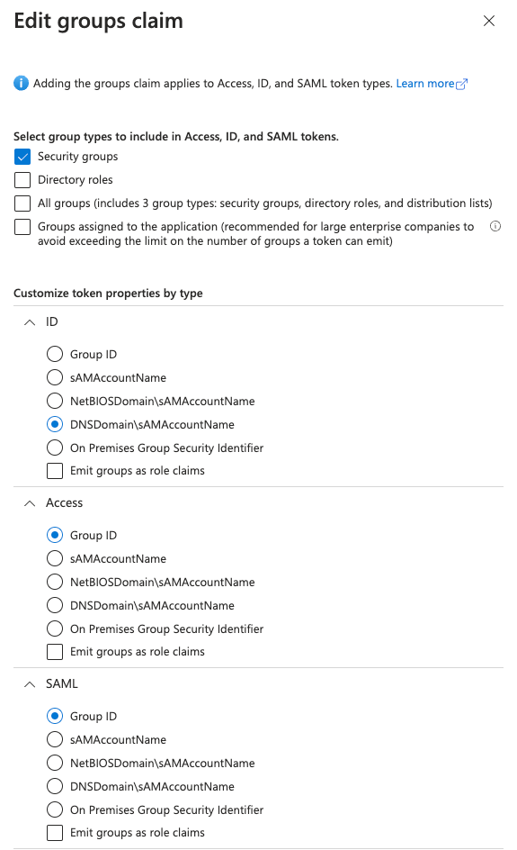

## What

Kubernetes has an inbuilt user (similar to admin I guess) that is identified by a Certificate

You can create more users by signing more certs, but this is not scalable.

We are able to use OIDC in K3s (Or any Kubernetes cluster) to **authenticate** and **authorize** users to do things

## Terminology

If you are new to this whole Kubernetes and OIDC, these words get confusing. Especially the difference between _Authenticate_ and _Authorize_

| Word          | What it means                                                                                                                                           |
|---------------|---------------------------------------------------------------------------------------------------------------------------------------------------------|
| Authenticate  | Validating **Who** you are                                                                                                                              |
| Authorize     | Validating **what** you can **do**                                                                                                                      |
| oidc          | openID Connect, an identity layer built on top of oauth2, which allows third party systems to verify end users identity                                 |
| jwt           | JSON Web Token (JWT) is an open standard (RFC 7519) that defines a compact and self-contained way for securely transmitting information between parties |
| Entra         | Microsoft Azure AD renamed to something terrible                                                                                                        |
| Azure AD      | Microsoft service offering of Active Directory (Azure is their Cloud Platform)                                                                          |

## How to read this Documentation

I will try and put at the top of each section an info box with what we're configuring overall, so if you're skimming this,
you can go off and do it.

The documentation is written in a means that if you copied and pasted, you'd have to change very little.

Any time you have to change a value, there will either be:

* `<your tenant ID here>`
* `CHANGEME`


## Configure Azure

!!! note "List of things to configure"
    * Entra App Registration
    * Redirect URL's
    * Client Secret
    * Token Configuration


### Create App Registration

Login to the Azure portal at [portal.azure.com](https://portal.azure.com) and Click on `Entra`



Select **App Registration**



Click **+ New Registration** (hint: It's at the top left of the page)

When prompted, fill out the below

| Field name              | Value                                                                               |
|-------------------------|-------------------------------------------------------------------------------------|
| Name                    | `K3S`                                                                               |
| Supported Account types | Accounts in this organizational directory only (<tenant name> only - Single tenant) |
| Redirect URL (Optional) | `http://localhost:8000`                                                             |

Once done, click **Register**

### Configure App Registration

Once your App Registration is completed, click on **Authentication** and then **Redirect URLs**

Add `http://localhost:18000`

??? question "Why add another one"
    Depending on the ports used on your computer, port `8000` may be used, so the redirect will go to `18000`

In the navigation bar on the left, click on **Certificates & secrets**

Click the **Client secrets** field

Click the **+ New client secret** button

Name this secret `kubectl`

When Generated, make sure to copy the **value** to a notepad and save this for later

We need to do one last thing in the App registration

#### Configuring Token configuration

Still in the App Registration UI, click on **Token Configuration**



We need to add 2 claims, `email` and `groups` - These will later be consumed by Kubernetes

Click on **Add optional claim**

Click **ID** followed by **email**

Click **Add**

Should look like the below




Next is to configure the `groups` claim

Click **Add groups claim**

Click **Security Groups**

Select **ID** tab, then click `DNSDomain\sAMAccountName` and then click **Save**

Should look like the below




## Make a note of important details

Click **Overview** on the current App Registration, and make note of the below fields at the top

* Application (client) ID
* Directory (tenant) ID

You should also have to hand the Client Secret from App Registration step

## Test the authentication flow

In order to see what Kubernetes will _see_ we need to test this.

This also segways on to an important CLI tool we need to install

* @int128/kubelogin

This can be installed with the below commands


=== "Brew"
    ```shell
    brew install int128/kubelogin/kubelogin
    ```
=== "krew"
    ```shell
    kubectl krew install oidc-login
    ```
=== "Windows"
    ```shell
    choco install kubelogin
    ```

Now prepare the command:

| Field name           | Value                                       | Full Example                                                    |
|----------------------|---------------------------------------------|-----------------------------------------------------------------|
| `oidc-issuer-url`    | `https://sts.windows.net/<tenant ID here>/` | `https://sts.windows.net/b5342830-afbd-445a-a8a5-09d29d3f3ca9/` |
| `oidc-client-id`     | Application (client) ID                     | `31a3ac37-5b21-4144-bd62-135f477c00a1`                          |
| `oidc-client-secret` | Client Secret from Secrets                  | `tgreavsd4hu3rb-!rgvuyymdn/rtn'.eg'weth`                        |
| `oidc-extra-scope`   | `groups,email`                              | `groups,email`                                                  |                                                                 |

Putting the command together looks like this


```shell
kubectl oidc-login setup --oidc-issuer-url=https://sts.windows.net/<your tenant id>/ --oidc-client-id=<your application client id> --oidc-client-secret="<your application secret>" --oidc-extra-scope groups,email
```

Putting this in to your terminal _should_ open your Browser, and ask you to log in to your Microsoft account

Scrolling up in your terminal should show something like this

```json
{
  "aud": "<your application client id>",
  "iss": "https://sts.windows.net/<your tenant id>/",
  "iat": 1700859846,
  "nbf": 1700859846,
  "exp": 1700863746,
  "amr": [
    "pwd",
    "mfa"
  ],
  "email": "user@domain.co.uk",
  "family_name": "<redacted>",
  "given_name": "Bradley",
  "groups": [
    "4eb423e7-183e-47e0-a86a-b876b65dffdb"
  ],
  "ipaddr": "203.192.192.24",
  "name": "Bradley <redacted>",
  "nonce": "<redacted>",
  "oid": "<redacted>",
  "rh": "<redacted>",
  "sub": "<redacted>",
  "tid": "<your tenant id>",
  "unique_name": "user@domain.co.uk",
  "upn": "user@domain.co.uk",
  "uti": "X1MzNGzA1E-CTEK8Es1mAQ",
  "ver": "1.0"
}
```

The most important fields here are `email` and `groups[]`, if these don't show up now is the time to pause and go back and
work out what went wrong

!!! note "FAQ section?"
    If you used this documentation and something went wrong, or something is not right please, please, please [open an issue](https://github.com/userbradley/documentation.breadnet.co.uk/issues)

Below the json, there will be a section that is similar to this

```shell
kubectl config set-credentials oidc \
  --exec-api-version=client.authentication.k8s.io/v1beta1 \
  --exec-command=kubectl \
  --exec-arg=oidc-login \
  --exec-arg=get-token \
  --exec-arg=--oidc-issuer-url=https://sts.windows.net/<your tenant id>/ \
  --exec-arg=--oidc-client-id=<your application client id> \
  --exec-arg=--oidc-client-secret=<your application secret> \
  --exec-arg=--oidc-extra-scope=groups \
  --exec-arg=--oidc-extra-scope=email
```

Run that one with your Kubernetes context you want to change, and then run the below to set the username to `oidc`

kubectl config set-context supercluster --user=oidc

## Configure your Cluster

!!! warning "k3s bias"
    This documentation is Biased for K3s, but you can adapt it to work on any kubernetes distribution
    by following the [official documentation](https://kubernetes.io/docs/reference/access-authn-authz/authentication/#openid-connect-tokens)

SSH to your control plane node on K3s

??? tip "How do I know which one is the control plane?"
    Run the below and look out for `control-plane` and `master`

    ```shell
    kubectl get nodes -o wide
    ```

Create a file called `config.yaml` in `/etc/rancher/k3s/`

```shell
touch /etc/rancher/k3s/config.yaml
```

In this file we now need to design our configuration and make an important decision on if we want to prefix our users and groups
with anything, or just use them as is.

I have decided to prefix the groups with `azure:` and no prefix for users as their email address should hopefully be unique enough

Edit the `config.yaml` file

Place in the file the below

``` yaml
kube-apiserver-arg:
  - "oidc-issuer-url=https://sts.windows.net/<your tenant id>/" # (1)!
  - "oidc-client-id=<your application client id>" # (2)!
  - "oidc-username-claim=email" # (3)!
  - "oidc-groups-claim=groups" # (4)!
  - "oidc-groups-prefix=azure:" # (5)!
```

1. OIDC Issuer URL
2. App ID
3. What users are known by
4. Where we get groups from
5. What prefixes to put in front of groups when we create `clusterrolebindings.rbac.authorization.k8s.io`

Save the file and restart k3s

=== "systemd"
    ```shell
    systemctl restart k3s
    ```
=== "other"
    Your mileage will vary. Read the instructions that came with your cluster

Provided your cluster didn't blow up, you should be able to now test the changes you made

## Test the changes

```shell
kubectl get pods
```

!!! tip "This is expected to fail"
    If all is well, you should get an error like:

    ```text
    Error from server (Forbidden): pods is forbidden: User "user@domain.co.uk" cannot list resource "pods" in API group "" in the namespace "bradley-is-cool"
    ```

This means a few things:

* Your JWT token has the `email` field in it
* The cluster was able to decode it
* Your plugin works
* [The stars aligned](https://dictionary.cambridge.org/dictionary/english/stars-align)

## Configure Role Based Access Control

So far, we have **authentication**, the cluster knows **who you are**, but doesn't know **what you can and cant do**

Kubernetes doesn't have a `deny` policy, by default everything is denied unless otherwise **explicitly** granted. If you're wondering,
yes this is a massive pain sometimes.


### Create a Group in Azure

I am going to make an assumption you know how to make an Azure group.

Title the group `k3s-admins`

Add your current user, and a collection of other users you want to have Cluster admin role


Copy the UUID (Object ID)

Create a file called `azure-admins.yaml` and in it place the below

``` yaml
apiVersion: rbac.authorization.k8s.io/v1
kind: ClusterRoleBinding
metadata:
  name: cluster-admins-from-azure # (1)!
roleRef:
  apiGroup: rbac.authorization.k8s.io
  kind: ClusterRole
  name: cluster-admin
subjects:
- apiGroup: rbac.authorization.k8s.io
  kind: Group
  name: azure:4eb423e7-183e-47e0-a86a-b876b65dffdb # (2)!
```

1. Name of the Cluster Role Binding
2. UUID of the Azure group with the prefix `azure` we specified

### Re-auth to the cluster

Because the JWT and tokens are valid for 1 hour, we can either wait for them to refresh, or we can manually cause a reauthentication

```shell
rm ~/.kube/cache/oidc-login/*
```

Now when you run `kubectl get pods` you should be authenticated


## Issues

### Getting access denied even after adding your self to azure group

Your token may still be valid.

Delete it

```shell
rm ~/.kube/cache/oidc-login/*
```

### Not getting authenticated

Edit your `~/.kube/config` file and add the below to the end of the `kubelogin` section

```yaml
      - -v1
```

so it looks like this:

```yaml
- name: oidc
  user:
    exec:
      apiVersion: client.authentication.k8s.io/v1beta1
      args:
      - oidc-login
      - get-token
      - --oidc-issuer-url=https://sts.windows.net/<your tenant id>/
      - --oidc-client-id=<your application client id>
      - --oidc-client-secret=<your application secret>
      - --oidc-extra-scope=groups
      - --oidc-extra-scope=email
      - -v1
      command: kubectl
      env: null
      interactiveMode: IfAvailable
      provideClusterInfo: false
```

When you run any `kubectl` command it will print the authentication json

Congrats!

## Additional reading

* [Use OIDC login with Terraform](../../automation/iac/terraform/terraform-provider-kubernetes-auth-with-oidc-login)
