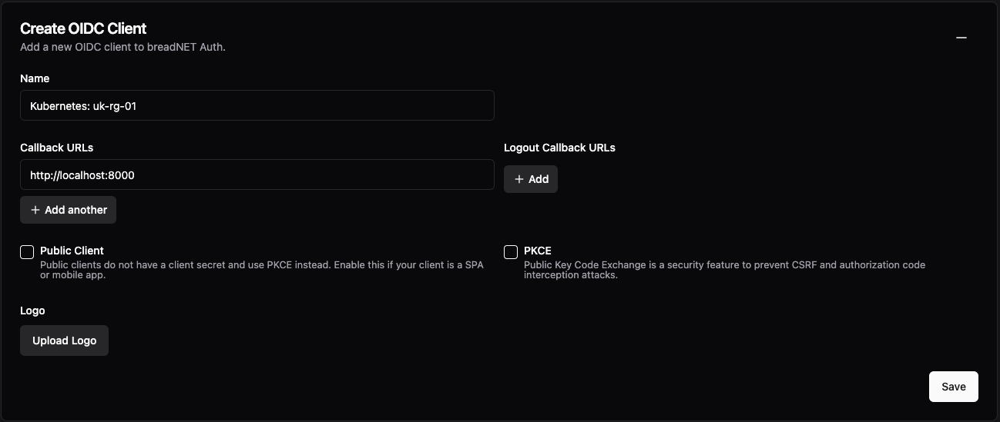
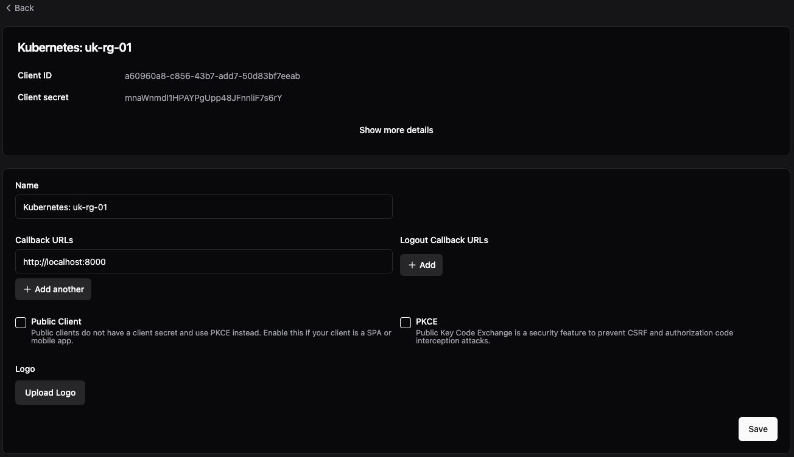
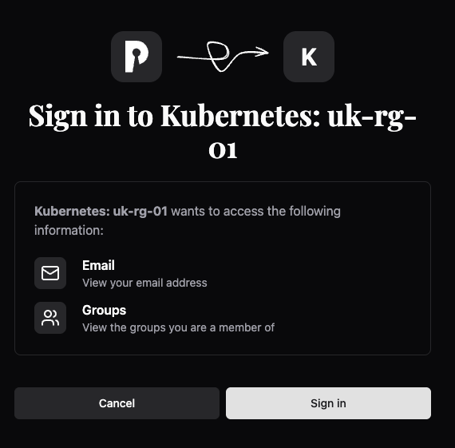
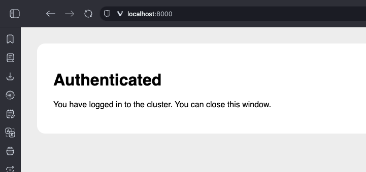

## What this document aims to provide

This document aims to assit a Kubernetes administrator setting up Talos and Pocket-id, so that Kubernetes can authenticate
users by a pass key.

## Configure Pocket-id

### Create application

In your Pocket-id instance, navigate to **OIDC Clients**

Click `Add OIDC Client` at the top right

Name the client, I am naming mine the cluster name, which will be `Kubernetes: uk-rg-01`

Set the `Callback URLs` to `http://localhost:8000`

Click **Save**



You should now have a page that looks like the below



Copy and paste the `Client ID` and `Client secret` in to a note as we will need this later on

Create a group called `Kubernetes` and add your self to this group. Also add this to the application. We will need this
in a later step

## Configure Talos

You should have a file called `controlplane.yaml` from when you set up your talos cluster, we will be making modifications to this

We need to setup the API server to use OIDC to validate users, which is done as `apiServer.extraArgs` in the `controlplane.yaml` file

The API server requires some values, as specified in [the Documentation](https://kubernetes.io/docs/reference/access-authn-authz/authentication/#openid-connect-tokens)

These are:

| Parameter           | Description                                                                                                                                                                                                         |
|---------------------|---------------------------------------------------------------------------------------------------------------------------------------------------------------------------------------------------------------------|
| oidc-issuer-url     | URL of the provider that allows the API server to discover public signing keys. Only URLs that use the https:// scheme are accepted. This is typically the provider's discovery URL, changed to have an empty path. |
| oidc-client-id      | A client id that all tokens must be issued for                                                                                                                                                                      |
| oidc-username-claim | JWT claim to use as the user name.                                                                                                                                                                                  |
| oidc-groups-claim   | JWT claim to use as the user's group. If the claim is present it must be an array of strings.                                                                                                                       |
| oidc-groups-prefix  | Prefix prepended to username claims to prevent clashes with existing names (such as system: users). For example, the value oidc: will create usernames like oidc:jane.doe                                           |

The below is an oversimplified version of the file, with the changes we need to make. Using the URL of the server (eg: pocket-id.example.com) for the `oidc-issuer-url` and the `Client ID` for the `oidc-client-id`

```diff
cluster:
    apiServer:
        image: registry.k8s.io/kube-apiserver:v1.33.1 # The container image used in the API server manifest.
+       extraArgs:
+           oidc-issuer-url: <url of pocket-id>
+           oidc-client-id: <Client ID from Pocket ID>
+           oidc-username-claim: sub
+           oidc-groups-claim: groups
+           oidc-groups-prefix: "oidc:"
```

Once these changes have been made, you will need to update all your API servers

!!! warning "Create a cluster role binding before you proceed"
    If you do not create a role binding you run the risk of locking your self out.

    _ask me how I know this..._

```yaml
# filename=crb.yaml
apiVersion: rbac.authorization.k8s.io/v1
kind: ClusterRoleBinding
metadata:
  name: cluster-admins-from-pass-keys
roleRef:
  apiGroup: rbac.authorization.k8s.io
  kind: ClusterRole
  name: cluster-admin
subjects:
  - apiGroup: rbac.authorization.k8s.io
    kind: Group
    name: oidc:kubernetes
```

The reason the `subjects.0.name` is set to `oidc:kubernetes` is this is the group our user is part of, and we're prefixing
groups from Pocket-id with `oidc` in case you have other group integrations etc

Apply this kubernetes resource

```shell
kubectl apply -f crb.yaml
```

Now we're able to apply the Talos config updating the API server

Note, your command may be different if you've got your config file in a central location

```shell
talosctl apply-config -n <ip> -e <ip> --file controlplane.yaml --talosconfig=./talosconfig
```

## Configure your kubectl

You will need a command line tool called `kubelogin`

* @int128/kubelogin

This can be installed with the below commands

=== "Brew"
    ```shell
     brew install int128/kubelogin/kubelogin
    ```
=== "krew"
    ```shell
    kubectl krew install oidc-login
    ```
=== "Windows"
    ```shell
    choco install kubelogin
    ```
=== "z/OS"
    Why are you trying to run this on an IBM mainframe bro? I often joke about running COBOL in Docker, but perhaps this is
    not the best use of your time. Just upgrade

We first need to test that we're getting a JWT token back from our Pocket ID instance.

Replace `<pocket ID url>`, `<client ID>`, and `<client secret>` with the values from the start

```shell
kubectl oidc-login setup \
--oidc-issuer-url=<pocket ID url> \
--oidc-client-id=<client ID> \
--oidc-client-secret=<client secret> \
--oidc-extra-scope=groups,email,name,sub,email_verified
```

Press enter on your keyboard

You should see a page like the below come up in your browser. Click **Sign in**



Once you've signed in and done your pass key flow, you _should_ see a page like the below:



_If you do not see this, see the [Possible errors](#possible-errors) section_

Checking back in your command line, if you scroll up you will see something like this. We need to check that the groups
are returned and the `email` is your user's email address.

!!! note "email_verified"
    If your email is not verified, you will not be able to use Kubernetes. See [Email not verified](#invalid-bearer-token-oidc-email-not-verified)

```json
{
  "aud": "a60960a8-c856-43b7-add7-50d83bf7eeab",
  "email": "username@domain.com",
  "email_verified": true,
  "exp": 1749867571,
  "groups": [
    "kubernetes"
  ],
  "iat": 1749863971,
  "iss": "<Pocket ID url>",
  "nonce": "sLY0SUaiLxe9JDfUpNEsBDbhKceOB-T1zxxRYJPQbvk",
  "sub": "643c3fba-370a-4738-92a6-9ergec96cd99"
}
```

Now we can create a new user in our `~/.kube/config` file

I will call mine `pass-key` as it's using passkeys, but you can call it what ever you want.

Open the `~/.kube/config` file and at the bottom add in the below

```yaml
- name: pass-key
  user:
    exec:
      apiVersion: client.authentication.k8s.io/v1beta1
      args:
        - oidc-login
        - get-token
        - --oidc-issuer-url=<pocket ID url>
        - --oidc-client-id=<pocket ID url>
        - --oidc-client-secret=<pocket ID url>
        - --oidc-extra-scope=groups
        - --oidc-extra-scope=email
        - --oidc-extra-scope=name
```

You will then need to find your `context` section of the file and update the cluster username to use `pass-key`

```diff
 - context:
     cluster: testing
     namespace: default
-    user: admin@testng
+    user: pass-key
-   name: admin@testing
+   name: testing
```

You should now be able to do a `kubectl get pods` and it will make you log in via the web page

## Possible errors

### Invalid callback URL, it might be necessary for an admin to fix this

```text
Invalid callback URL, it might be necessary for an admin to fix this.
```

Check the call back URL is set to `http://localhost:8000`

If you have something running on that port, you can set the `oidc-login` tool to use a different port

=== "Setup command"

    ```text
    kubectl oidc-login setup \
    --oidc-issuer-url=<pocket ID url> \
    --oidc-client-id=<client ID> \
    --oidc-client-secret=<pocket ID url> \
    --oidc-extra-scope=groups,email,name \
    --listen-address=127.0.0.1:9090
    ```

=== "Kube config file"

    ```yaml
    - name: pass-key
      user:
        exec:
          apiVersion: client.authentication.k8s.io/v1beta1
          args:
          - oidc-login
          - get-token
          - --oidc-issuer-url=<pocket ID url>
          - --oidc-client-id=<pocket ID url>
          - --oidc-client-secret=<pocket ID url>
          - --oidc-extra-scope=groups
          - --oidc-extra-scope=email
          - --oidc-extra-scope=name
          - --listen-address=127.0.0.1:9090
    ```

### error: You must be logged in to the server (Unauthorized)

Check that your email is verified. You need to have a verified email address, see [email not verified](#invalid-bearer-token-oidc-email-not-verified)

Try also clearing your token

```shell
rm ~/.kube/cache/oidc-login/*
```

### invalid bearer token, oidc: email not verified

This error is seen by checking the logs on the `kube-api-server` pod

This is because you're using the `email` claim for the username, as such kubernetes will reques the `email_verified` claim
which you can [see here](https://github.com/kubernetes/kubernetes/blob/77bd3f89fbc389d5dfebbed880e08a1e4949312c/staging/src/k8s.io/apiserver/plugin/pkg/authenticator/token/oidc/oidc.go#L833-L847)

Either verify your email by setting up SMTP or set all emails as verified under **Application Configuration** > **Emails Verified**

### Still nothing is working

Try increase the verbostiy level

Edit your `~/.kube/config` file

```diff
 - name: pass-key
   user:
     exec:
       apiVersion: client.authentication.k8s.io/v1beta1
       args:
       - oidc-login
       - get-token
       - --oidc-issuer-url=<pocket ID url>
       - --oidc-client-id=<pocket ID url>
       - --oidc-client-secret=<pocket ID url>
       - --oidc-extra-scope=groups
       - --oidc-extra-scope=email
       - --oidc-extra-scope=name
+      - -v2
```

## Feedback/ issues

If you are struggling to get this working, please reach out to me and create an issue on the @userbradley/documentation.breadnet.co.uk repo!
