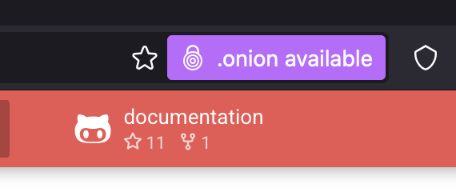

## Why

If your Material for MKDocs site is available on TOR, you can advertise this to TOR compatible browsers

## How

### Theme Overrides

In your `mkdocs.yaml` file, add an overrides block

```diff
theme:
  name: material
+ custom_dir: overrides
```

In the root of the site repo, make a directory called `overrides`

### Overriding `main.html`

Creat a file called `main.html` in the `overrides` directory

Place the below in the `main.html` file

```jupyter
% extends "base.html" %}


{{ super() }}
<meta http-equiv="onion-location" content="http://<onion address>" />

```

### Testing it works

Once your site is pushed and deployed, open a TOR browser and you should see a pop-up like the below



## Read next

* [Install lyrebird on Alpine](../kb/tor/install-lyrebird-on-alpine.md)
