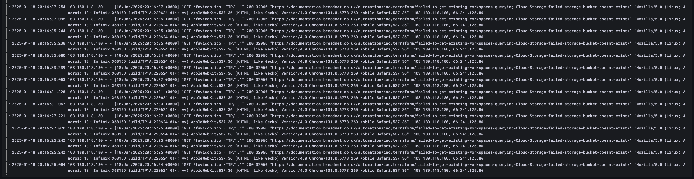
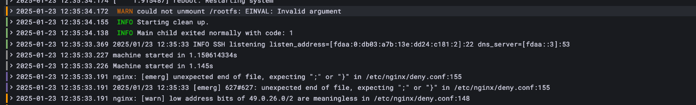
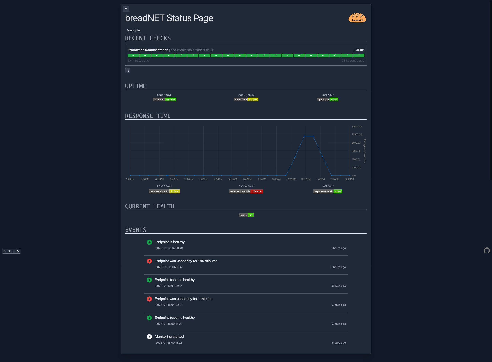
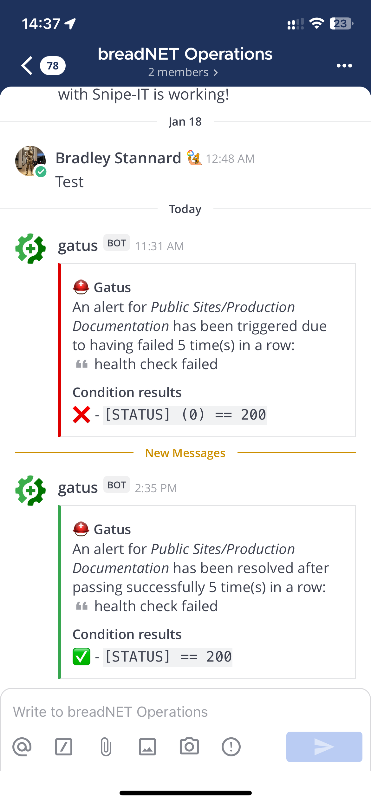
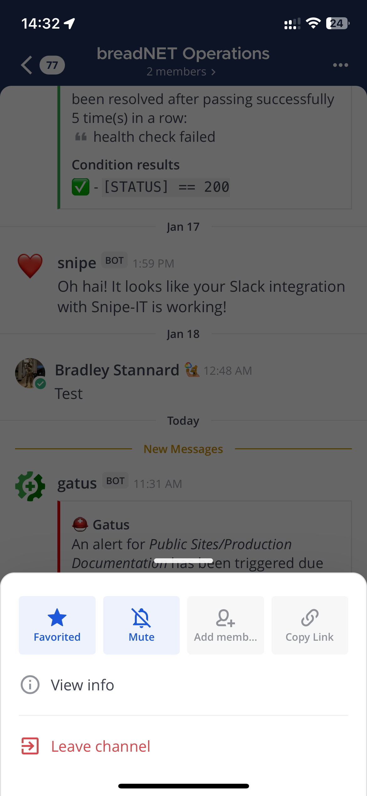

## What was affected

* Documentation
* Documentation Dev

## What caused it

I regularly check the logs for my websites and saw there was significant amount of requests to a single page coming from
an IP address

```text
103.180.118.180 - - [18/Jan/2025:20:06:59 +0000] "GET /favicon.ico HTTP/1.1" 200 32060 "https://documentation.breadnet.co.uk/automation/iac/terraform/failed-to-get-existing-workspaces-querying-Cloud-Storage-failed-storage-bucket-doesnt-exist/" "Mozilla/5.0 (Linux; Android 13; Infinix X6815D Build/TP1A.220624.014; wv) AppleWebKit/537.36 (KHTML, like Gecko) Version/4.0 Chrome/131.0.6778.260 Mobile Safari/537.36" "103.180.118.180, 66.241.125.86"
```



They were constantly making requests to `https://documentation.breadnet.co.uk/automation/iac/terraform/failed-to-get-existing-workspaces-querying-Cloud-Storage-failed-storage-bucket-doesnt-exist/`, specifically the favicon, which is weird

I have had blocking on this site since around [9th of December, 2022](https://github.com/userbradley/documentation.breadnet.co.uk/pull/58)
but have not used it that much. Recently I have started to take that more serioudly

On the [17th of Jan](https://github.com/userbradley/documentation.breadnet.co.uk/pull/471) I blocked Hetzner range
as there was a DDOS attack coming from them via scraping, so I put together a custom block page incase legitimate users
get caught up in the _net_

On the 23rd of January, I made a [PR number 481](https://github.com/userbradley/documentation.breadnet.co.uk/pull/481) which blocked
a new range of spammers, `pt persada data multimedia` - [AS149359](https://bgp.he.net/AS149359)

During the editing of the deny file, I made a mistake and did not finish the final line with a `;` [as you can see here](https://github.com/userbradley/documentation.breadnet.co.uk/pull/481/files#diff-7eb394579d8b71b404dd6c5f76545304edff00e4a4a9a4b038b2280a67929b1fR154)

This caused NGINX to _crash loop_ and in turn fail the fly.io health check



## What monitoring was in place

I run an internal deployment of Gatus which alerted to this at `2025-01-18 11:29:15`



Gatus is set up to push alerts in to an Operations channel on Mattermost



Issue being, I muted this channel, so I never got the alert



I only realized the site was down when I went to Slack and was confused as to why the media icon was not loading in a Thread

## What was done to resolve it

Checked the PR and realized that I did not finish the line with `;`, instead `'`

I resolved this in PR [482](https://github.com/userbradley/documentation.breadnet.co.uk/pull/482/files) where I removed the
erroneous character

## What did we learn

* No docker containers validate the nginx config
* No Validation on nginx files in CI

Checking both `Dockerfiles` ([even tho I don't use docker](https://breadnet.co.uk/docker-its-over-moving-to-podman/)) there is no validation step

This should look like the below

```diff
COPY deny.conf /etc/nginx/deny.conf
COPY .htpasswd /etc/nginx/.htpasswd
+ RUN nginx -t

# Copy built site from the builder stage (the heaviest change)
COPY --from=BUILDER /app/site /var/www/documentation
```
