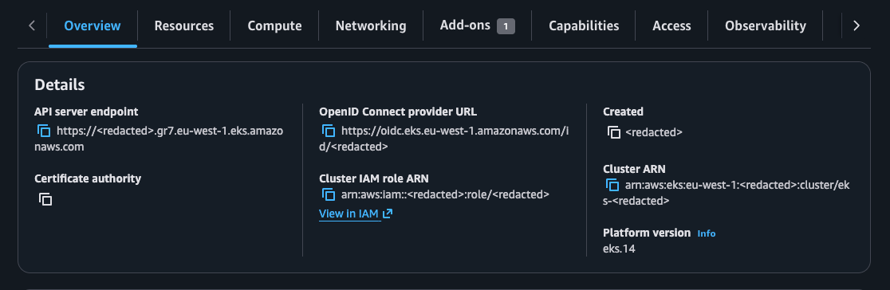
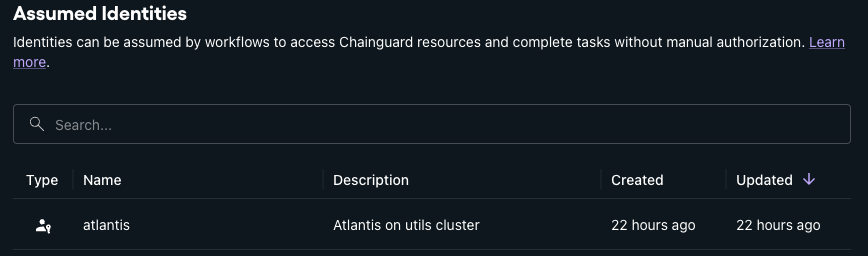

## What's the problem

When managing Chainguard through Terraform, specifically via Atlantis, you need to authenticate to Chainguard.

Traditionally this is done by adding environment variables to the Atlantis pod. Doing it this way means you've got to now manually manage
secrets. We all know that if a secret is manually managed it's not getting rotated for fear of breaking something random that's
using that secret _that should not have been_

## Solution

Chainguard allows you to _assume identities_ via OIDC. If you're familiar with Google Cloud, this is "Workload Identity Federation"

!!! note "Some steps cant be automated"
    Because we need to write terraform to allow atlantis to then run terraform against chainguard, we run in to a chicken-and-    egg issue. How can we apply the Terraform to allow access to Chainguard from Atlantis if we need atlantis to apply the terraform.

    For that reason, this entire page details the **manual** steps you need to run.

### Prerequisites

In order to follow along, you should have:

* Kubernetes cluster with a public JWKS endpoint.
   * As a solution to get around this, you can also upload the JWKS. This is explained later
* Chainguard Organisation

### Install required tooling

In order to configure the below, you will need the below installed and set up.

* [Terraform](https://terraform.io)/ [OpenTofu](https://opentofu.org)
* [Chainctl](https://edu.chainguard.dev/chainguard/chainctl-usage/how-to-install-chainctl/)

For installing Terraform/OpenTofu I suggest using [tfswitch](https://tfswitch.warrensbox.com/Installation/)

### Config

The below section guides you through creating the config files and the commands to run to apply them.

#### provider.tf

Create a file called `provider.tf`. In that file put:

```hcl
# provider.tf
terraform {
  required_providers {
    chainguard = {
      source  = "chainguard-dev/chainguard"
      version = "0.2.11"
    }
  }
}

provider "chainguard" {}
```

#### main.tf

First you will need to get your clusters issuer URL.

Run the below depending on your cluster, and keep it to hand. We need this URL later

=== "Kubernetes"

    ```shell
    kubectl get --raw /.well-known/openid-configuration | jq -r .issuer
    ```

=== "AKS"

    ```shell
    az aks show -n NAME -g RESOURCE_GROUP --query "oidcIssuerProfile.issuerUrl" -otsv
    ```

=== "EKS"

    ```shell
    aws eks describe-cluster --name NAME --query "cluster.identity.oidc.issuer" --output text
    ```

Next we will be creating the binding between a Kubernetes service account and Chainguard.

The steps you follow depend on if your cluster has a public issuer URL, or a private URL.

??? tip "How do I know if the endpoint is public"

    The below sections depend on if your cluster's OIDC issuer URL is public.

    Most clusters have a public OIDC issuer URL. An exmaple is an EKS cluster. Note the field called **OpenID Connect provider URL**

    

    This endpoint exposes the clusters OIDC Keys, as well as the identity it uses to sign these tokens.

    An example of a token minted by Kubernetes is below. Pay attention to the line `iss`. This is the endpoint we need to check.

    ``` json hl_lines="7"
    {
      "aud": [
        "<redacted>"
      ],
      "exp": 1781100596,
      "iat": 1781096996,
      "iss": "https://kubernetes.breadnet.co.uk",
      "jti": "<redacted>",
      "kubernetes.io": {
        "namespace": "atlantis",
        "node": {
          "name": "rg-utils-1",
          "uid": "820c658a-e8a1-46dc-8df1-768db2d9f247"
        },
        "pod": {
          "name": "atlantis-68c7589f9d-mnts7",
          "uid": "92017bbb-5f9a-4006-8cf4-8fc4009d4d7f"
        },
        "serviceaccount": {
          "name": "atlantis",
          "uid": "2d411b87-498b-48c6-a66f-04aa169d97bf"
        }
      },
      "nbf": 1781096996,
      "sub": "system:serviceaccount:atlantis:atlantis"
    }
    ```

    We should be able to `curl` this and get back a response.

    ```shell
    curl https://kubernetes.breadnet.co.uk/.well-known/openid-configuration | jq
    ```

    We should then be able to see something like

    ```json
    {
      "issuer": "https://kubernetes.breadnet.co.uk",
      "jwks_uri": "https://kubernetes.breadnet.co.uk/.well-known/jwks.json",
      "response_types_supported": [
        "id_token"
      ],
      "subject_types_supported": [
        "public"
      ],
      "id_token_signing_alg_values_supported": [
        "RS256"
      ]
    }
    ```

    If this works, it means your endpoint is public, and you can follow [Public Issuer](/#__tabbed_1_1). If it's failed, follow [Private issuer](#__tabbed_1_2)

=== "Public Issuer"

    Create a file called `main.tf`. In that file put:

    You will need to change the `issuer` value to reflect that of your cluster

    ```hcl
    data "chainguard_group" "root" {
      name = "breadnet.co.uk" # CHANGE ME!
    }

    resource "chainguard_identity" "atlantis" {
      parent_id   = data.chainguard_group.root.id
      name        = "atlantis"
      description = "Atlantis on utils cluster"

      claim_match {
        issuer          = "https://kubernetes.breadnet.co.uk" # CHANGE ME!
        # subject pattern explained: This is the namespace and service account of the pod you intentd to connect to Chainguard.
        #                  system:serviceaccount:<namespace>:<service account>
        # So in this case we're connecting the `atlantis` service account in the `atlantis` namespace
        subject_pattern = "system:serviceaccount:atlantis:atlantis"
        audience        = "issuer.enforce.dev"
      }
    }

    data "chainguard_role" "registry_editor" {
      name   = "registry.editor" # Can put what ever you want here.
      parent = "/"
    }

    resource "chainguard_rolebinding" "binding" {
      identity = chainguard_identity.atlantis.id
      group    = data.chainguard_group.root.id
      role     = data.chainguard_role.registry_editor.items[0].id
    }

    output "atlantis_chainguard_identity" {
      value = chainguard_identity.atlantis.id
    }
    ```

=== "Private Issuer"

    Get the keys from your cluster, and save them to a file called `keys.json`

    ```shell
    kubectl get --raw /openid/v1/jwks > keys.json
    ```

    !!! note "What if the keys expire?"

        Cloud providers sometimes rotate the keys, so you will need to re-run the above command and then re-apply the terraform
        if this happens

    Create a file called `main.tf`. In that file put:

    You will need to change the `issuer` value to reflect that of your cluster.

    ```hcl
    data "chainguard_group" "root" {
      name = "breadnet.co.uk" # CHANGE ME!
    }

    resource "chainguard_identity" "atlantis" {
      parent_id   = data.chainguard_group.root.id
      name        = "atlantis"
      description = "Atlantis on utils cluster"

      claim_match {
        issuer          = "https://kubernetes.breadnet.co.uk" # CHANGE ME!
        # subject pattern explained: This is the namespace and service account of the pod you intentd to connect to Chainguard.
        # So in this case we're connecting the `atlantis` service account in the `atlantis` namespace
        #                 "system:serviceaccount:<  ns  >:<  sa  >"
        subject_pattern = "system:serviceaccount:atlantis:atlantis"
        audience        = "issuer.enforce.dev"
      }
      static {
        issuer_keys = file("keys.json")
      }
    }

    data "chainguard_role" "registry_editor" {
      name   = "registry.editor" # Can put what ever you want here.
      parent = "/"
    }

    resource "chainguard_rolebinding" "binding" {
      identity = chainguard_identity.atlantis.id
      group    = data.chainguard_group.root.id
      role     = data.chainguard_role.registry_editor.items[0].id
    }

    output "atlantis_chainguard_identity" {
      value = chainguard_identity.atlantis.id
    }
    ```

#### backend.tf

You should store your terraform state in a remote backend.

Setting up a backend is out of scope for this document.

Please refer to

* Terraform: [Backend block configuration overview](https://developer.hashicorp.com/terraform/language/backend)
* OpenTfu: [Backend Configuration](https://opentofu.org/docs/language/settings/backends/configuration/)

### Login to Chainguard, and terraform apply

!!! warning "Elevated permissions needed"

    In order to run the below commands, you need elevated permissions in Chainguard.

    I have not tested the exact permissions neeed, but I found `owner` works.

When running the above terraform, we have to run this locally and not from Atlantis.

To log in to Chainguard, run

```shell
chainctl auth login
```

This will take you through the login process and store credentials locally on your computer.

Next we can apply the terraform.

It will ask if you want to confirm, type `yes`.

```shell
terraform apply
```

### Validate resources are created

In theory, all resources were created. Verify this in the UI by going to [Settings > Assumed Identities](https://console.chainguard.dev/org/:org/settings/identities)

You should see your identity present.



Click on your identity, and make a note of the `ID`, as we need this later. Make note of it!

## Atlantis config

Atlantis can be deployed by _hand cranking_ the YAML, or using the [Atlantis Helm Chart](https://github.com/runatlantis/helm-charts)

=== "Hand Cranked"

    Below shows an example of a barebones Atlantis deployment, with the changes you need to make.

    ```diff
    --8<-- "docs/security/chainguard/atlantis-access-to-chainguard-using-oidc-in-kubernetes/atlantis.yaml"
    ```

=== "Helm Chart"

    Add to your `values.yaml` the below

    ```diff
    --8<-- "docs/security/chainguard/atlantis-access-to-chainguard-using-oidc-in-kubernetes/values.yaml"
    ```

Deploy the changes to your Cluster via whatever means you use. Be that `kubectl`, `flux` or `argo`

## How to use Terraform with the OIDC token

Once all the configuration is done, the below shows how to use the Chainguard provider, with the OIDC token.

You will need to replace `identity_id` with the `ID` value from the Chainguard UI.

```terraform
terraform {
  required_providers {
    chainguard = {
      source  = "chainguard-dev/chainguard"
      version = "0.2.11"
    }
  }
}

provider "chainguard" {
  login_options {
    identity_token = "/var/run/chainguard/oidc/oidc-token"
    identity_id    = "<identity ID from UI>"
  }
}
```

### What does `identity_token = "/var/run/chainguard/oidc/oidc-token"` do?

From the docs for [Chainguard terraform provider](https://registry.terraform.io/providers/chainguard-dev/chainguard/latest/docs#identity_token-3)

> `identity_token` (String, Sensitive) A path to an OIDC identity token, or explicit identity token.

This is the JWT token that the provider then exchanges with Chainguard's STS server to get a Chainguard token, which it then
makes requests. The actual file `/var/run/chainguard/oidc/oidc-token` is populated by Kubernetes using the service account the pod uses.

You can read more about this at [serviceAccountToken projected volumes](https://kubernetes.io/docs/concepts/storage/projected-volumes/#serviceaccounttoken)

Because Atlantis is in Kubernetes, it can access the `/var/run/chainguard/oidc/oidc-token` file, and uses this to authenticate.

## Security Considerations

By using a pod-wide token in Atlantis, it means that any `project` on that Atlantis instance can then also access Chainguard
with whatever permissions you've given the Assumed Identity.

## Further reading

* [Chainguard Overview of Assumable Identities](https://edu.chainguard.dev/chainguard/administration/assumable-ids/assumable-ids/)
* [Chainguard Documentation on Assumed Identities for Kubernetes](https://edu.chainguard.dev/chainguard/administration/assumable-ids/identity-examples/kubernetes-identity/)
