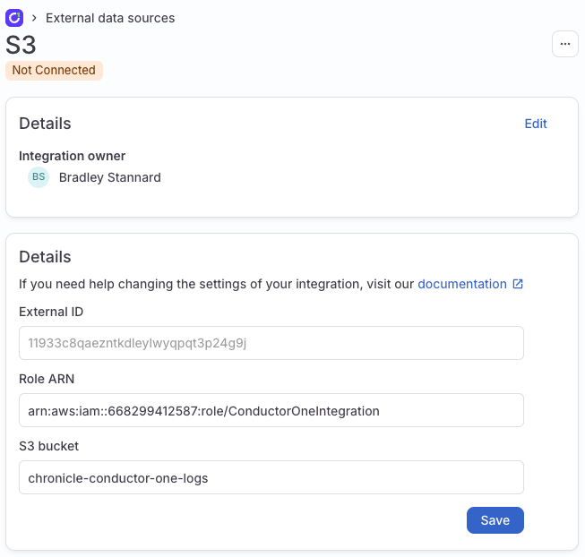
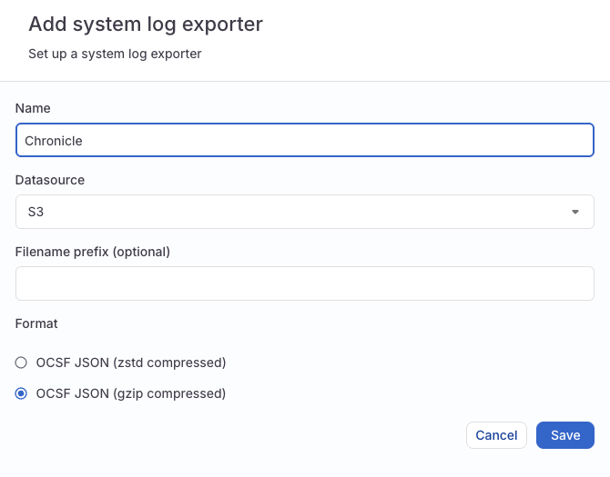
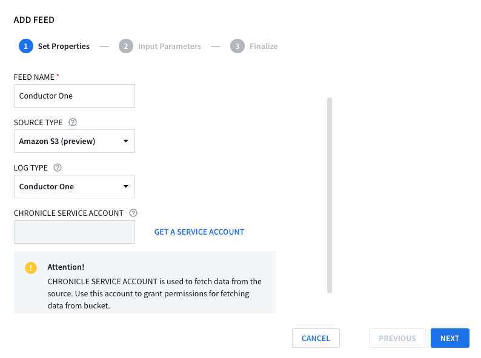
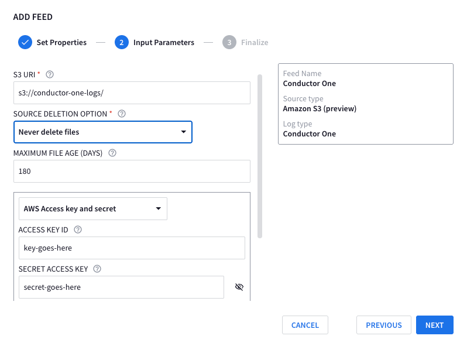

## What is this document about?

This document outlines the reasons why administrators of Conductor One should integrate their platform's audit logs with a Security Information and Event Management (SIEM) solution like Google Chronicle SecOps.

### Why is this important?

Forwarding Conductor One audit logs to Chronicle SecOps enables you to:

* **Enhance Security Monitoring:** Gain comprehensive visibility into all permission and entitlement changes within Conductor One, allowing for real-time monitoring and threat detection.
* **Improve Threat Detection:** Leverage Chronicle SecOps's advanced threat intelligence and machine learning capabilities to identify suspicious activities, such as unauthorized access attempts, privilege escalations, and anomalous entitlement modifications.
* **Meet Compliance Requirements:** Maintain a robust audit trail of all Conductor One activities for compliance with industry regulations (e.g., GDPR, SOX, HIPAA) and internal security policies.
* **Streamline Investigations:** Accelerate security investigations by analyzing Conductor One logs alongside other security data sources within Chronicle SecOps, enabling faster incident response and remediation.

### Who should read this?

This guide is essential for security engineers, analysts, and administrators responsible for:

* Managing Conductor One platforms
* Implementing security monitoring and incident response processes
* Utilizing Google Chronicle SecOps for security analytics

By integrating Conductor One with Chronicle SecOps, you can significantly strengthen your organization's security posture and protect sensitive data related to permissions and entitlements.

## Prerequisites

* Conductor One Admin
* Chronicle Admin

## Conductor One resources

You need to create

* External Data source
* System log

### External Data source

1. Navigate to **Admin** > **Settings** > **External data sources**
2. Click Add data source.
3. Click `My self`
4. Copy the `External ID` in to your clipboard

You will need to come back to this page, so do not close it or click save just yet. Move on to creating the AWS Resources

## Create AWS resources

!!! note "Terraform"
    We will use terraform here as it's the industry standard. If you want to use something else, go for it.

```terraform linenums="1" hl_lines="2 34"
resource "aws_s3_bucket" "conductor_one_logs" {
  bucket = "chronicle-conductor-one-logs" # (1)!
  tags = {
    Name = "Conductore One to Chronicle Logs"
  }
}

output "conductor_one_bucket" {
  description = "Name of the Conductor One bucket"
  value       = aws_s3_bucket.conductor_one_logs.bucket
}

resource "aws_iam_role" "conductor_one_integration" {
  name               = "ConductorOneIntegration"
  assume_role_policy = data.aws_iam_policy_document.conductor_one_s3_datasource_service.json
}

output "conductor_one_role_arn" {
  description = "ARN of the Conductor One role"
  value       = aws_iam_role.conductor_one_integration.arn
}

data "aws_iam_policy_document" "conductor_one_s3_datasource_service" {
  statement {
    effect = "Allow"
    principals {
      type        = "AWS"
      identifiers = ["arn:aws:iam::765656841499:role/ConductorOneS3DatasourceService"]
    }
    actions = ["sts:AssumeRole"]

    condition {
      test     = "StringEquals"
      values   = ["<EXTERNAL ID FROM CONDUCTOR ONE PAGE"] # (2)!
      variable = "sts:ExternalId"
    }
  }
}

resource "aws_iam_role_policy_attachment" "conductor_one_s3_policy_attachment" {
  role       = aws_iam_role.conductor_one_integration.name
  policy_arn = aws_iam_policy.conductor_one_s3_policy.arn
}

resource "aws_iam_policy" "conductor_one_s3_policy" {
  name        = "cone-chronicle-logs-bucket"
  description = "Conductor One Chronicle Logs"
  policy      = data.aws_iam_policy_document.conductor_one_s3_policy.json
}

data "aws_iam_policy_document" "conductor_one_s3_policy" {
  statement {
    effect = "Allow"
    actions = [
      "s3:GetObject",
      "s3:GetObjectAttributes",
      "s3:HeadBucket",
      "s3:ListBucket",
      "s3:GetBucketLocation",
      "s3:PutObject"
    ]

    resources = [
      "arn:aws:s3:::${aws_s3_bucket.conductor_one_logs.bucket}",
      "arn:aws:s3:::${aws_s3_bucket.conductor_one_logs.bucket}/*"
    ]
  }
}

resource "aws_iam_user" "conductor_one_chronicle" {
  name = "conductor-one-chronicle"
}

resource "aws_iam_user_policy" "conductor_one_chronicle" {
  user   = aws_iam_user.conductor_one_chronicle.name
  policy = data.aws_iam_policy_document.conductor_one_chronicle_s3_access.json
}

data "aws_iam_policy_document" "conductor_one_chronicle_s3_access" {
  statement {
    effect = "Allow"
    actions = [
      "s3:ListBucket",
      "s3:GetBucketLocation"
    ]
    resources = [
      aws_s3_bucket.conductor_one_logs.arn
    ]
  }
  statement {
    effect = "Allow"
    actions = [
      "s3:GetObject"
    ]
    resources = [
      "${aws_s3_bucket.conductor_one_logs.arn}/*"
    ]
  }
}
```

1. You will need to make this name globally unique
2. This needs to be replaced with the ID from the Conductor one page

Once you've made the modifications to the file (line 2 and 34) apply the terraform.

You will get an output like

```text
Outputs:

conductor_one_bucket = "chronicle-conductor-one-logs"
conductor_one_role_arn = "arn:aws:iam::668299412587:role/ConductorOneIntegration"
```

Make note of these

## Back in Conductor One

Paste the vale of `conductor_one_role_arn` in to the **Role ARN** field and the bucket name in **S3 Bucket**



Click Save

Navigate to **Settings** > **System logs**

Click **Add Exporter** at the top

Give it a name

For **Datasource** Select S3

Format needs to be set to **OCSF JSON (gzip compressed)**



## Create Chronicle Feed

In Chronicle, navigate to **Settings** > **SIEM Settings** > **Feeds**

Click `ADD NEW` and then fill out using the below details

* FEED NAME: `Conductor One`
* SOURCE TYPE: `S3 (preview)`
* LOG TYPE: `Conductor One`

!!! note "Do not click Get a service account"
    Google is rolling out new auth methods for Chronicle and AWS (federated identity)

    Clicking the `GET A SERVICE ACCOUNT` will cause auth issues later on

Your page should look like the below:



Click **NEXT**

Fill in the details for your bucket, and access key. You will need to set if you wish to delete the files or not, I recommend
keeping them as it allows historical loads should you need to go back for any reason



* S3 URI: `s3://<bucket name>/` - Trailing `/` is required
* SOURCE DELETION OPTION: Either set to `Never delete files` or `Delete transferred files and empty directories` depending on what you followed
* ACCESS KEY ID: AWS access key
* ACCESS KEY SECRET: AWS access key secret

## Troubleshooting

As I've had no issues whilst setting this up, there is nothing I can add to troubleshoot, so if you come across
an issue, please consider opening an issue on the repo, which can be done by clicking `documentation` on the top right of
this site

### Internal Error s3-datasource

```text
Internal Error
s3-datasource: unable to assume role into 'arn:aws:iam::668299412587:role/ConductorOneIntegration': failed to refresh cached credentials, operation error STS: AssumeRole, https response error StatusCode: 403, RequestID: 5532619d-9e81-48a5-8c54-a60b4906e5fa, api error AccessDenied: User: arn:aws:sts::765656841499:assumed-role/ConductorOneS3DatasourceService/aws-go-sdk-1749733429702867113 is not authorized to perform: sts:AssumeRole on resource: arn:aws:iam::668299412587:role/ConductorOneIntegration (UNKNOWN)
```

You copy and pasted from the docs instead of the role from your terraform
