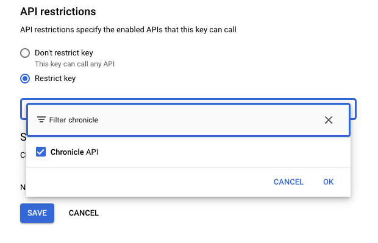

## What is this document about?

This document outlines the reasons why administrators of Entitle.io should integrate their platform's audit logs with a Security Information and Event Management (SIEM) solution like Google Chronicle SecOps.

### Why is this important?

Forwarding Entitle.io audit logs to Chronicle SecOps enables you to:

* **Enhance Security Monitoring:** Gain comprehensive visibility into all permission and entitlement changes within Entitle.io, allowing for real-time monitoring and threat detection.
* **Improve Threat Detection:** Leverage Chronicle SecOps's advanced threat intelligence and machine learning capabilities to identify suspicious activities, such as unauthorized access attempts, privilege escalations, and anomalous entitlement modifications.
* **Meet Compliance Requirements:** Maintain a robust audit trail of all Entitle.io activities for compliance with industry regulations (e.g., GDPR, SOX, HIPAA) and internal security policies.
* **Streamline Investigations:** Accelerate security investigations by analyzing Entitle.io logs alongside other security data sources within Chronicle SecOps, enabling faster incident response and remediation.

### Who should read this?

This guide is essential for security engineers, analysts, and administrators responsible for:

* Managing Entitle.io platforms
* Implementing security monitoring and incident response processes
* Utilizing Google Chronicle SecOps for security analytics

By integrating Entitle.io with Chronicle SecOps, you can significantly strengthen your organization's security posture and protect sensitive data related to permissions and entitlements.

## Prerequisites

* Entitie.io Admin
* API Keys Admin (`roles/serviceusage.apiKeysAdmin`) on your Chroncile Project
* Chronicle Admin

## Create Chronicle Feed

In Chronicle, navigate to **Settings** > **SIEM Settings** > **Feeds**

Click `ADD NEW` and then fill out using the below details

* FEED NAME: `Beyondcorp Entitle.io`
* SOURCE TYPE: `Webhook`
* LOG TYPE: `BeyondTrust`

Your page should look like the below:


For `Input Parameter` you can skip this

Click **NEXT** and then **SUBMIT**

You will see a new page come up saying `Attention: A secret key is needed to complete feed setup.` - Do not close this window
it's required in the next step

Click on **Details** on the window that has just opened up, and copy and paste the `Endpoint Information` in to a text document

## Create Chronicle Credentials

Click on the button that reads **Generate Secret Key**


Copy and paste the secret key in to a notepad like

```text
X-Webhook-Access-Key=<key from window>
```

## Create GCP Credentials

Navigate to the GCP project you are using to _house_ Chronicle

??? note "How to find project that Chronicle is deployed from"

    Click **Settings** > **SIEM SETTINGS**

    On the home page it will say `GCP Project ID: `

In this project, navigate to **APIs and services** > **Credentials**

Click **+ CREATE CREDENTIALS** on the top left of the page.

Once a randomly generated credential is made, click the 3 dots on the right hand side and select **Edit API key**

Set the **Name** to `Beyondcorp Entitle.io`

Under restrictions set the API to be Chronicle



Click `OK` and then `SAVE`

Once returned back to the main menu, click **SHOW KEY** and paste this in to a text document with our other key in the format like below

```text
X-Webhook-Access-Key=<key from window>
X-goog-api-key=<key from GCP>
```

You should have something that looks like the below:

```text
X-Webhook-Access-Key=b3022395dea87f5dae12d45e2413f747863ec8333e54319faa0d240c53e85c19
X-goog-api-key=yBShXnMzYVOWGujPcA5o5rGPSoWFAaY9bvMF88Q6lRqHWSluHAal
```

## Setup Entitle

Navigate to [app.entitle.io/organizationSettings](https://app.entitle.io/organizationSettings)

Create a new file on your IDE called `headers.json`, and format it like the below:

```json
{
  "X-Webhook-Access-Key": "<key from window>",
  "X-goog-api-key": "<key from GCP>"
}
```

??? tip "Example file"

    ```json
    {
      "X-Webhook-Access-Key": "b3022395dea87f5dae12d45e2413f747863ec8333e54319faa0d240c53e85c19",
      "X-goog-api-key": "yBShXnMzYVOWGujPcA5o5rGPSoWFAaY9bvMF88Q6lRqHWSluHAal"
    }
    ```

Scroll down till you see `Audit Logs Webhooks`

Select `+ Add`

* For `Webhook URL` use the URL that Chronicle provided in [Create Chronicle Feed](#create-chronicle-feed) section
* For `Headers` use the `json` file we just created
* For `Additional Audit Log Parameters` you can leave this empty

---

## Troubleshooting

As I've had no issues whilst setting this up, there is nothing I can add to troubleshoot, so if you come across
an issue, please consider opening an issue on the repo, which can be done by clicking `documentation` on the top right of
this site
