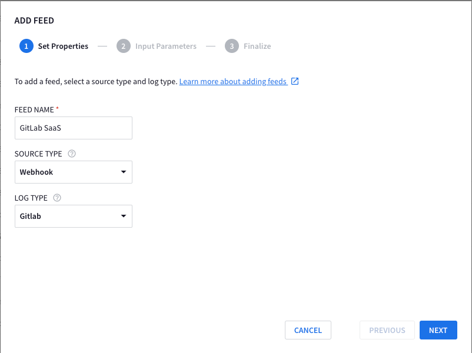
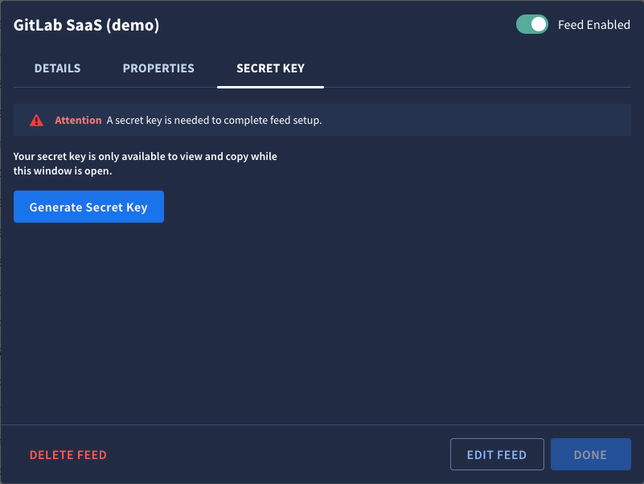
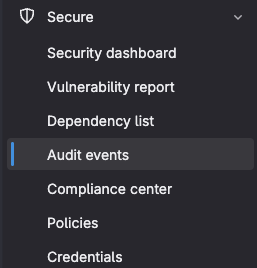
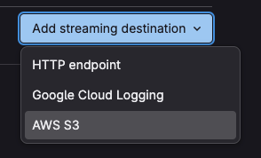
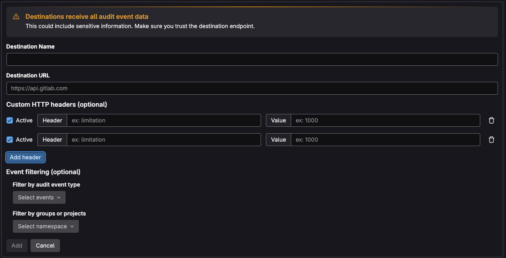

## What is this document about?

This document provides a comprehensive guide on how to export audit logs from GitLab SaaS (Software as a Service) and ingest them into Google Chronicle for security monitoring and analysis.

### Why is this important?

Shipping GitLab SaaS audit logs to Chronicle empowers you to:

* Enhance Security Monitoring: Centralize your GitLab security logs within Chronicle to gain a unified view of your organization's security posture.
* Improve Threat Detection: Leverage Chronicle's advanced analytics and threat intelligence to identify and respond to potential security threats originating from your GitLab environment.
* Meet Compliance Requirements: Maintain a robust audit trail of GitLab activity for compliance with industry regulations and internal security policies.
* Streamline Investigations: Accelerate security investigations by analyzing GitLab logs alongside other security data sources within Chronicle.
Who should read this?

This guide is essential for security engineers, analysts, and administrators responsible for:

* Managing GitLab SaaS environments
* Implementing security monitoring and incident response processes
* Utilizing Google Chronicle for security analytics
* By following the instructions in this document, you can effectively integrate GitLab SaaS audit logs into your Chronicle security operations workflow.

## Prereaquisites

* GitLab Admin
* API Keys Admin (`roles/serviceusage.apiKeysAdmin`) on your Chroncile Project
* Chroncile Admin

## Create Chroncile Feed

In Chronicle, navigate to **Settings** > **SIEM Settings** > **Feeds**

Click `ADD NEW` and then fill out using the below details

* FEED NAME: `GitLab Saas`
* SOURCE TYPE: `Webhook`
* LOG TYPE: `Gitlab`

Your page should look like the below:



For `Input Parameter` you can skip this

Click **NEXT** and then **SUBMIT**

You will see a new page come up saying `Attention: A secret key is needed to complete feed setup.` - Do not close this window
it's required in the next step

Click on **Details** on the window that has just opened up, and copy and paste the `Endpoint Information` in to a text document

## Create Chronicle Credentials

Click on the button that reads **Generate Secret Key**



Copy and paste the secret key in to a notepad like

```text
X-Webhook-Access-Key=<key from window>
```

## Create GCP Credentials

Navigate to the GCP project you are using to _house_ Chronicle

??? note "How to find project that Chroncile is deployed from"
    Click **Settings** > **SIEM SETTINGS**

    On the home page it will say `GCP Project ID: `

In this project, navigate to **APIs and services** > **Credentials**

Click **+ CREATE CREDENTIALS** on the top left of the page.

Once a randomly generated credential is made, click the 3 dots on the right hand side and select **Edit API key**

Set the **Name** to `GitLab SaaS`

Under restrictions set the API to be Chronicle


Click `OK` and then `SAVE`

Once returned back to the main menu, click **SHOW KEY** and paste this in to a text document with our other key in the format like below

```text
X-Webhook-Access-Key=<key from window>
X-goog-api-key=<key from GCP>
```

You should have something that looks like the below:

```text
X-Webhook-Access-Key=b3022395dea87f5dae12d45e2413f747863ec8333e54319faa0d240c53e85c19
X-goog-api-key=yBShXnMzYVOWGujPcA5o5rGPSoWFAaY9bvMF88Q6lRqHWSluHAal
```

## Setup GitLab

Navigate to your GitLab SaaS group on the browser

??? tip "What's my URL?"

    Most likely `https://gitlab.com/<company>`

On the left hand side navigation bar, click **Secure** > **Audit Events**



Click on **Streams** at the top

Click `Add streaming destination` and select `HTTP endpoint`



Click `Add header` twice and your page will look like the below



Fill it out with the below information

* Destination name: `Chronicle SecOps`
* Destination URL: `URL of the feed`
* Custom HTTP header 1: Header: `X-Webhook-Access-Key`, Value: `<key from window (Chroncile)>`
* Custom HTTP header 1: Header: `X-goog-api-key`, Value: `<key from GCP>`

Once done, click `Add` at the bottom of the page

---

## Troubleshooting

As I've had no issues whilst setting this up, there is nothing I can add to troubleshoot, so if you come across
an issue, please consider opening an issue on the repo, which can be done by clicking `documentation` on the top right of
this site
