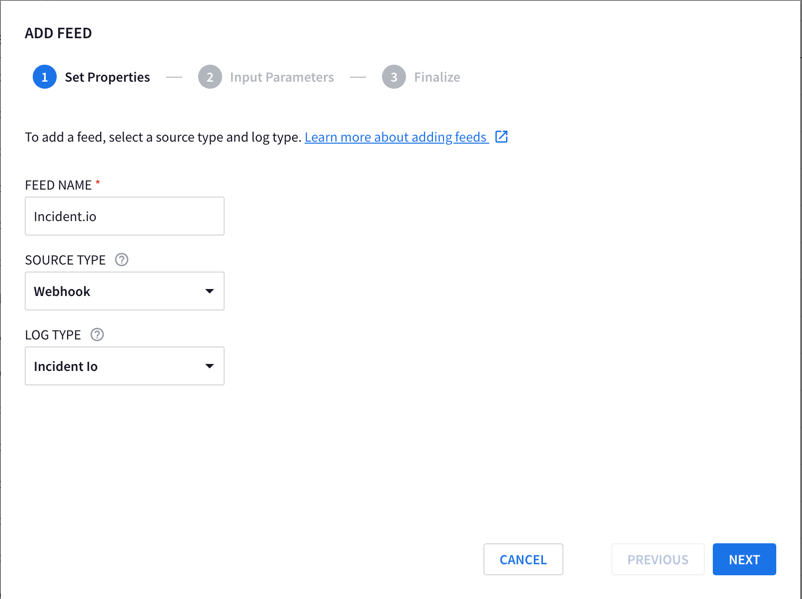
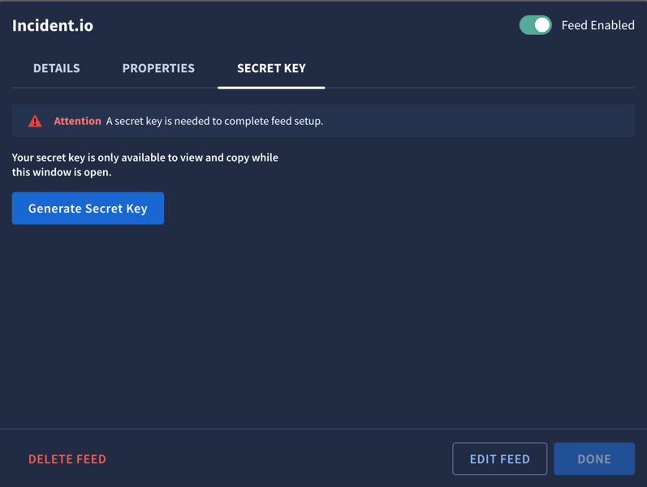
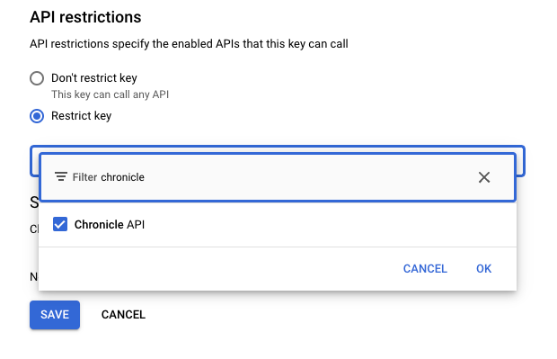
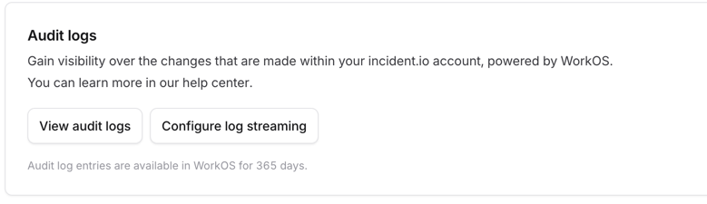
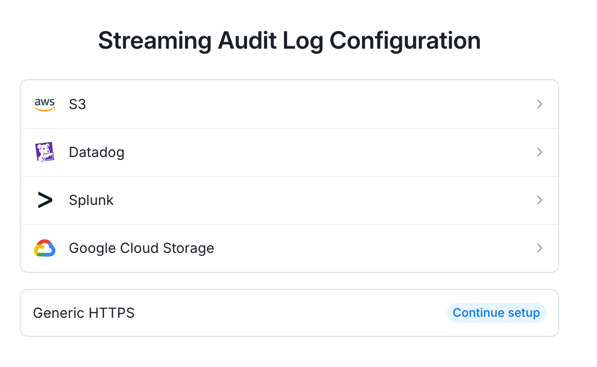
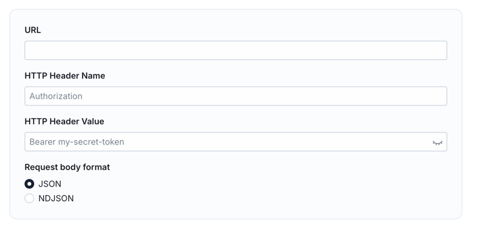

## What is this document about?

This document provides a comprehensive guide on how to export audit logs from Incident.io and ingest them into Google Chronicle for security monitoring and analysis.

### Why is this important?

Shipping incident.io activity logs to Chronicle empowers you to:

* **Centralized Security Visibility:**
  * Consolidate incident.io activity logs within Chronicle to gain a comprehensive view of your incident response activities alongside other security data.
* **Enhanced Threat Detection:**
  * Leverage Chronicle's advanced analytics to identify suspicious patterns or anomalies in incident response workflows, potentially indicating malicious activity or process deviations.
* **Improved Incident Investigation:**
  * Correlate incident.io logs with other security events in Chronicle to accelerate investigations and gain a deeper understanding of the context surrounding security incidents.
* **Compliance and Audit Trail:**
  * Maintain a detailed audit trail of incident response actions within Chronicle, facilitating compliance with regulatory requirements and internal security policies.

This guide is essential for:

* Security operations center (SOC) analysts.
* Incident response teams.
* Security engineers.
* Anyone responsible for monitoring and investigating security incidents.

By following this guide, you can effectively integrate incident.io activity logs with Chronicle, strengthening your organization's security posture and incident response capabilities.

## Prerequisites

* Incident.io Admin
* API Keys Admin (`roles/serviceusage.apiKeysAdmin`) on your Chronicle Project
* Chronicle Admin

## Create Chronicle Feed

In Chronicle, navigate to **Settings** > **SIEM Settings** > **Feeds**

Click `ADD NEW` and then fill out using the below details

* FEED NAME: `Incident.io`
* SOURCE TYPE: `Webhook`
* LOG TYPE: `Incident Io`

Your page should look like the below:



For `Input Parameter` you can skip this

Click **NEXT** and then **SUBMIT**

You will see a new page come up saying `Attention: A secret key is needed to complete feed setup.` - Do not close this window
it's required in the next step

Click on **Details** on the window that has just opened up, and copy and paste the `Endpoint Information` in to a text document

## Create Chronicle Credentials

Click on the button that reads **Generate Secret Key**



Copy and paste the secret key in to a notepad like

```text
X-Webhook-Access-Key=<key from window>
```

## Create GCP Credentials

Navigate to the GCP project you are using to _house_ Chronicle

??? note "How to find project that Chronicle is deployed from"

    Click **Settings** > **SIEM SETTINGS**

    On the home page it will say `GCP Project ID: `

In this project, navigate to **APIs and services** > **Credentials**

Click **+ CREATE CREDENTIALS** on the top left of the page.

Once a randomly generated credential is made, click the 3 dots on the right hand side and select **Edit API key**

Set the **Name** to `Incident.io`

Under restrictions set the API to be Chronicle



Click `OK` and then `SAVE`

Once returned back to the main menu, click **SHOW KEY** and paste this in to a text document with our other key in the format like below

```text
X-Webhook-Access-Key=<key from window>
X-goog-api-key=<key from GCP>
```

You should have something that looks like the below:

```text
X-Webhook-Access-Key=b3022395dea87f5dae12d45e2413f747863ec8333e54319faa0d240c53e85c19
X-goog-api-key=yBShXnMzYVOWGujPcA5o5rGPSoWFAaY9bvMF88Q6lRqHWSluHAal
```

## Setup Incident.io

Navigate to Incident.io

Click **Settings** > **Security**

Scroll down and click on `Configure log streaming`



Here you have several options on the destinations, we are going to send them to an HTTP endpoint.

Select **Generic HTTPS**



Prepare your URL using the [Chronicle URL Creation tool](chronicle-http-url-maker.md) and copy it to your clipboard

In the below, put:

* `URL`: URL from the tool
* `HTTP Header Name`: `unset`
* `HTTP Header Value`: `not-used`

Set the Request body format to `JSON`



Click **Save** and then you're done!

---

## Troubleshooting

As I've had no issues whilst setting this up, there is nothing I can add to troubleshoot, so if you come across
an issue, please consider opening an issue on the repo, which can be done by clicking `documentation` on the top right of
this site
