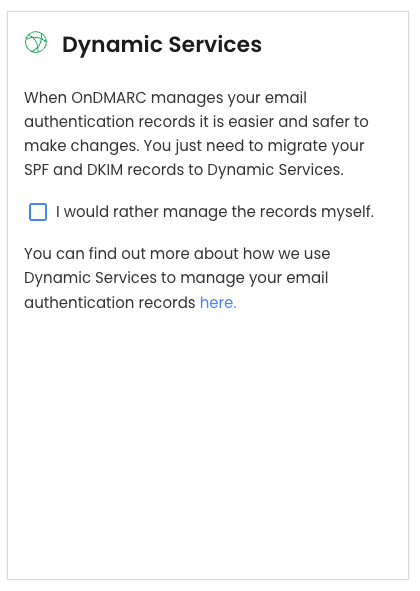
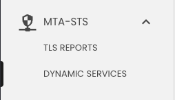
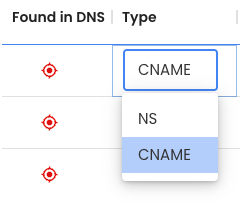
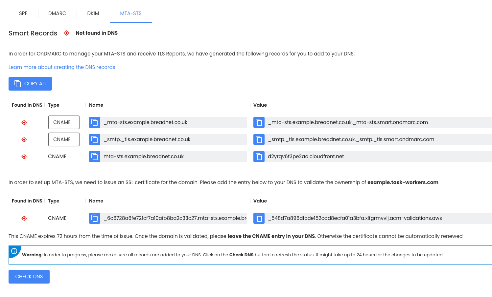
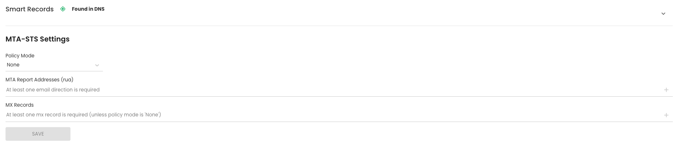
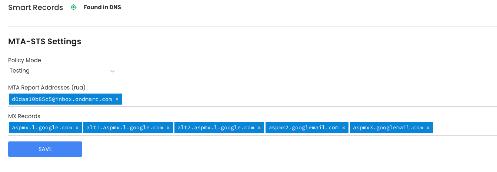

## What

This guide explains how to set up MTA-STS using OnDMRAC, a managed hosted solution.

### What is MTA-STS

MTA-STS stands for "Mail transfer agent Strict Transport Security" and declares to other mail servers that they accept secure
TLS based messages, and if they should refuse to deliver to the domain if they are not secure.

Below is the abstract from the RFC: [RFC: 8461](https://datatracker.ietf.org/doc/html/rfc8461)

> SMTP MTA Strict Transport Security (MTA-STS) is a mechanism enabling
mail service providers (SPs) to declare their ability to receive
Transport Layer Security (TLS) secure SMTP connections and to specify
whether sending SMTP servers should refuse to deliver to MX hosts
that do not offer TLS with a trusted server certificate.

MTA-STS relies on SMTP TLS Reporting as defined in [RFC8460](https://datatracker.ietf.org/doc/html/rfc8460), which is
covered by OnDMARC

## Setup

There are several steps

* [Add your domain](#add-your-domain)
* [Create MTA-STS records](#create-mta-sts-records)
* [Set up the Policy](#set-up-the-policy)

If your domain is already in OnDmarc you can skip to [create MTA-STS records](#create-mta-sts-records)

### Add your domain

Navigate to [app.redsift.cloud](https://app.redsift.cloud) and select `REDSIFT OnDMARC` > **GO TO RED SIFT ONDMARC**

On the dashboard you're greeted with, click on **ADD DOMAIN ->**

Type the name of your domain in.

You will be asked if you wish to use Dynamic Services.

Dynamic services are hosted by OnDmarc and are the easiest way to manage mail config, as you can use their UI and they take
care of all the admin like `sts-policy-max-age` and [`sts-id`](https://datatracker.ietf.org/doc/html/rfc8461#:~:text=sts%2Did%20%20%20%20%20%20%20%20%20%20%3D%20%25s%22id%3D%22%201*32(ALPHA%20/%20DIGIT)%20%20%20%20%20%3B%20id%3D...)

**Untick** the box so it looks like below



You will then be asked to add the DNS records presented to your domain.

!!! note "Limitation of this guide"
    This guide will not go in to how to add DNS records to your domain, as this is different for each DNS provider.

One the DNS records have been added, click **NEXt ->** at the bottom of the page

### Create MTA-STS records

!!! note "When do you actually create the policy?"
    I had this question, and this is why I made this documentation.

    After you've created the DNS records, there is no active policy. Eg: None.

    Once you've then gone through the wizard to create the policy, only then does it become live and you can make adjustments.

Navigate to MTA-STS on the side menu, and select **DYNAMIC SERVICES**



Select your domain from the Domain selector at the top

Click **GENERATE RECORDS**

You will be presented with records, and under the `TYPE` column, set them to CNAME



Create the listed records in your DNS provider's control panel.



Make a sandwich or what ever it is that takes around 10 minutes, then click on **CHECK DNS** at the bottom of the page.
It takes some time for DNS changes to come through all around the world, and 10 minutes seems like a reasonable amount of time.

### Set up the policy

You will be greeted with a page like the below. This is where we design our policy



You will need the `RUA/ RUF` email address for your OnDMARC account, navigate to **Settings** > **Domains** and scroll down
and copy the email address you see at the bottom of the page. It will be formatted like `d0daa10b85c5@inbox.ondmarc.com`

| Setting name       | Explanation and considerations                                                                                                                                              | Value                                    |
|--------------------|-----------------------------------------------------------------------------------------------------------------------------------------------------------------------------|------------------------------------------|
| Policy mode        | Should the policy be in reporting only mode, or reject if emails do not comply. For the first month when you set this up, put it in `testing`                               | `enforce` or `testing`                   |
| MTA Report Address | The email address that reports get sent to.                                                                                                                                 | Use RUA/ RUF email from the Domains page |
| MX Records         | This is the list of MX servers your emails get delivered to. I recommend running `dig MX <your domain>` and putting them in order of priority as they show in the MX record | Your MX records                          |

An example completed policy for a domain using Google Workspace ([setup before 2023](https://support.google.com/a/answer/16004259?hl=en&src=supportwidget0&authuser=0#:~:text=Google%20for%20delivery.-,Legacy%20MX%20record%20values,-If%20you%20started)) would look like the below



#### MX records

Let's say our domain is `example.com` and we dig for MX records

```shell
dig MX example.com
```

We get the response:

```text
➜ dig MX example.com

; <<>> DiG 9.10.6 <<>> MX example.com
;; global options: +cmd
;; Got answer:
;; ->>HEADER<<- opcode: QUERY, status: NOERROR, id: 48442
;; flags: qr rd ra; QUERY: 1, ANSWER: 5, AUTHORITY: 0, ADDITIONAL: 1

;; OPT PSEUDOSECTION:
; EDNS: version: 0, flags:; udp: 4096
;; QUESTION SECTION:
;example.com.                        IN      MX

;; ANSWER SECTION:
example.com.         300     IN      MX      1 aspmx.l.google.com.
example.com.         300     IN      MX      10 aspmx2.googlemail.com.
example.com.         300     IN      MX      10 aspmx3.googlemail.com.
example.com.         300     IN      MX      5 alt1.aspmx.l.google.com.
example.com.         300     IN      MX      5 alt2.aspmx.l.google.com.

;; Query time: 80 msec
;; SERVER: 127.0.2.2#53(127.0.2.2)
;; WHEN: Thu Jul 24 14:24:24 BST 2025
;; MSG SIZE  rcvd: 176
```

We would then put in to the `MX Records` field

```
aspmx.l.google.com alt1.aspmx.l.google.com alt2.aspmx.l.google.com aspmx2.googlemail.com aspmx3.googlemail.com
```

## How to test this

Let's assume your domain is `example.com`:

You can navigate to: <https://mta-sts.example.com/.well-known/mta-sts.txt> or use `curl` and you should see the below

```text
version: STSv1
mode: testing
mx: aspmx.l.google.com
mx: alt1.aspmx.l.google.com
mx: alt2.aspmx.l.google.com
mx: aspmx3.googlemail.com
mx: aspmx2.googlemail.com
max_age: 86401
```

You can also use one of the below tools

* [MX toolbox](https://mxtoolbox.com/mta-sts.aspx)
* [Mail hardener](https://www.mailhardener.com/tools/mta-sts-validator)
* [Easy DMARC](https://easydmarc.com/tools/mta-sts-check)
* [UK public sector only: NCSC Mail Check](https://www.mailcheck.service.ncsc.gov.uk/)
* [DMARCLY](https://dmarcly.com/tools/mta-tls-checker)
* [esmtp.email](https://esmtp.email/tools/mta-sts/)

## When do I get the reports

As per the RFC that MTA-STS depends on ([RFC8460](https://datatracker.ietf.org/doc/html/rfc8460)) reports **should**
be generated at [midnight each day](<https://datatracker.ietf.org/doc/html/rfc8460#section-4.1>, [and then sent via email to your RUA address](https://datatracker.ietf.org/doc/html/rfc8460#section-5)
and then in theory a day later they will be OnDMARC's STS reports.

## Next steps

Review the reports generated, remediate any issues and then set the policy from `Testing` to `Enforce`
